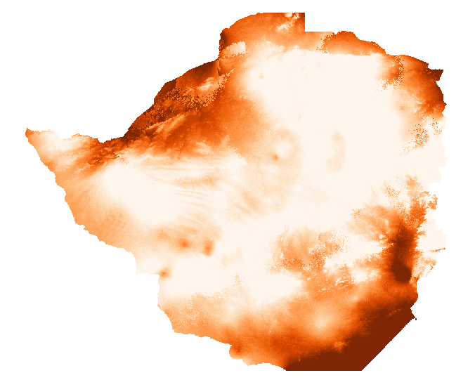

I wanted to write this up to show how easy it is becoming to test ideas and find interesting trends in data. Please don't draw too many conclusions from the numbers here - pinch of salt and all that.

Yesterday I came across the [Wellcome Trust Data Re-Use Prize: Maleria.](https://map.ox.ac.uk/wellcomemalariaprize/) They have made tons of data available, and invited participants to generate a new insight, tool or health application from that data. Incredible to see such great initiatives.

Browsing through the data, one map in particular drew my attention - the 'Residual Means'. These "show the remaining (residual) transmission that has not been accounted for by the covariates already in the model." Doesn't that smell juicy?

Explaining this unattributed transmission is one of the example questions provided. It would be neat to see if we can figure out why malaria infection rates are higher than expected in some areas, and lower in others.

I was looking at all this as I procrastinated some work I'm doing mapping baobab trees. It occurred to me that it wouldn't be completely absurd to see if there is any relation between the two subjects. Now you'll just have to take my word on this for now, but rest assured that I have a decently accurate map of baobab tree density for Zimbabwe and surrounds. I quickly downloaded the residuals maps and fired up QGIS to take a look.

This isn't the density map I used, but it is similar and looks prettier

Estimating correlation by looking at two maps and saying "there seems to be some patterns here" is not an established scientific practice, but it is fun to see the brains pattern-matching functions get abused. After a few minutes the fun wore off and I got down to the serious business. I want to see if there is a correlation between baobab density (or rather, access to baobab fruit) and malerial transmission/infection.

Stackoverflow "get raster value at point" since it's been a while. Wow - I don't even have the gdal toolbox on this laptop yet! Technical hurdles out of the way, I threw together some code:

Full code listing on Github <LINK>

Creating regularly spaced points over the area of interest (i.e. the area I have baobab densities for), I use the above code to sample the baobab density and the transmission residual at each point. Next, we check to see if they're correlated:

_scipy.stats.pearsonr(densities, maleria\_residuals)_ yields a correlation coefficient of -0.1226401351031383, p=0. That is, places with more baobabs have less unattributed transmission than places without. To show this visually, let's look at a scatter plot of the two variables:

Scatter plot - unattributed transmission vs baobab density

Places with high baobab density have inexplicably low transmission rates, in general. In fact, 86% of locations with estimated baobab density >10 trees/hectare had a negative 'unattributed transmission' value.

At this point, my half-hour break should have ended, but I was interested. I had mainly done asked the question as an exercise in seeing how easy it was to play with the data. But there was a correlation (note: correlation != causation). Now it could well be that baobab trees and malaria transmission are both dependent on some of the same environmental factors, some of which might not have been taken into account by the model. But could it be the case that this wonderful tree (I'm a little biased) might be doing some good?

Baobab fruit is good for you \[1\]. It's got lots of minerals and vitamins, and my initial hunch was that maybe, just maybe, it could be boosting the health of any community who lives close to the trees. Another angle came up when I looked for sources for \[1\] and found references to the use of baobab in traditional medicine as a treatment for malaria \[2, 3\]. Now curious, I looked around and found a study \[4\] suggesting "that Adansonia digitata protects against Plasmodium berghei induced-malaria, and that administration of the extract after established infection reduced malaria progression." (in mice - from the \[4\]).

To sum up, we've looked at the malaria data and found that there are some variations in the transmission rates that the current models can't explain. We've then examined the relationship between baobab tree density and malaria transmission residuals and noted that there is a small negative correlation. We've seen that areas with baobabs present tend to have lower transmission rates than expected, and presented the idea that this could be due to the health benefits of the fruit or the anti-malarial properties of the bark, which is often used in traditional medicine. All done, thank you very much, can I has my PhD yet?

Science isn't quite that easy. I share this story to show how rapidly you can start generating hypotheses and playing with data. But to give a rigorous answer will take a little more than an hour coding and an hour smugly writing a blog post. I can think of a few reasons why the results here should be taken with a large pinch of salt, and I leave it as an exercise for the reader to list a whole bunch more. Hopefully soon I'll have time for a follow-up, doing it properly and explaining how one should actually go about it.

For now, cheers

References

\[1\] - I had some sources, but it's more entertaining if you google 'baobab superfruit' and then ignore the most enthusiastic 90% of results. But see \[2\] for some good info (available online at https://www.sciencedirect.com/science/article/pii/S222116911530174X#bib4)

\[2\] - Rahul, J., Jain, M.K., Singh, S.P., Kamal, R.K., Naz, A., Gupta, A.K. and Mrityunjay, S.K., 2015. Adansonia digitata L.(baobab): a review of traditional information and taxonomic description. _Asian Pacific Journal of Tropical Biomedicine_, _5_(1), pp.79-84.

\[3\] - Kamatou, G.P.P., Vermaak, I. and Viljoen, A.M., 2011. An updated review of Adansonia digitata: A commercially important African tree. _South African Journal of Botany_, _77_(4), pp.908-919.

\[4\] - Adeoye, A.O. and Bewaji, C.O., 2018. Chemopreventive and remediation effect of Adansonia digitata L. Baobab (Bombacaceae) stem bark extracts in mouse model malaria. _Journal of ethnopharmacology_, _210_, pp.31-38.
