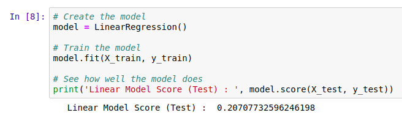
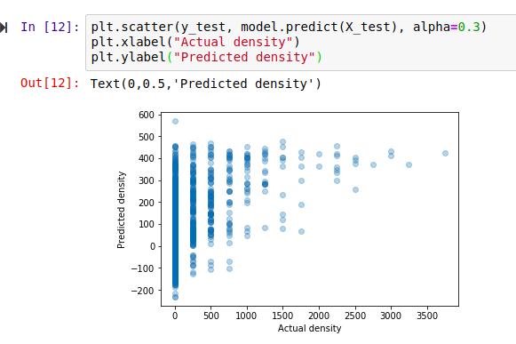
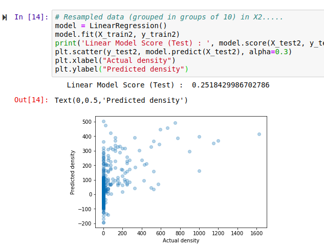
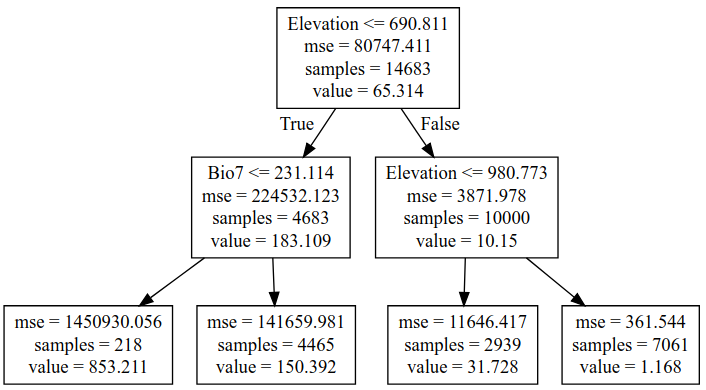
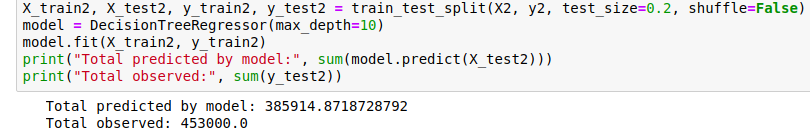
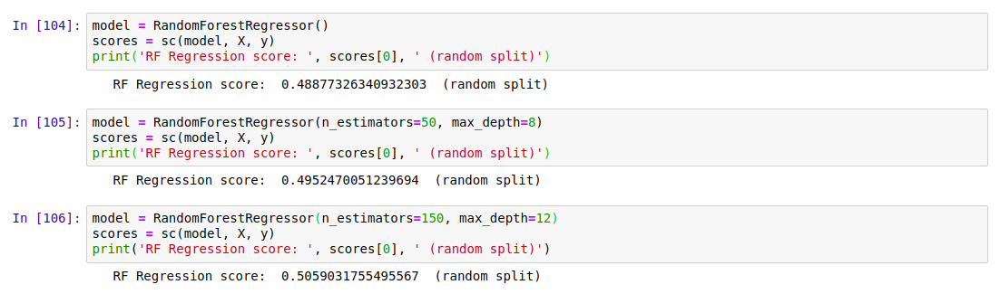
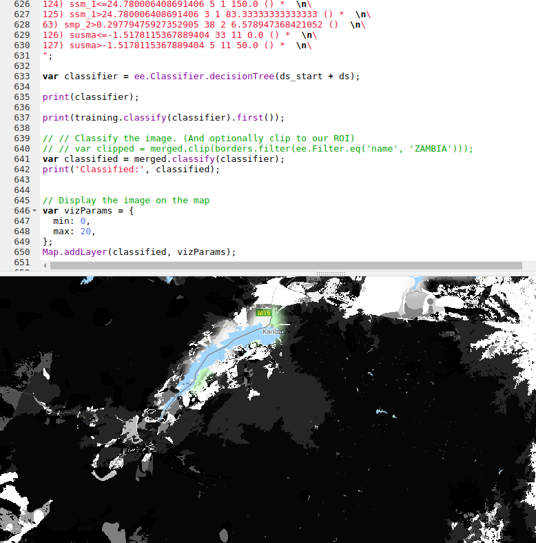

Update, July 2020: GEE now has a good random forest implementation (ee.Classifier.smileRandomForest) that can do regression - I'd suggest using that instead of the approach mentioned in this post.

## Recap and Following Along

[The last post](https://datasciencecastnet.home.blog/2019/02/15/mapping-baobabs-part-1-modelling-the-density-of-baobab-trees-in-zimbabwe-with-a-linear-model-in-gee/) looked at creating a simple linear model to predict the density of baobab trees across Zimbabwe. In this post, we'll try to quantify how accurate the predictions are and then see if we can make them even better. Since we'll want to try all kinds of models, we'll take a break from Google Earth Engine and use Python (with scikit-learn) to play with some concepts before taking our final model back into GEE again.

I'll be working in a Jupyter notebook. This gives an interactive environment, perfect for trying out ideas and experimenting. If you'd like to follow along, I've uploaded the data and a complete notebook <here>. It goes much deeper than I'm able to in blog form - consider this post a summary rather than a comprehensive explanation of the topics involved.

## Loading the data

I'm using a library called pandas to load the training data (which we made to train the model in GEE) into a data structure called a DataFrame. Think of it as a spreadsheet, with columns representing the input variables (altitude, rainfall etc) and the output variable that we intend to model (in this case, tree density).

Loading the data into a pandas DataFrame

## Model Performance

We need ways of gauging model performance so that we can decide how reliable the predictions are or choose between two models. An easy way to do this is to hold back some of the training data and see how well the model performs with it. We train a model with, say, 80% of our data and then make predictions on the remaining 20%. The closer the predictions are to the true values, the better the model has done. Let's see an example:

The data has been split into training and test sets. X represents the inputs to the model and y the desired outputs. So here, we train the model with X-train and y\_train and then see how well it does on the unseen test data. But hang on, what does model.score() even do?

The score shown is known as the 'R-Squared Score'. It is a measure of how well the model explains the variance in the output variable. Scores closer to 1 are better. We'll use this going forward, but it isn't very easy to understand (read more [here](http://blog.minitab.com/blog/adventures-in-statistics-2/regression-analysis-how-do-i-interpret-r-squared-and-assess-the-goodness-of-fit)). A quick way to get a more intuitive understanding of how well a model does, I like to plot the models predictions vs the actual figures. An ideal model would predict the outputs 100% correctly, resulting in a straight line (y=x). The closer to this ideal we get, the better our model is. Here we go:

Hmm, that's not much like a straight line. But there is some relation - an encouraging sign. Also, the X axis (actual densities) seems to be appearing in increments of 25 - what's up with that? Well, the data is split into very small plots (4ha each). In an area where the baobab density is 50 trees per square km, one plot might have 2 trees (giving a density of 50 trees/km^2), another might have none (density=0) and a third might have 5 (density=125). To smooth things out, we can clump adjacent plots together. This will give us fewer, larger plots, each with a better density figure. The code for this is in the accompanying notebook. Repeating the scoring process with this new input data, we get the following:

Better, and the score has improved. But still not great - for example, the model predicts a density of -100 trees/km^2 in some places. However, this gives us a starting point.

Using a single test/train split gives an idea of performance, but we can get more accurate scores by doing multiple splits (look up cross-validation for more info). It's also important to think about HOW we split. Splitting randomly might be fine in some cases, but here the data was collected as we drove along roads. Having test points right next to training samples means the model can sometimes make a good guess, but we want to know how well it will perform in new areas, not just along roads we've sampled. A better approach is to split the data into sections - each represents a new area with different conditions, and more accurately represents the challenge. Going forward and looking at new models, I'll record the score for both cases in CV (random) and CV (non-radom) respectively. More info in the notebook and a future post. I'll also show scores with both the original training data and the resampled data (larger plots) for comparison.

Final bit in this section: let's clear our heads by getting another measure of performance. Imaging we've driven 80% of the roads, and want to predict how many baobabs we'll see on the final stretch. We'll do it for this model (and all the following models) and compare:

Quite the error!

The summary score for the linear model:  
Random split: 0.169 (train), 0.152 (test)  
Sequential Split: 0.172 (train), -0.549 (test)  
And Re-sampled plots  
Random split: 0.257 (train), 0.213 (test)  
Sequential Split: 0.262 (train), -1.119 (test)  

## Adding Polynomial Features

The linear model essentially fits a set of straight lines to the data. density = a\*altitude + b\*temperature +... . This doesn't work when more complicated relationships are at play. To arrive at a model that can fit more complex curves, we can add polynomial features and re-run the line fitting process. This lets us more accurately describe curves (y = 0.3x + 0.2x^2 for example). There is an excellent write-up of polynomial regression on [towardsdatascience.com](https://towardsdatascience.com/polynomial-regression-bbe8b9d97491) (which also has excellent resources on linear regression and other types of modelling with scikit-learn).

Adding quadratic features (altitude^2 etc) gives a better R^2 score for a random split of 0.22, up from ~0.15 for Simple Linear Regression. Adding cubic features gives a further boost to 0.26. However, both models do even worse when the data is split sequentially - in other words, these models don't generalize as well.

## Decision Trees

We could keep on refining the simple models above, adding regularization parameters to help them generalize better, for example. But let's move on and try a new kind of model - a decision tree. This post is already getting long, so I'll leave an [explanation](https://towardsdatascience.com/everything-you-need-to-know-about-decision-trees-8fcd68ecaa71) of decision trees to someone else. Suffice to say that decision tree methods give a series of true/false splits that can be followed to get a prediction for a given set of inputs. For example, a simple (depth=2) tree predicting the baobab density looks like the following:

We can set how complex we want the decision tree to be by changing the max\_depth parameter. Too simple, and we don't account for the trends in the data. Too complex, and we 'overfit', reducing our model's ability to generalize by fitting noise in our training data. We can make trees of different depth, and see how this affects the score. Observe the following two graphs:

Model score with varying max\_depth parameter

More complex models do better but are worse at generalizing. Since we don't see much of an improvement in score for randomly split data above a depth of 10, and beyond that, the score on unseen data (when we split the data sequentially) gets significantly worse, a max depth of ~10 would be a reasonable parameter choice.

Comparing the prediction for the last 20% of the data (as we did with the first linear model), we see that this gives a much closer estimate:

Prediction of the total within 15%.

## Random Forests

Random forests are a great example of the value of ensemble modelling. By creating a set of different decision trees, each of which does a mediocre job of making predictions, and then averaging the predictions to weed out extreme errors, they arrive at a more probable prediction. There is more to it than that, but let's just try a couple out and see how they do:

## Results

## Exporting Decision Trees for use in Google Earth

Our best model was used Random Forest Regression (which could be further improved with some extra tweaks), and this is what I've used previously for some Species Distribution Modelling tasks. However, Google Earth Engine doesn't yet have support for doing regression (not classification) with random forests. A reasonable second place is Decision Trees, which have the added bonus of being computationally cheap - important when you're working with gigabytes of data. We'll export our best performing decision tree from python and load it using GEE's **ee.Classifier.decisionTree(),** which takes in a string describing the tree.

I wrote a function to export a tree from scikit-learn into GEE's format. Code here <add link> and example usage in GEE here <add link>.

The finished map doesn't look as good as the smooth output of the linear model, but the predictions are more accurate.

## Where Next?

At this point we've looked at model accuracy, chosen a better model and applied that model in Google Earth Engine. We know roughly how well it does in areas similar to those we sampled. But is it reliable elsewhere? Would you trust the predicted densities for France? The model says lots of trees, but the French say il n'y a pas de baobabs and we both know who is right. To clear up these questions, we'll spend the next post exploring the idea of model applicability, coverage of sample space and pitfalls with extrapolation. See you there!

PS: This is still a draft but I'm hitting publish so that I can move on to the next one. I'll refine it later. If you've hit a missing link or error write to me or wait a few days. Fortunately I don't have readers yet. I hope I remember to come back to this.
