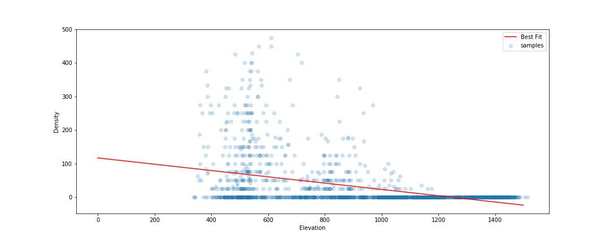
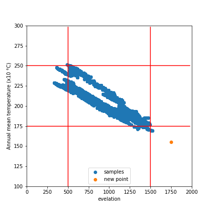
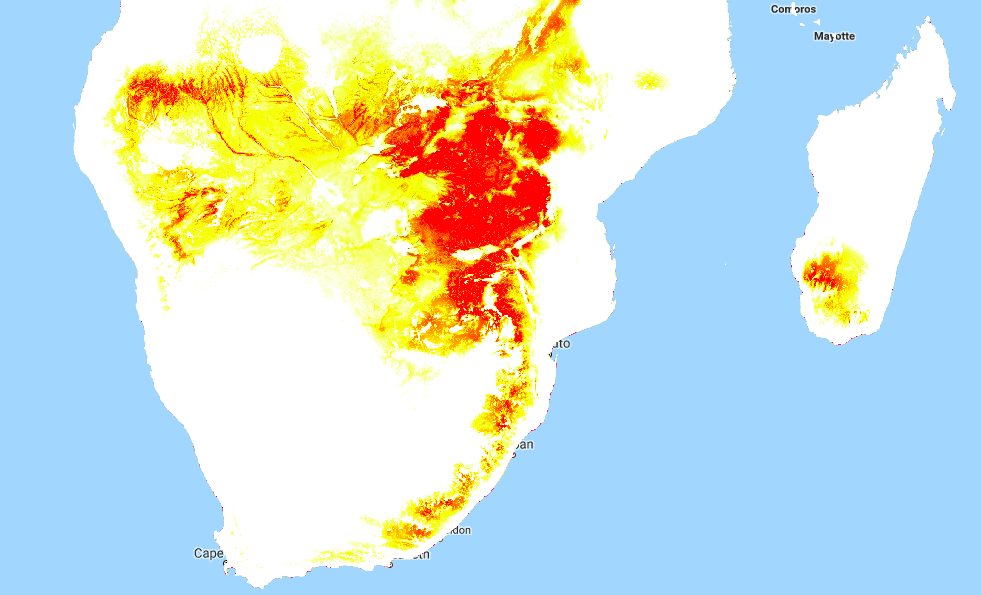

In the previous two posts, we built a Species Distribution Model and used it to predict the density of Baobab trees in Zimbabwe. Then we tried some more complex models, trained a decision tree regressor and imported it into Google Earth Engine. We showed various metrics of how well a model does, but ended with an open question: how to we tell how well the model will do when looking at a completely new area? This is the subject we'll tackle in today's post.

The key concept here is distance from the sample space. We sampled at a limited number of geographic locations, but there is no way these locations completely cover all possible combinations of temperature, rainfall, soil type and altitude. For example, all samples were at altitudes between 300 and 1300m above sea level. We might expect a model to make reasonable predictions for a new point at 500m above sea level. But what about a point at 290m elevation? Or 2000m? Or sea level? Fitting a linear model based purely on altitude, we see the problem clearly:

Line of best fit: Elevation vs Density

Negative tree densities at high altitude? Insanely high densities at sea level? Clearly, extrapolating beyond our sample space is risky. Incidentally, if it looks to you like there are two Gaussian distributions there in the data you are not alone - they might correspond to the two types\* of baobabs found on mainland Africa. Until recently, conventional wisdom held that there is only one species present, and this is still contested. See a related paper I worked on [here](https://www.sciencedirect.com/science/article/pii/S0254629915003129) \[1\]. A more complex model might help, but that's besides the point. A model's predictions are only valid for inputs that are close enough to the training data for extrapolation to make sense.

So how do we deal with this? A simple approach might be to define upper and lower bounds for all input variables and to avoid making predictions outside of the range covered by our training data. We can do this in GEE using masking:

Black areas fall within 80% bounds for all variables

This is a reasonable approach - it stops us doing much dangerous extrapolating outside our sample space and has the added benefit of clearly conveying the limitations of the model. But we can do better. Imagine an area that is almost identical to some of our training data, but differs in a few attributes. Now further imagine that none of these attributes matter much to baobabs, and in any case they are only _just_ below our thresholds. Surely we can expect a prediction in this area to have some value? We need a way to visualise **how far away** a point is from our sample space, so that we can infer how bad our predictions for that point are likely to be.

Enter what I call the |Weighted Distance Vector|. We represent each input as a dimension. We consider how far away a point is from our sample space along each dimension, and compute the vector sum of these distances. I say the 'weighted' sum since we can scale the distance on each axis to reflect the relative importance of that variable, attaching higher weight to variables with larger effects on the output. Let's clarify with an example.

Considering only two variables, elevation and temperature, we can represent all our training data as points (blue) on a grid where the X axis represents elevation and the y axis temperature. We'll draw out our limits around the training data using bounds covering 90% of our data. A point within the limits has a |WDV| of 0. Now consider a point outside the limits (red). It's 250m higher than any we've seen - 0.25 times the range of elevations observed. It's 2.5 degrees cooler than any of our sampled locations, which is 0.3 times the upper-lower bounds for temperature. The distance is sqrt(0.25^2 +0.3^2) = 0.39. However, altitude has a large influence on distribution, while temperature does not. Scaling by appropriate weights (see the penultimate paragraph for where these come from) we get |WDV| = sqrt((0.173\*0.25)^2 +(0.008\*0.3)^2) = 0.043. The key point here is that the |WDV| captures the fact that elevation is important. A point at 750m elevation with a mean temp of 30 °C will have a low |WDV| (0.005), while one with a mean temp of 23 °C but an altitude of 1600m will have a high |WDV| (0.02).

A point outside our sampled region

To do this in GEE is fairly simple, since we can map functions over the input images to get the |WDV| at each location. [This script](https://code.earthengine.google.com/c5cabd5c33829e8420694874ba3e35b2) shows it in action. And the result gives us much more information than the mask we made earlier. Red areas have a very small |WDV|, and we expect our model to do well there. White areas are out of scope, and I'd take predictions in the yellow regions with a grain of salt. What isn't included here is geographical distance - extrapolating to different continents, even if conditions match, is not advised.

|WDV| over Southern Africa. Red areas are similar to sampled regions, white are not.

One thing I've glossed over so far: how do we get the weights used? I defined the |WDV| as weighted because we "scale the distance on each axis to reflect the relative importance of that variable." The feature weights can be thumb-sucked by an expert (I've seen this done) but the easiest way to get reasonable weights is to look at the model.feature\_importances\_ variable of a trained random forest regressor. In the process of fitting the model, the relative importance of each input feature is computed, so we get this info for free if we've done the modelling as described in Part 2. Another option would be to use the correlation coefficients of each input var with the density. I leave that as an exercise for the reader.

So there you go - a way to visualise how applicable a model is in different locations, using weighted distance from sample space as a metric. In the next post of this series I'll share the method I'm using to expand our sample space and get a model that can produce useful predictions over a much wider area. Before then, I'm going to take a break from baobabs and write up some other, smaller experiments I've been doing. See you then!

\*I'm using 'type' instead of 'species' here, because while the genetics are contentious, it is fairly clear that there are at least two kinds of baobabs here.

\[1\] - Douie, C., Whitaker, J. and Grundy, I., 2015. Verifying the presence of the newly discovered African baobab, Adansonia kilima, in Zimbabwe through morphological analysis. South African Journal of Botany, 100, pp.164-168.
