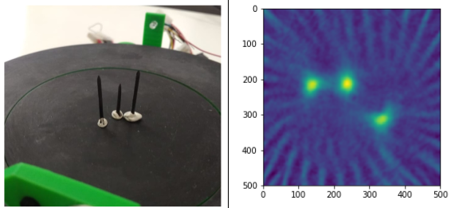
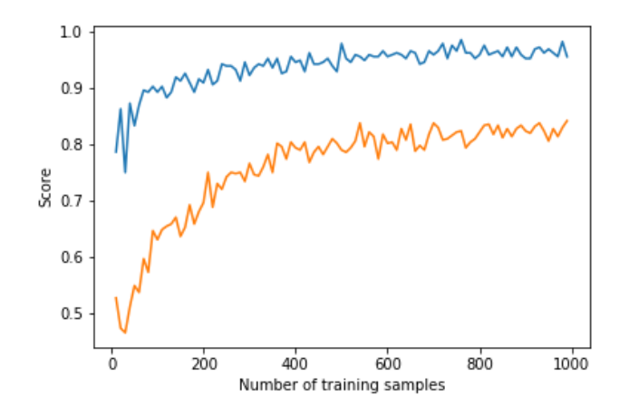
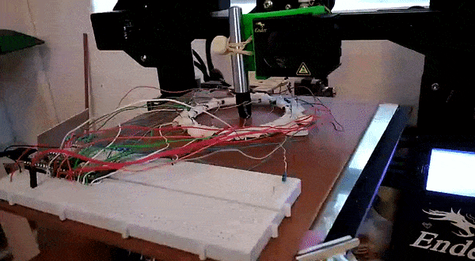

I studied Electrical and Computer Engineering at UCT, and the final year project was my chance to really dive deep into a topic. I chose IR tomography, and explored various questions around that topic. For today's post, I'll focus on one small aspect: the use of machine learning. This post will go through some background and then show a couple of ML models in use. For much more detail and my full thesis, see this [GitHub repository.](https://github.com/johnowhitaker/CIRTS)

## Background

This project arose because I wanted to do some experiments with Computed Tomography, but I didn't know enough to see what would work and what wouldn't. How many sensors does one need to achieve a particular goal for resolution or performance? What geometries work best? And what if we can't keep everything nice and regular? 

I built some tools that let me simulate these kinds of arrangements, and did some early experiments on image reconstruction and on the use of machine learning (specifically neural networks) to make sense of readings. Even with a weird arrangement like the one on the right, I could make some sense of the data. For more information on the simulation side, see the report in the [GitHub repository](https://github.com/johnowhitaker/CIRTS).

I tested out these arrangements in the real world by building some fixed arrangements, and by using a 3D printed scanner to position an LED and a phototransistor (PT from now on) in different locations to slowly simulate having many detectors and emitters. Using light as opposed to X-rays means cheap emitters and detectors, and of course much less danger.

A ring of 8 LEDs and 8 PTs. Larger rings were also constructed, and the scanner could simulate arrangements of >1000 sensors and emitters.

By taking a set of readings, we can start to estimate how much light travels along different paths, and thus build up an image of whatever is being scanned. This works well with lots of readings from the scanner:

A reconstructed image of some small nails. The scanner could resolve objects less than 1mm in size.

However, for arrangements with relatively few sensors (such as the static arrangement of 8 shown above), the reconstructed images are an apparently meaningless blur. The goal of this project was to use ML to make sense of these sets of readings, for example by identifying objects placed within the sensor ring or estimating their position.

## Model Selection

To answer the question "can machine learning be useful", I needed to pick a good approach to take. Simply throwing the data at a decision tree and then noting the performance wouldn't cut it - every choice needs to be justified. I wrote a notebook explaining the process [here](https://github.com/johnowhitaker/CIRTS/blob/master/Model%20Selection/Model%20Selection.ipynb), but the basics are as follows:

1. Define your problem (for example, classifying objects) and load the data
2. Pick a type of model to try (for example, Logistic Regression)
3. Train a model, and see how well it performs by splitting your data into training and testing sets. Use cross-validation to get more representative scores.
4. Tune the model parameters. For example, try different values on 'gamma' (a regularisation parameter) for a Support Vector based classifier.
5. Repeat for different types of model, and compare the scores

Choosing the optimum number of hidden layers for a Multi-Layer Perceptron model (Neural Network)

For example, in the case of object classification, a neural network approach worked best (of the models tested):

Model scores on a classification task

## Object Classification

Using the ring with 8 LEDs and 8 PTs, I'd place an object randomly within the ring. The object (one of four used) and location (which of four 'quadrants' contained the object) were recorded along with a set of readings from the sensors. This data was stored in a csv file for later analysis.

Using the model selected according to the method in the previous section, I was able to achieve an accuracy of 85% (multi-class classification) or 97% (binary classification with only two objects) using 750 samples for training. More training data resulted in better accuracy.

Model performance with more training samples for multi-class classification (orange)  
and binary classification (blue)

This was a fun result, and a good ML exercise. The data and a notebook showing the process of loading the data and training models can be found in the ['Model Selection' folder of the GitHub repository.](https://github.com/johnowhitaker/CIRTS/tree/master/Model%20Selection)

## Position Inference

Here, instead of trying to identify an object we attempt to predict it's location. This requires knowing the position precisely when collecting training data - a problem I solved by using a 3D printer to move the object about under computer control.

Gathering training data for position inference

This results in a [dataset](https://github.com/johnowhitaker/CIRTS/blob/master/Pos_inf_r14/reads_500.csv) consisting of a set of readings followed by an X and Y position. The goal is to train a model to predict the position based on the readings. For the ring of 8, the model could predict the location with an error of ~10% of the radius of the ring - approximately 7mm. For the ring of 14 (pictured above, and the source of the linked dataset), I was able to get the RMSE down to 1.6mm (despite the ring being larger) using the tricks from the next section. You can read more about this on my [hackaday.io](https://hackaday.io/project/162352-cirts-configurable-infra-red-tomography-systems) page.

Playing a game with the sensor ring.

The ring can take readings very fast, and being able to go from these readings to a fairly accurate position opens up some fun possibilities. I hooked it up to a game I had written. A player inserts a finger into the ring and moves it about to control a 'spaceship', which must dodge enemies to survive. It was a hit with my digs-mates at the time.

## Using Simulation to boost performance

One downside of this approach is that it takes many training samples to get a model that performs adequately. It takes time to generate this training data, and in an industrial situation it might be impossible to simulate all possible positions in a reasonable time-frame. Since I already had a simulator I had coded, why not try to use it to generate some fake training data?

Using purely simulated data resulted in some spectacularly bad results, but if a model was 'primed' with even a small real-world training dataset (say, 50 samples) then adding simulated data could improve the model and make it more robust. I'll let the results speak for themselves:

Model performance for position inference with and without simulated data for training

The simulator didn't map to real life exactly, and no doubt could be improved to offer even more performance gains. But even as-is, it allows us to use far less training data to achieve the same result. Notice that a model trained on 150 samples does worse than one using only 50 samples but augmented with extra simulated data. A nifty result to keep in mind if you're ever faced with a dataset that's just a little too small!

## Conclusions

I had a ton of fun on this project, and this post only really scratches the surface. If you're keen to learn more, do take a look at the [full report(PDF)](https://github.com/johnowhitaker/CIRTS/blob/master/EEE4022S_2018_FINAL_REPORT_WHTJON002_WHITAKER_J_WILKINSON.pdf) and [hackaday project](https://hackaday.io/project/162352-cirts-configurable-infra-red-tomography-systems). This is a great example of machine learning being used to get meaningful outputs from a set of noisy, complicated data. And it shows the potential for using simulation of complex processes to augment training data for better model performance - a very cool result.

I'm thinking about moving this website in a different direction as I start on a new project - stay tuned for news!
