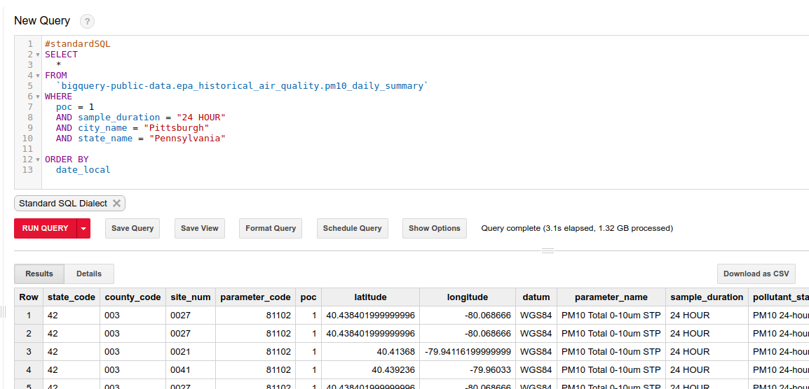
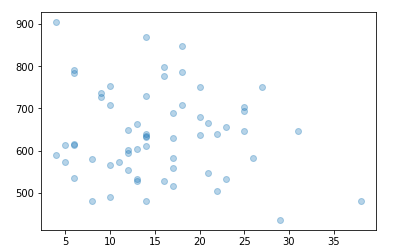
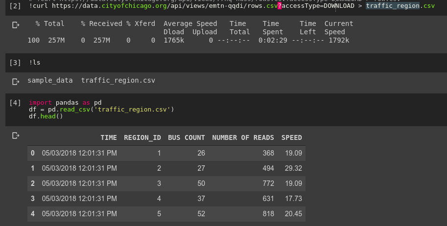
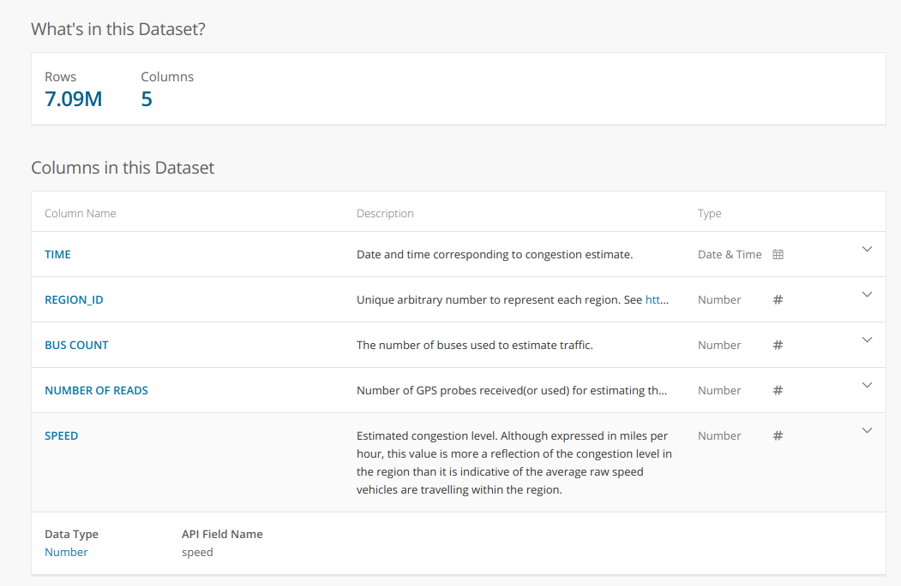

I'm currently on a mission to explore the different datasets available publicly, and hopefully to add to that list. One key reason I'm passionate about this is that data often generates good questions. This post documents an example of this. Soon after seeing the air quality databases available on BigQuery, I started to think about if/how this relates to traffic. I had Uber movement in mind, but I was also curious what other traffic data is available. Once that initial question lodges in the mind, a journey begins.

## First try: Uber movement travel times as a proxy for traffic levels

[Uber movement](https://movement.uber.com) makes various data from millions of Uber rides available to the public. However, it isn't particularly easy to estimate traffic from the available data. Daily average travel times are only available for a single, selected route at a time, and for a maximum of three months per download. The restrictions make sense, but are a little inconvenient. To get around this, I chose one route through the centre of my city of interest and decided to use this as a rough measure - longer travel times would hopefully translate to days with heavier traffic. To get better estimates, one could repeat this for many different routes to improve the metric.

Average uber ride travel times - a rough proxy for traffic conditions?

I initially selected Nairobi for my investigation, since Uber data is available there and it seemed like air quality data was available as well. However, looking more closely at the air quality data revealed that it is sparse and there was almost none available for the dates that uber movement data had been gathered. So, with regret, I moved my initial exploration to the States, where air quality data has been gathered in many locations for decades - just one more way in which Africa lags behind in terms of data availability.

I chose Pittsburgh, since it seemed as good a place as any when I looked at the list of cities with Uber Movement data. As before, I picked a route through town and downloaded the average daily travel times from movement.uber.com. To get the air quality data, I turned to Google Bigquery. The following code pulls the relevant data from the giant (>1GB) dataset:

Querying the epa historical air quality dataset

The resultant 1MB csv can be downloaded and loaded into a pandas dataframe for analysis. Combining it with the uber data meant it was time for the moment of truth: is there a correlation between travel times (as a measure of traffic intensity) and air quality? Let's plot the two:

Air quality (X axis) vs mean travel times (y axis)

If anything, there was a tiny negative correlation. But the main issue is the quality of the data. A single route is probably not a good metric for traffic as a whole. Less than a year's worth of data is not great. This ignores co-factors such as weather. Etc, etc. Can we do better?

## Take Two: Better traffic data

I plan on looking deeper into Uber Movement data in the future, but for this quick project I wanted a better source of traffic data to answer my initial question. Fortunately, the wonderful City of Chicago has a treasure-trove of data available: https://data.cityofchicago.org/. Their historical traffic data comes from sensor-laden busses tracking traffic speed. The dataset is fairly large, so to avoid taxing my Zimbabwean internet connection I used Google Colab to download the data and upload it to BigQuery for later. I could also start playing with the data in Colab's notebook interface:

Loading the data into pandas with Google Colab

A description of the dataset from the [data portal](https://data.cityofchicago.org/Transportation/Chicago-Traffic-Tracker-Historical-Congestion-Esti/emtn-qqdi):

I processed the data to get an average speed over all regions for each day. This, combined with the historical air quality measurements from the EPA database, gave me the data I desired:

Analysing the data

No obvious trend (correlation coefficient of -0.008). Honestly, not quite what I was expecting!

## So what does this mean?

I haven't done any proper analysis yet (scatter plots don't really count), but that wasn't the point. I saw some data, I had a question in mind, I found the data I needed to start answering it and I got some quick results. Tools like Google BigQuery and Colaboatory let anyone access and manipulate large datasets, and the availability of data means that you don't have to belong to a company or research organisation to do serious research.

I have 8 minutes left before I need to get back to work, so this is where I'll end this post. I hope you've enjoyed this small demo of what is possible when curiosity meets open data. If you'd like to try this yourself, contact me for code if I haven't yet uploaded the notebooks and data used here to GitHub. Share any other questions you'd like me to look into, and please send me any interesting datasets you come across. Farewell until next time.
