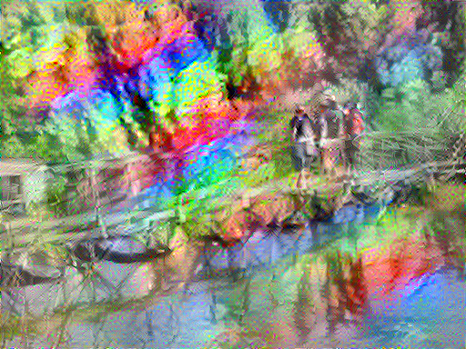

I'm going to try entering some Zindi competitions this week. First up is the 'AI Art' contest. I have many crazy plans, but my nascent tensorflow skills mean everything takes time. For now, let me present my first attempt:

'Bridge over Rainbow Water' - J Whitaker, 2019

This is made with a technique called Style Transfer. For more information and an easy way to try it out yourself, see the example on [Google Colab](https://research.google.com/seedbank/seed/neural_style_transfer_with_tfkeras). The general idea is to use a neural network to generate images that are similar to a 'content image' but that have the style of a separate 'style image'. The way the style difference is quantified is by using a network trained for image recognition - the early layers in these networks tend to measure style attributes.

Now for the specifics of this piece:  
\- The general practice is to start from the content image, and slowly morph to an image that stylistically matches the style image. I turned this around, beginning with the style image and watching the structure slowly emerge.  
\- I tweaked the learning rate and other parameters, trying to maintain the curving, flowing nature of the style image even as the straight lines of the bridge come forward.  
\- Most styles are picked from famous artists. Since this is a co-creation with my laptop, the style image is a microscope image of my screen, which was itself displaying the microscope feed. The screen's sub-pixels are the source of the rainbow colours.

Some attempts that didn't make the cut:

- 
    
- 
    
- 
    
- 
    
- 
    

As you might suspect, I've been playing with introducing distortion into the process. Just as we perceive a work in progress through the lens of our eyes (from different angles, with non-uniform lighting), I'd like the algorithm to only see a distorted view of it's output. This could be a blur or transform, but ultimately I'd like to try using a webcam and some wavy glass to create a means of perception for my co-artist.

Stay tuned for more attempts at music and art!
