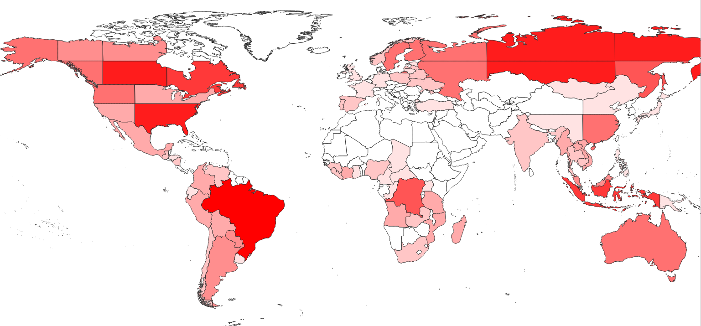
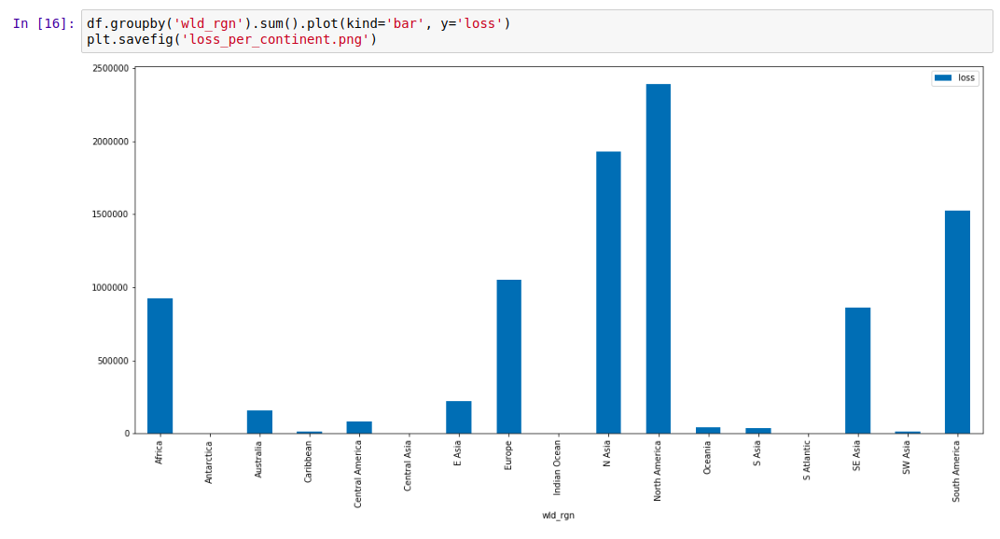
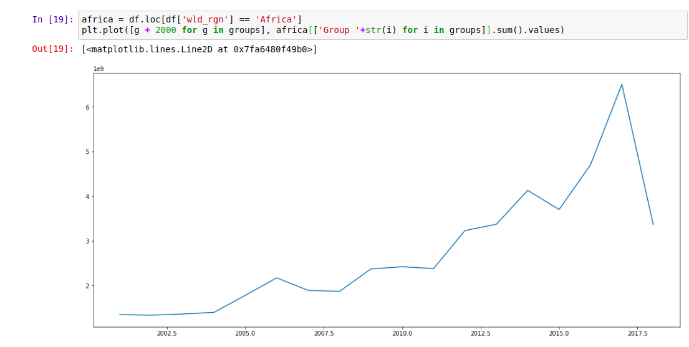

Forest loss is a major problem facing many parts of the world right now. Trees are being cleared to make way for agriculture, or simply cut down for fuel and timber. Tracking this loss is an important goal, and much work has been done in this area.

One of the best datasets on the topic is the Hansen Global Forest Change \[1\] dataset, available for free on the Google Earth Engine platform. This dataset tracks forest loss since the year 2000, and has become a key tool in fighting deforestation.

Forest cover (green), loss (red) and gain(blue) - from the Hansen dataset\[1\]

There is only one issue that I have with this data: it is HUGE! Approximately 1.22 TB. For anyone unable to write the code needed to analyse the data in GEE, this size means that downloading the data or importing it into traditional mapping applications is not feasible. And often we don't need all of this data, instead simply requiring a few key stats on an area of interest. Consider wanting a graph of forest loss in your country over the last 20 years: it's a nice visual to help you make a point, but it's not worth learning to code or downloading >1TB of data for.

This leads to today's project. I wrote some code that takes in a file specifying the boundaries of different regions. It then aggregates the data from the Hansen dataset over each of the specified regions. For example, I used the Large Scale International Boundary Polygons (LSIB) \[2\] map of the world's countries as an input, ending up with total forest loss, loss per year and forest cover for every country in a convenient 98 KB csv file. It also outputs a version of the input file as a shapefile, with added attributes containing the summarized forest change data. The former is all you need to plot change over time, see which regions have experienced the most loss or identify which country has lost the most forest in the last ten years. The latter is nice for creating colorful maps displaying this information - it's only ~60MB, and loads quickly into the mapping software on my laptop.

Forest loss in different regions

The Earth Engine code is available [here](https://code.earthengine.google.com/e575f8a19112ed6116fcceffdeceb96a).The rest of this post will explain how to use the generated datasets (available [here](https://github.com/johnowhitaker/hansen_data_countries)) for simple analyses.

## Viewing the shapefile in QGIS

QGIS \[3\] is an open source GIS application. The vector file (available [here](https://github.com/johnowhitaker/hansen_data_countries)) can be opened in QGIS with 'Open Data Source Manager' -> 'Vector Layer' -> browse to the .shp file and click 'Add'. By default, it looks uniform. To see the information better, right click on the layer, open properties and change the style from 'single symbol' to 'graduated':

Setting the style of the vector layer in QGIS

With these settings applied, the differences between countries become apparent. Play with the colours and classes until it looks good. To query the exact value of the loss in a given country, use the 'Identify Features' tool (Ctrl-Shift-I) and click to see all the attributes. To create a beautiful PDF map, consult a tutorial such as [this one](https://www.qgistutorials.com/en/docs/making_a_map.html) for all the fancy output options.

Forest loss displayed in QGIS

## Analyzing the data with Python + Pandas

The smaller csv file (available [here](https://github.com/johnowhitaker/hansen_data_countries)) is good for cases where the country outlines are not required. It is possible to open the file in Excel or Google Sheets, but let's stretch our Python muscles and make some simple plots. A notebook with the full code for this example is available in the [GitHub repository](https://github.com/johnowhitaker/hansen_data_countries).

The first step is loading the data: we import the necessary libraries then load the data into a pandas DataFrame with "df = pd.read\_csv('countries\_w\_hansen.csv')". For our first plot, let's look at the total loss (from the 'loss' column) for different world regions:

Plotting forest loss for different regions

The Hansen data encodes the years different areas experienced loss events. This data is captured in the 'Group X' columns. We can sum these columns to see the total loss each year, and note the worrying trend:

Forest loss per year

Of course, we have the country data, and can focus on a single country or region using df.loc:

Forest loss over time in Africa. The drop looks encouraging... until you consider the latest date this data was updated (2018 was still ongoing)

## Where next?

This data is fairly depressing, but my hope is that an exploration of it doesn't end with resignation. There are things we can do, ways we can help reduce this loss. Take a look at the data. Share the stats on your country, and push for change. Post those graphs on Facebook, call your representatives and demand action, find an organization working to fight this... If we're serious about saving our planet, we're all going to have to be involved.

## References

\[1\] - Hansen, M. C., P. V. Potapov, R. Moore, M. Hancher, S. A. Turubanova, A. Tyukavina, D. Thau, S. V. Stehman, S. J. Goetz, T. R. Loveland, A. Kommareddy, A. Egorov, L. Chini, C. O. Justice, and J. R. G. Townshend. 2013. “High-Resolution Global Maps of 21st-Century Forest Cover Change.” Science 342 (15 November): 850–53. Data available on-line at: [http://earthenginepartners.appspot.com/science-2013-global-forest](http://earthenginepartners.appspot.com/science-2013-global-forest).

\[2\] - LSIB: Large Scale International Boundary Polygons, Simplified  
The United States Office of the Geographer provides  
the Large Scale International Boundary (LSIB) dataset. The detailed  
version (2013) is derived from two other datasets: a LSIB line  
vector file and the World Vector Shorelines (WVS) from the National  
Geospatial-Intelligence Agency (NGA).

\[3\] - QGIS. A Free and Open Source Geographic Information System. [qgis.org](https://qgis.org/en/site/)

\[4\] - GitHub repository containing data and code: [https://github.com/johnowhitaker/hansen\_data\_countries](https://github.com/johnowhitaker/hansen_data_countries)
