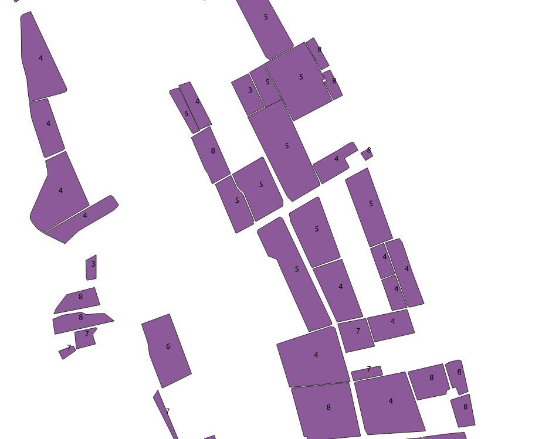
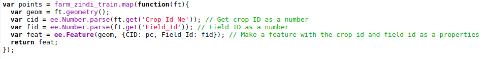
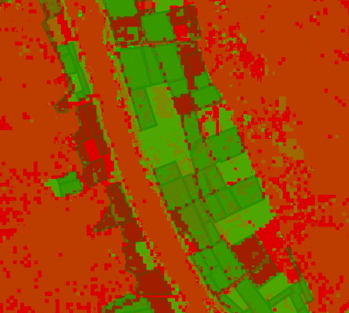
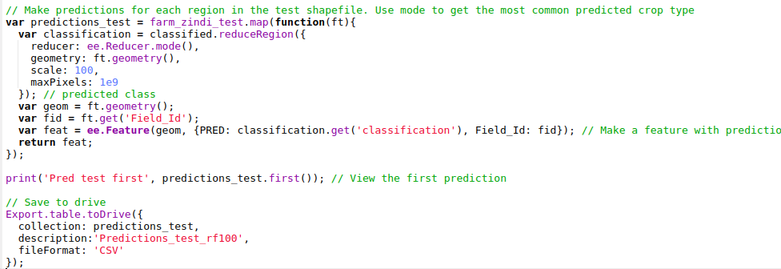
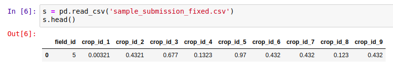
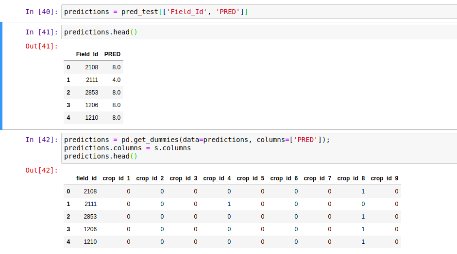

## Attempting Zindi's _Farm Pin Crop Detection Challenge_ Without Downloading any Imagery

[Zindi](http://zindi.africa) is currently hosting a [competition](https://zindi.africa/competitions/farm-pin-crop-detection-challenge) to classify fields by crop type using Sentinel-2 satellite imagery. They provide labeled fields with the crop type, and a separate set of fields as the 'test' set. The goal is to use the provided imagery to predict the crop type as accurately as possible. It's a great contest, BUT: The imagery files are huge (although they offer Azure credits to help mitigate this by using cloud computing), and extending such an analysis to other areas is not easy. The goal of this post is to show how we can use the labeled fields to train our own classifier in Google Earth Engine (GEE), using Landsat imagery for the classification (EDIT: Sentinel 2 imagery is also available in GEE, making this choice somewhat arbitrary). This results in a model that can be applied over any region, and is a process that could be replicated by anyone with some known crop fields and an internet connection.

I won't include all the code here. Instead, view it and try it for yourself [here](https://code.earthengine.google.com/afa4cec9b21f3835f3a5e1feb39beb5d).

## The Training Data

The important data is contained in a shapefile (a mapping-related file format for 'vector' layers that can contain points, lines or polygons). It contains multiple features (polygons), each representing a field with a certain kind of crop. The crop type is encoded as a number from 1 to 10. More info [here](https://zindi.africa/competitions/farm-pin-crop-detection-challenge/data).

Some features in the 'train' shapefile.

We can upload this data as an asset in GEE by using the 'New Table Upload' option and selecting all the files except `train.qpj` (which is unnecessary). I named the asset 'farm\_zindi\_train', and repeated the steps for the test dataset.

There is one last hurdle we must overcome when using this data to train classifiers in GEE. Each feature in the training shapefile contains a property, 'Crop\_Id\_Ne', that tells us the crop type. Unfortunately, this is represented as a string. To convert it to the required type, we create a function that is mapped over the feature collection and use `ee.Number.parse()` to convert the string into a number for the model to use.

Getting the required properties in the correct type by mapping a function over the collection

## Landsat Imagery

Instead of the Sentinel-2 imagery the competition is using, we'll see if we can achieve the same results with freely available Landsat 8 imagery. I used code from [this tutorial](https://developers.google.com/earth-engine/tutorial_api_06) to load the landsat data and create a 'greenest pixel composite' based on a computed value called NDVI (normalized difference vegetation index). This is not an ideal approach - we could instead have chosen a time of year when the differences between crops are most obvious, or used multiple images from different times in the growing season. These improvements will be considered in a future tutorial.

## Training A Classifier

The ['Supervised Classification' guide](https://developers.google.com/earth-engine/classification) by Google is good place to start when attempting this kind of classification task. The only changes I made to the provided code was to change the references to match my own training data, tweak the scale to reduce memory use and specify the property we're trying to predict (in our case, 'CID' for crop ID). Looking at the output, it seems to roughly match the farm outlines - a good sign.

Classifier output with farm boundaries shown.

## Comparing Classification Accuracy

Ideally, we'd split the data into training and test sets, compare different classifiers and pick the best. We might even keep a third set of data, the 'validation' set, to get a better idea of how our chosen classifier will perform on unseen data. As with the different options for input layers, I'll leave this for a second tutorial. For now, we will be lazy and evaluate the accuracy on the training data: print('Accuuracy', trained.confusionMatrix().accuracy());

The accuracy of a CART classifier is listed as **65%**. Not bad, given that there are 10 classes, but not great either. Switching to a random forest model gives a much higher accuracy score, but may be subject to overfitting.

## Exporting Predictions

To get the predicted crop type in each region of the test file, we look at the most common crop type predicted by the classifier in each region and export the predictions to a CSV file:

Exporting predictions

This results in a file containing columns for Field\_Id and predicted crop type. Normally, this is what we'd like. However, the Zindi contest specifies the submission with predicted probabilities for each different crop:

The submission format

To get the data in this format, I used Python and pandas, with the pandas get\_dummies function:

Formatting the data correctly

This is not ideal - we see a 1 for our predicted class, with 0s for the rest. It would be better to predict the probabilities and hedge our bets, but let's see see how this does. `predictions.to_csv('pred_test_cart.csv', index=False)` gives a file we can upload on Zindi... And the final score? ~17.4 (or ~15 with the random forest model), putting this submission in 30th place out of 31 entries as of today.

## Future Improvements

There are many ways we could improve this score. A different classifier might perform better. Selecting the greenest pixels was probably not the best approach. Instead of using ee.Reducer.mode(), we could count how many pixels are predicted for each crop type and use those counts to assign probabilities for our submission. Etc Etc. Some of these improvements will be covered in a future tutorial, hopefully coming soon.

## Conclusions

Despite our lackluster score, this exercise has hopefully shown the possibilities of this approach. Using only freely available imagery, which we never had to download thanks to Google Earth Engine, we were able to make predictions about which crops were being grown in different fields. If you've followed along, I hope you've seen what is possible with GEE - simply by copying snippets of code and gluing them all together. Once the accuracy is improved, this technique could be applied in many different situations.
