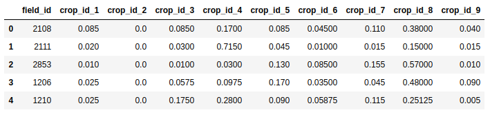
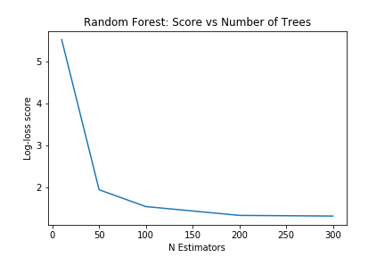

Following on from the last tutorial, this post will look at some ways we can improve our crop identification method. At the end of the last post, we were using a CART classifier to classify crops based on a greenest-pixel composite made from landsat 8 imagery. It didn't do too well compared to other submissions, and the classifier was getting around 65% accuracy on the training data. Let's start fixing some of the more obvious errors.

## Improving the input data for the classifier

Using a greenest-pixel composite was an easy first step. However, the competition is focused on a single year (2017), while the composite image likely drew data from previous years. And, with a single composite image, any growth cycles or seasonal variation between the different crops is lost. This leads to our first major improvement: using images from different times of year and combining them into one input image that preserves the seasonal changes.

Best quality landsat imagery from Jan-March 2017, one of the new model inputs

The [new Earth Engine code](https://code.earthengine.google.com/563621fb2a09a2682672541f6af1c228) filters the available Landsat imagery by date, splitting it into 4-month sections. The earliest high-quality imagery from each time period is selected (based on the code in [this guide](https://developers.google.com/earth-engine/ic_composite_mosaic)). Once this step is complete, the images are combined int a single new image that maintains the bands from each. The result is an image with 28 bands, which will be sampled and used by the model.

Merging the images into one

Using the resultant merged image in place of the greenest-pixel composite, a CART classifier now achieves an accuracy of 76% on the training data, and scores 16.56 on the test data - an improvement over our previous score for this model. A randomForest classifier with 100 trees does even better, bringing the score down to 13.56, our new best.

## Training models and making predictions locally for faster iteration

So far, we've been using GEE's classifiers and making predictions over the whole area, then sampling the predictions to get a single class as our final prediction. Instead, let's sample the landsat data for each polygon in the train and test sets, download that data and use it to train models locally. This will be make experimenting with different models much faster.

The full code is [here](https://code.earthengine.google.com/953e305ff85af75a94ccabc7e9c0c829), and by taking the median value for each band of the merged image for each region of the training and test datasets, we get a pair of CSV files that we can easily load into Pandas for further analysis.

Loading the data

Before experimenting with different models, optimizing parameters and so on, the first thing I tried was switching from predicting a single output class to predicting the probabilities that a given set of inputs belong to each of the different classes. Using the RandomForestClassifier from Scikit-learn, this is as simple as calling predict\_proba(X) instead of predict(X). This gives a submission file much closer to the example provided by Zindi:

_Predicting probability for each class_

So how does this new, improved submission score? **1.48**! We've jumped from near-last to top 50% (15'th as of today) _while still not using the provided satellite data!_

## Model Tuning

Just for fun, let's see how good we can get. Instead of submitting to Zindi to get a score (limited to 5 a day), we need a way to compare models locally, ideally with the same metric the contest uses. Fortunately, they're open about the scoring method - it's based on log-loss. By splitting the training data, using part to train a model and the rest to test it, we can get a rough idea of what out model would score:

Scoring a model with log\_loss

The score depends on the test/train split. For better accuracy, we can average the scores with several different test/train splits. With a scoring method in place, we can start optimizing our models. As an example, we can pick the number of trees to use with the random forest model by plotting how the scores change with more estimators. In this case, anything above 200 looks to provide minimal extra advantage.

With Random Forest bottoming out at ~1.4 after some tweaking, I turned to XGBoost. A nice summary of tuning XGBoost can be found [here](https://towardsdatascience.com/fine-tuning-xgboost-in-python-like-a-boss-b4543ed8b1e). Starting with some suggested values and tweaking the max\_depth and learning\_rate parameters led me to a model that scored 1.15 in my tests - enough of an improvement that I made a submission using it's predictions on Zindi. Score: **1.51**. Pretty much the same as the Random Forest model.

## Combining good models - Ensemble Modelling

Given several good models, can we get a better prediction by combining their outputs? This is a complex subject, but by simply taking the mean of the predictions made by my two best models, I achieved a score of **1.41** - 14'th place.

## Conclusions

This GitHub repository contains the training and test datasets I generated with sampled Landsat data, as well as explanatory notebooks containing all the code described in this post. Feel free to follow along, make improvements and try it yourself. The key to further score improvements will be feature engineering - trying imagery from different time periods, adding features for plot area, distance to river, variation within the field etc. Lowering the scale variable in GEE to 30 will give slightly better data, as will sampling from the central areas of the fields. If I try any of these, I'll update this post.

For now, however, I am content. We've seen that it is possible to perform the specified task (crop identification) using nothing but some free Landsat data in GEE and some open source libraries to do the ML heavy lifting. While the fancy imagery provided is no doubt useful (see the top scores as evidence of this), this exercise shows that it is not essential to this kind of analysis. I hope that it inspires some of you to see what else is possible.
