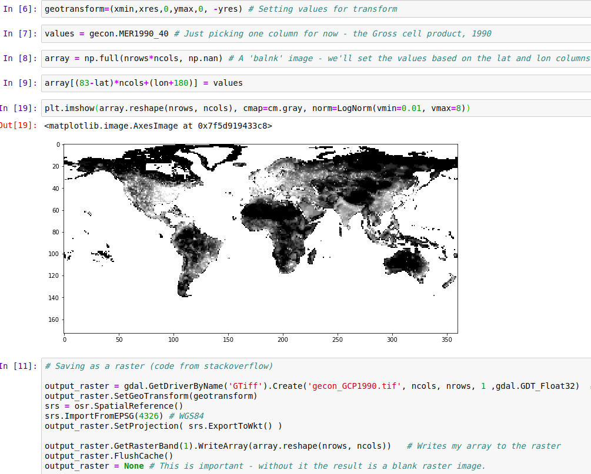
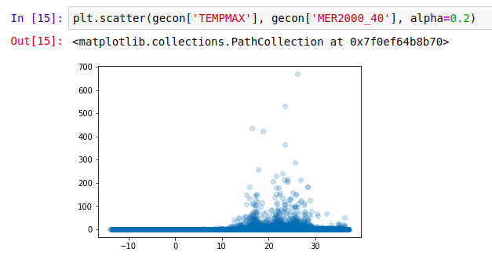
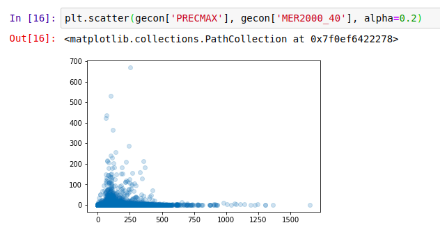
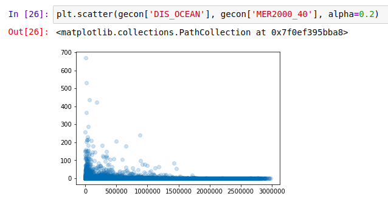
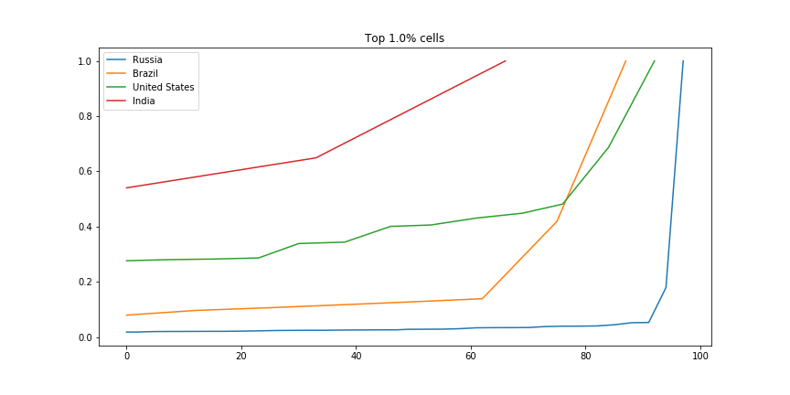

This is the first 'data glimpse' - a short exploration of an existing dataset, with code and examples showing some of the ways the data can be used. For today's glimpse, I'll be playing with the 'G-Econ' dataset \[1\], as recommended by <jonasmendes> on Pioneer. This dataset looks at economic activity for different locations, as opposed to breaking it down by country. There is data available from 1990, 2000 and 2005, broken down by 'grid cell' (a square one degree wide and one degree high).

Economic Activity by Grid Cell - G-Econ data for 1990

## Loading the data

The data is shared as a Microsoft Excel worksheet \[2\]. There are 27,446 rows, and it's a little overwhelming visually. Spreadsheets aren't my forte, so my first step was to load the data into a Pandas DataFrame in a Jupyter notebook ([available here](https://github.com/johnowhitaker/datasciencecastnet/tree/master/gecon) for anyone who wants to follow along). With the data ready, I set out on the most obvious task: showing the data as a map. A few minutes of StackOverflow later, we have a visual and a GeoTiff file that can be opened in mapping software such as QGIS:

## Asking questions

Because the data is aggregated by location (as opposed to population), it can answer some interesting questions. How does economic output vary with temperature or rainfall? How 'centralized' is industry in different regions? What's the deal with all that $$$ hugging the coastlines? Let's dig in.

#### Environmental Factors

First up, the effect of temperature:

Not much gets done where it's cold, it seems

What about rainfall?

Economic Activity (2000) vs max precipitation (mm rainfall)

And finally, distance to the ocean:

Coasts are the place to be?

It appears that the most productive places are those where people like to be: accessible, not too hot, not too dry but not constantly drenched... A Goldilocks zone for human activity. The data already contains these environmental variables - I highly encourage you to try your own plots, or to read up the more thorough analyses in \[1\].

#### Comparing Countries

There are many ways we could compare countries. A bar plot of average economic activity per grid cell, perhaps, or comparison between the most productive single grid cell in each country. I was interested to see which countries had the most spread. The GIF below shows this dramatically: the top few cells in Russia are responsible for a huge chunk of the economic activity, while India has much more of a spread:

Scaled fraction of the total economic activity in four countries.

For the code, see the [GitHub repository](https://github.com/johnowhitaker/datasciencecastnet/tree/master/gecon) associated with this post.

## Conclusions

I hope you've enjoyed this quick, informal look at a fun dataset. I'm planning on doing more of these 'Data Glimpse' posts, since they take less time than a full write-up. The trade-off is that quality is lower, since I'm not going to invest time into perfectly labelled axes, long explanations or extra figures. Let me know what you think about this plan!

References:  
\[1\] - Nordhaus, W., Azam, Q., Corderi, D., Hood, K., Victor, N.M., Mohammed, M., Miltner, A. and Weiss, J., 2006. The G-Econ database on gridded output: Methods and data. _Yale University, New Haven_, _6_.References:  
\[2\] - [https://gecon.yale.edu/data-and-documentation-g-econ-project](https://gecon.yale.edu/data-and-documentation-g-econ-project) (accessed June 2019)
