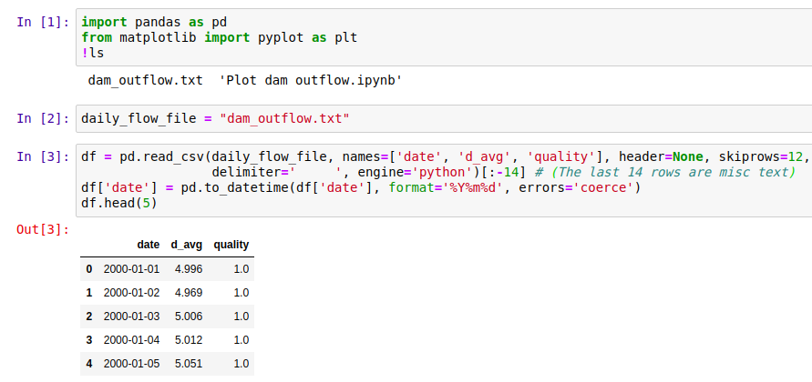

South Africa's Department of Water Affairs (DWA) makes all kinds of data publicly available through their data portal: [http://www.dwa.gov.za/hydrology/](http://www.dwa.gov.za/hydrology/). The download interface is a little clunky, but simple once you get the hang of it. This short post will take a look at some typical data, and list some of the ways this could be used in the future.

The DWA website, after selecting 'Verified data'.

Most of the data comes from monitoring stations, each of which is assigned a unique ID. The easiest way to find stations in your area of interest is via the 'Station Catalogue' link visible in the above screenshot. Stations are typically a depth measure in a dam or river.

With a station chosen, the next step is to specify the date range and type of data you'd like to download. The available dates and information are listed in the Station Catalog. I picked a station in the Pongola river system, and saved the data file generated by the website as 'daily\_flows.txt'. This is a text file with variables separated by whitespace, and can be loaded into a pandas dataframe for analysis as follows:

Loading the data.

With the data thus loaded, it's fairly easy to pot the flow over a given year, or calculate monthly averages. Here's a plot showing the daily flow rate out of Jozini dam in 2018. Note that the graph has many flat areas - this is because this is a managed flow, with the amount of water released from the dam regulated by local authorities (somewhat badly, in this case \[2\]).

A plot of the daily flow rate.

A notebook showing more plots and an example of re-sampling for yearly averages is available [here](https://github.com/johnowhitaker/datasciencecastnet).

So what can you do with this data? Here are some ideas (let me know if you'd like to see any as future posts):  
\- Get dam level data for dams all over South Africa and and animate the levels over time, to illustrate the recent drought and the (alarming) longer trend.  
\- Use the data to learn hydrodynamic modelling (see \[1\])  
\- Combine with rain data to see how watershed capture has changed with agriculture and land use change  
\- Look for the change in river flows after new projects (dams, diversions and so on)

I hope you've enjoyed this brief glimpse at some fun data. Please let me know if you do something with this, or if you have some data that you'd like featured.

References:  
\[1\] - Birkhead, A.L., Brown, C.A., Joubert, A.R., Singh, A. and Tlou, T., 2018. The Pongola Floodplain, South Africa–Part 1: Two-dimensional hydrodynamic modelling in support of an environmental flows assessment. Water SA, 44(4), pp.731-745.

\[2\] - Lanyi, Shira. 2018. “Paradise Lost: The Struggle to Preserve the Pongola River and its Inhabitants.” Open Rivers: Rethinking Water, Place & Community, no. 11. http://editions.lib.umn.edu/openrivers/article/paradise-lost/.
