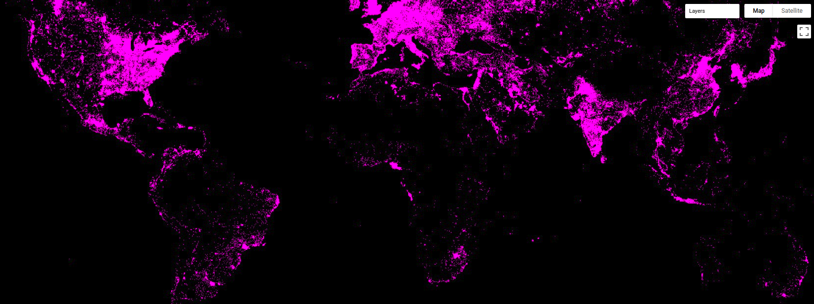

This 'Data Glimpse' post will look at the Global Radiance-Calibrated Nighttime Lights [dataset](https://developers.google.com/earth-engine/datasets/catalog/NOAA_DMSP-OLS_CALIBRATED_LIGHTS_V4) \[1\], available through Google Earth Engine. However, the method shown here can be used with any Raster data source. To avoid repetition, I'll refer back to this post any time I aggregate raster data over a shapefile.

### The Data

The dataset is a collection of images from different years showing nighttime lights all over the globe. This information can be used to see where people are \[2\] and estimate measures such as economic activity in an area \[3\]. They have been used in some great research estimating the Global Human Footprint and highlighting the last wild places on earth \[4\].

Nighttime lights displayed in GEE

Each image contains two bands: 'avg\_vis', which is the measure of illumination, and 'cf\_cvg' describing cloud cover (used as a data quality metric).

### Aggregating the Data by Region

Instead of a large raster image, we might want to aggregate the data by region. For example, we might want to look at how the amount of light visible at night in National Parks has changed over time. To get the data in the form that we want, we first need to define the regions that we're interested in. [This script](https://code.earthengine.google.com/d82fba85f9bed557fd58c650cb7a38cd) that I made to illustrate the idea uses a landuse map of Zimbabwe as an example, but one could just as easily use Country outlines or draw a region with the 'Draw a shape' tool in GEE.

With the input region(s) defined, the key step is to use the `reduceRegions` function to add properties to each feature (area) that summarize the underlying raster. For example, with an image of nighttime illumination in the year 2000 called 'lights\_2000' and the landuses map, we can add the mean illumination in each area with `var landuse_with_lights = lights_2000.reduceRegions(landuses, ee.Reducer.mean());`. The result can be exported as a shapefile or CSV file (see the [script](https://code.earthengine.google.com/d82fba85f9bed557fd58c650cb7a38cd) for details) and displayed or analyses in whatever software you like.

Average nighttime illumination over Zimbabwe

### Change over Time

One of the nice things about this dataset is that it contains values for several different years. I took a look at the data from 2000 and 2010, with the goal of seeing if protected areas (forest lands, national parks etc) had seen an increase in nighttime lights (an indicator that people are moving into these areas). Most protected areas in Zimbabwe had almost no nighttime lights recorded, and those that did show (on average) a drop in the amount of nighttime lights (2010 values are ~20% lower than those for 2000). In the few places where lights had increased, the increase seems to be due to safari camps rather than encroachment from neighboring districts. The data can't tell the whole story, and poor coverage plus the relative dimness of firelight might mean that some encroachment is missed, but it was encouraging to see that the wilderness areas are still largely dark and empty - just the way they should be.

### References

\[1\] - https://developers.google.com/earth-engine/datasets/catalog/NOAA\_DMSP-OLS\_CALIBRATED\_LIGHTS\_V4  
\[2\] - Elvidge, C.D., Imhoff, M.L., Baugh, K.E., Hobson, V.R., Nelson, I., Safran, J., Dietz, J.B. and Tuttle, B.T., 2001. Night-time lights of the world: 1994–1995. ISPRS Journal of Photogrammetry and Remote Sensing, 56(2), pp.81-99. 
\[3\] - Wu, J., Wang, Z., Li, W. and Peng, J., 2013. Exploring factors affecting the relationship between light consumption and GDP based on DMSP/OLS nighttime satellite imagery. Remote Sensing of Environment, 134, pp.111-119. 
\[4\] - Sanderson, E.W., Jaiteh, M., Levy, M.A., Redford, K.H., Wannebo, A.V. and Woolmer, G., 2002. The human footprint and the last of the wild: the human footprint is a global map of human influence on the land surface, which suggests that human beings are stewards of nature, whether we like it or not. BioScience, 52(10), pp.891-904.
