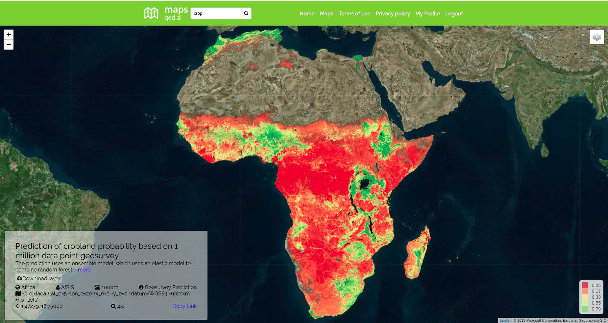

The point of this Data Glimpse post is to feature a wonderful yet badly publicized data source: [https://maps.qed.ai/](https://maps.qed.ai/). Using crowd-sourced data, they built really accurate maps of fields and settlements for the whole of Africa. They also make related spatial layers available (Enhanced Vegetation Index for different years, soil metrics etc). Their focus is "data systems and AI for health and agriculture". The soil maps draw heavily on the AfSIS project, which makes the data from thousands of soil samples available ([https://www.isric.org/projects/africa-soil-information-service-afsis](https://www.isric.org/projects/africa-soil-information-service-afsis)).

The maps.qed.ai interface showing cropland probability

The QED maps interface makes it really easy to download all the available maps at 1km resolution. I'm not going to do any further analysis in this post - these maps are useful without modification, and it was really interesting for me to see the distribution of agriculture in Africa. The cropland probability map will be making an appearance in the next post.
