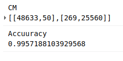
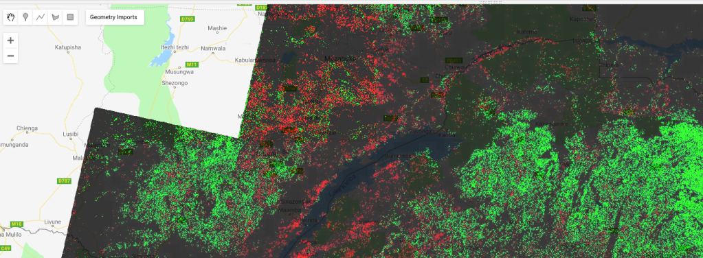

I'm going to be working on a project that will ultimately require manually outlining tobacco fields in Zimbabwe. To help locate potential fields, it would be nice to have a model that can predict whether a giver area contains cropland. To train such a model required labeled fields - a chicken and egg scenario that should have me resigned to hours of manual work. But I much prefer not to do things if I can possibly get a computer to do it, and this post (along with one or more sequels) will document the ways I've made my life easier, and the lessons learnt in the process.

## Trick #1: Standing on shoulders

I recently encountered a project that already did a lot of the hard work tagging fields all over Africa. Their results (featured in today's [Data Glimpse post](https://datasciencecastnet.home.blog/2019/07/13/data-glimpse-cropland-and-settlement-maps-from-qed-ai/)) look great, but the training data used isn't published. Now, I could just use their published map, but I'm also interested in change over time, while their map is based solely on 2015 data. What if we train a new model on the output of their model? This isn't generally a great idea (since you're compounding errors) but it might be good enough for our purposes.

Satellite image (left) and my predicted cropland (right, in red)

In Google Earth Engine (script available here), I created a composite image from Landsat 8 images taken in 2015, including NDVI, band values from a greenest-pixel composite and band values from late in the year (planting season for most crops). This is to be the input to out model. I then sampled 2500 points, recording the inputs (the bands of the composite image) and the desired output (the cropland probability made available by the qed.ai team). This data was used to train a random forest model (framing the task as a classification problem) and the predictions compared to the predictions from the QED data. The result: 99% accuracy.

Confusion matrix and accuracy

What does this accuracy figure mean? How is it so high? It's less astonishing when we look more deeply. This is a model, the same type as that used by the QED team, with roughly the same inputs. It isn't surprising that it can quickly replicate the decision function so accurately. It's highly unlikely that it's this accurate when compared to the ground truth. But we can say the following: we now have a model that is very similar to that used by the QED team to predict cropland probability for the year 2015.

## Now what? Looking at change over time

The model takes landsat 8 image data as it's inputs. It was trained on 2015 data, but there is no reason why we can't make predictions based on other years, and see where these predictions differ from the 2015 ones. Subtracting two years' predictions gives a difference image, shown below for 2015 - 2018. Red indicated areas where cropland is predicted in 2018 and not 2015 (new cropland). Black and green are areas where the model predicts no change or less cropland in 2018.

Difference Image (2018). Potential new cropland shown in red.

I don't want to trust this model too much, but if nothing else this shows some areas where there **might** be fields that have appeared in the last few years. I now have a much better idea where to look, and where to dig deeper with manual inspection of images from different years.

## Conclusions and next steps

This sets the scene for my next steps: manually outlining fields, differentiating between different crop types, training an improved model, adding more inputs... Stay tuned for part 2.
