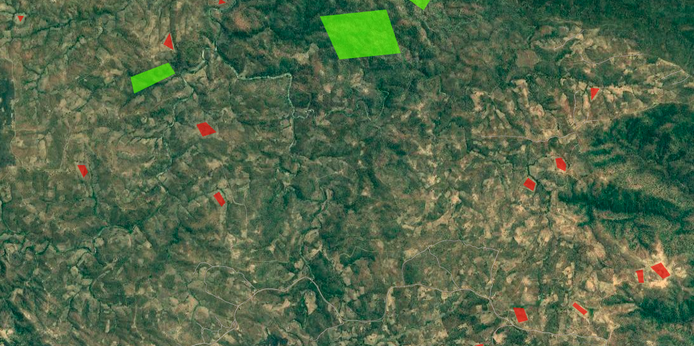

In [Part 1](https://datasciencecastnet.home.blog/2019/07/14/mapping-change-in-cropland-in-zimbabwe-part-1/), I showed a quick way to get a model that predicts cropland extent, using someone else's model as a starting point. This was a fun exercise, but in today's post I'd like to show a more conventional approach to achieve the same goal, and then use that to track change in land cover over time within a region.

## Training Data

This time, we'll generate training data manually. For convenience, I'm changing the goalposts slightly: in this post, we'll be making a simple model to distinguish between open land (fields, grassland, bare earth) and woodland. In the area of interest, this pretty much covers all the bases. Collecting data is a simple but laborious process - examples of each class are outlines in Google Earth Engine and saved as two separate FeatureCollections:

Some open areas (red) and woodland (green) manually outlined for training.

## Modelling

We've covered modelling in GEE before, so I won't go into details here. Sentinel 2 imagery is used, and I pretty much followed the [docs](https://developers.google.com/earth-engine/classification) to create a classifier and then apply it to the input image over the whole area. The model is fairly accurate, and a quick visual double-check confirms that it's doing a good job of making the open areas:

Open area masked (left) vs input image (right)

## Change over time

By choosing fields and wooded areas for training that have been present for decades, we can use the same training data to build models on imagery from different years. To track change in open land area, we can make a prediction for each year and sum the area that is classified as 'open land' with the following code snippet:

Getting the total area classified as open land over an ROI (ward 8)

For my ROI, the total open land trends steadily upwards. For dates earlier than 2015, I used Lnadsat 7 imagery as the input. From 2015 to 2018, Sentinel 2 Imagery was used as well as Landsat for comparison. In some years (2010 and 2018/19) there were enough cloudy images that I combined two years for the estimate. Some of the Landsat 7 imagery isn't the best quality, and there are some issues with this approach that mean I wouldn't trust the figures to be incredibly accurate. BUT, we've accomplished our goal: the figures show the change in land cover over time:

## Conclusion

I hope this inspires you to try something like this for yourself, in an area that you're interested in. I don't think I'll come back to this topic, although I'll keep working on this project to turn it into something reliable (adding more training data, properly assessing accuracy, incorporating ground-truth data to verify etc etc). This post also marks the end of the Pioneer project mentioned [here](https://datasciencecastnet.home.blog/2019/06/19/pioneer-tournament-has-begun/). My posting schedule will likely slow down, and you can expect some more diverse posts in the near future. Stay tuned!
