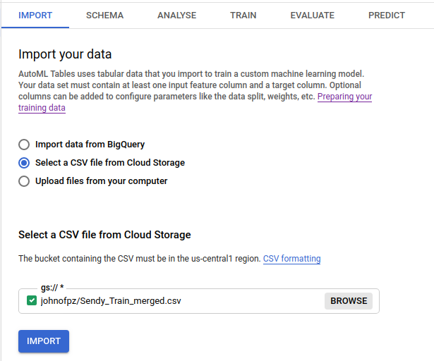
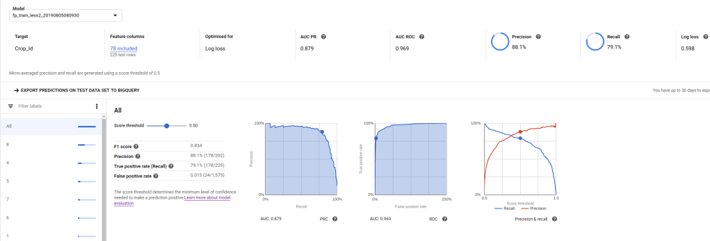
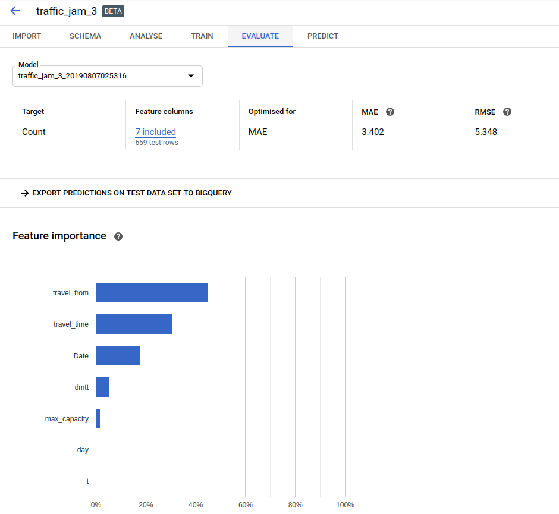

Some students had asked me for my opinion on automated tools for machine learning. The thought occurred that I hadn't done much with them recently, and it was about time I gave the much-hyped time savers a go - after all, aren't they going to make data scientists like me redundant?

In today's post, I'll be trying out [Google's AutoML tool](https://cloud.google.com/automl/) by throwing various datasets at it and seeing how well it does. To make things interesting, the datasets I'll be using will be from Zindi competitions, letting us see where AutoML would rank on the player leader-board. I should note that these experiments are a learning exercise, and actually using AutoML to win contests is almost certainly against the rules. But with that caveat out the way, let's get started!

## How it works

AutoML (and other similar tools) aims to automate one step of the ML pipeline - that of model selection and tuning. You give it a dataset to work on, specify column types, choose an output column and specify how long you'd like it to train for (you pay per hour). Then sit back and wait. Behind the scenes, AutoML tries many different models and slowly optimizes network architecture, parameters, weights... essentially everything one could possibly tweak to improve performance gets tweaked. At the end of it, you get a (very complicated) model that you can then deploy with their services or use to make batch predictions.

The first step with AutoML tables - Importing the data.

The resultant models are fairly complex (mine were ~1GB each fully trained) and are not something you can simply download and use locally - you must deploy them via Google (for an extra fee). This, coupled with the cost of training models, makes it fairly expensive to experiment with if you use up your trial credits - so use them wisely.

Fortunately, there are other ways to achieve broadly the same result. For example, AutoKeras. Read more about that [here](https://towardsdatascience.com/autokeras-the-killer-of-googles-automl-9e84c552a319).

## Experiment 1: Farm Pin Crop Detection

This competition involves a classification problem, with the goal being to predict which crop is present in a given field. The training data is provided as field outlines and satellite images - not something that can effortlessly slot into AutoML tables. This meant that the first step was to sample the image bands for the different fields, and export the values to a CSV files for later analysis (as described in [this post](https://datasciencecastnet.home.blog/2019/06/27/tutorial-improving-crop-type-predictions/)). This done, I uploaded the resultant training file to cloud storage, selected the table, chose my input and output columns and hit go.

AutoML 'Evaluate' tab showing model performance.

The scoring metric for this competition is log loss. My previous best (using the same training data to train a random forest model) scored around 0.64 (~20th on the leaderboard). So a score of <0.6 looked promising. I uploaded the test set, hit predict and then manually cleaned up the output to match the submission format for Zindi. Score? **0.546, putting me in 12th place.** No feature engineering besides sampling some satellite images, no manual tweaking of model parameters.... not bad!

I was quite pleased with this result. I enjoy the feature engineering side of things, but the tedium of hyper-parameter tuning is less appealing to me. If this tool can magically let me skip that step, it's a win in my book! I may re-visit this with some added features, information from more images and perhaps a trick or two to enlarge the training set.

## Experiment 2: Traffic Jam

Spurred on by the first success, I turned to the Traffic Jam competition since I still had the dataset on my laptop. This was a regression problem, with the goal being to predict the number of tickets sold for a given trip into Nairobi. The training data was fairly sparse, with only ~2000 rows to work from. Still, I figured it was worth a shot and threw a few node hours worth of Google-managed ML magic at the problem.

An MAE of 3.4, hypothetically equivalent to ~3rd place!

The evaluation results had me excited - and MAE of 3.4 would have placed the model in third place had the competition remained open. I hastily uploaded the predictions to Zindi, to see the score of... 5.3 (160th place). Now, I might be missing some glaring error in the way I formatted predictions for upload, but I suspect that the issue is with AutoML. It's not really designed for such small datasets. From the website: "Depending on how many features your dataset has, 1,000 rows might not be enough to train a high-performing model." The impressive MAE shown in the results tab is for one particular test set, and it seems that for the Zindi test set we were simply not as lucky. Another potential factor: The random test set will have sampled from the same date range as the training data, whereas the Zindi test set was for a different time period. In cases like this, a non-shuffled test/train split can be a better indicator of true performance.

So, we've learnt something new! The magic tool isn't magic, and just like any other method it needs good training data to make good predictions.

## Experiment 3: Sendy

I couldn't resist trying it out once more on the newly launched Sendy Competition. I merged the Riders info into the train and test sets, uploaded the data, gave it an hour of training time and set it going. The goal is to minimize RMSE when predicting travel time between two locations (for deliveries). I also did some modelling myself while I waited for the AutoML training to finish.

Scores (RMSE for predicted time in seconds)  
My first attempt (Catboost on provided data): 734 (7th place when this post was written)  
First place: 721  
Google AutoML: **724 (4th place until I convince them to remove my latest entry**)

Not too shabby! To me, one of the great uses of a tool like this is to give a ballpark for what a good model looks like. Without the Zindi leaderboard, I wouldn't have a way to gauge my model performance. Is it good? Could it get better with the same data? Now I can compare to the AutoML, using it as a 'probably close to best' measure.

## Where next?

These quick tests have convinced me that these automated tools can be a useful part of my workflow, but are not a complete replacement for manual experimentation, exploration, feature engineering and modelling. I intend to play around more with AutoML and other tools in the near future, so stay tuned for a continuation of this series.
