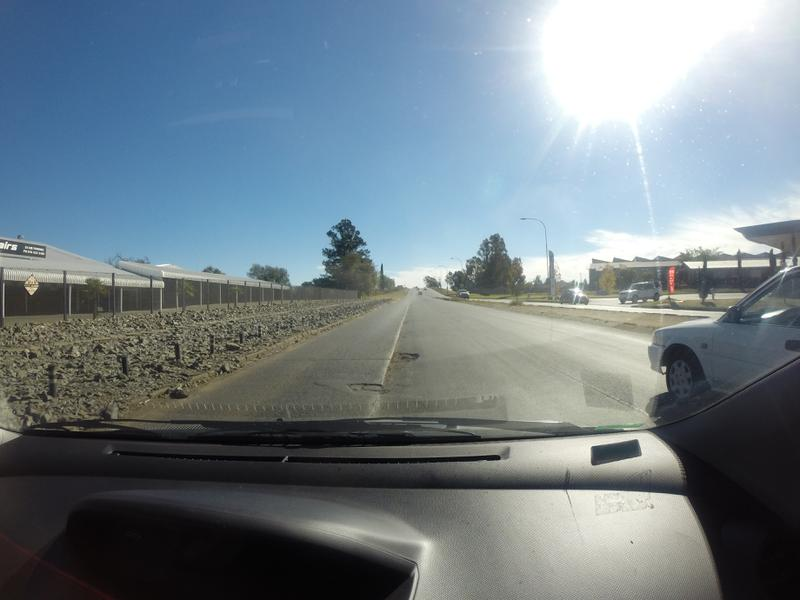
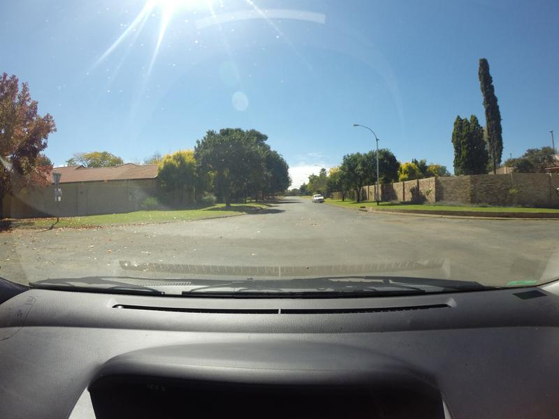
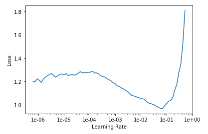
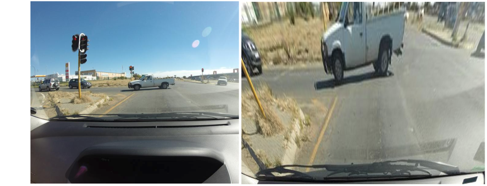
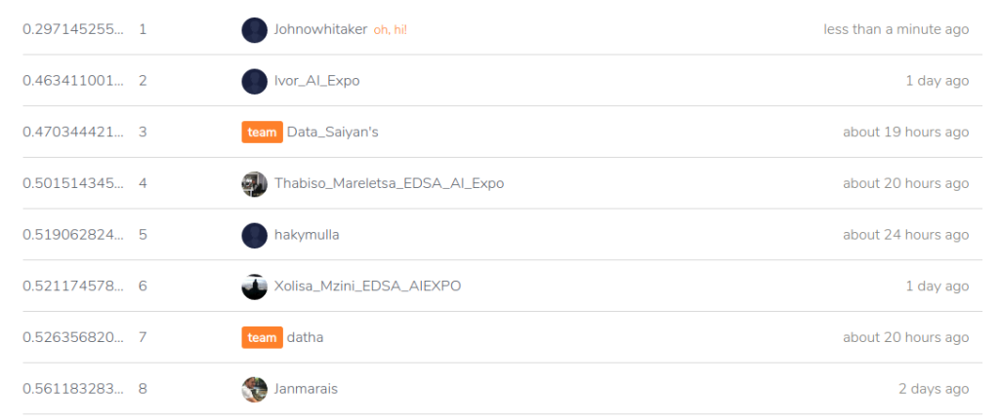

This week saw folks from all over the AI space converge in Cape Town for the AI Expo. The conference was inspiring, and I had a great time chatting to all sorts of interesting people. There were so many different things happening (which I'm not going to cover here), but the one that led to this post was a hackathon run by Zindi for their most recent Knowledge competition: the [MIIA Pothole Image Classification Challenge](https://zindi.africa/competitions/miia-pothole-image-classification-challenge). This post will cover the basic approach used by many entrants (thanks to Jan Marais' excellent starting notebook) and how I improved on it with a few tweaks. Let's dive in.

## The Challenge

The dataset consists of images taken from behind the dashboard of a car. Some images contain potholes, some don't - the goal is to correctly discern between the two classes. Some example pictures:

- 
    
- 
    
- 
    
- 
    
- 
    

Train and test data were collected on different days, and at first glance it looks like this will be a tough challenge! It looks like the camera is sometimes at different angles (maybe to get a better view of potholes) and the lighting changes from pic to pic.

## The first solution

Jan won a previous iteration of this hackathon, and was kind enough to share a starting notebook (available [here](https://github.com/cortexlogic/PotHoleDetection)) with code to get up and running. You can view the notebook for the full code, but the steps are both simple and incredibly powerful:

- Load the data into a 'databunch', containing both the labeled training data and the unlabeled test data. Using 15% of the training data as a validation set. The images are scaled to 224px squares and grouped into batches.

The images are automatically warped randomly each time (to make the model more robust). This can be configured, but the default is pretty good.

- Create a model: `learn = cnn_learner(data, resnet18, metrics=accuracy)`. This single line does a lot! It downloads a pre-trained network (resnet18) that has already been optimised for image classification. It reconfigures the output of that network to match the number of classes in our problem. It links the model to the data, freezes the weights of the internal layers, and gives us a model ready for re-training on our own classes.
- Pick a learning rate, by calling `learn.lr_find()` followed by `learn.recorder.plot()` and picking one just before the graph bottoms out (OK, it's more complicated than that but you can learn the arcane art of lr optimization elsewhere)

\*sucks thumb\* A learning rate of 0.05 looks fine to me Bob.

- Fit the model with `learn.fit_one_cycle(3, lr)` (Change number of epochs from 3 to taste), make predictions, submit!

There is some extra glue code to format things correctly, find the data and so on. But this is in essence a full image classification workflow, in a deceptively easy package. Following the notebook results in a log-loss score of ~0.56, which was on par with the top few entries on the leaderboard at the start of the hackathon. In the starter notebook Jan gave some suggestions for ways to improve, and it looks like the winners tried a few of those. The best score of the day was Ivor (Congrats!!) with a log-loss of 0.46. Prizes were won, fun was had and we all learned how easy it can be to build an image classifier by standing on the shoulders of giants.

## Making it better

As the day kicked off, I dropped a few hints about taking a look at the images themselves and seeing how one could get rid of unnecessary information. An obvious answer would be to crop the images a little - there aren't potholes in the dashboard or the sky! I don't think anyone tried it, so let's give it a go now and see where we get. One [StackOverflow page](https://stackoverflow.com/questions/14177744/how-does-perspective-transformation-work-in-pil/14178717) later, I had code to crop and warp an image:

Before and after warping. Now the road is the focus, and we're not wasting effort on the periphery.

I ran my code to warp all the images and store them in a new folder. Then I basically re-ran Jan's starting notebook using the warped images (scaled to 200x200), trained for 5 epochs with a learning rate of 0.1, made predictions and.... **0.367** \- straight to the top of the leader-board. The image warping and training took 1.5 hours on my poor little laptop CPU, which sort of limits how much iterating I'm willing to do. Fortunately, Google Colab gives a free GPU, cutting that time to a few minutes.

## Conclusions

My time in the sun

Thanks to Google's compute, it didn't take long to have an even better model. I leave it to you dear readers to figure out what tweaks you'll need to hop into that top spot.

My key takeaway from this is how easy it's become to do this sort of thing. The other day I found code from 2014 where I was trying to spot things in an image with a kludged-together neural network. The difference between that and today's exercise, using a network trained on millions of images and adapting it with ease thanks to a cool library and a great starting point... it just blows my mind how much progress has been made.

Why are you still reading this? Go enter the competition already! :)
