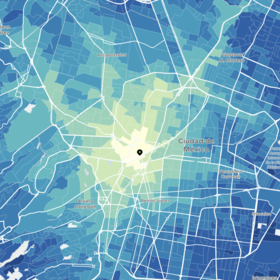
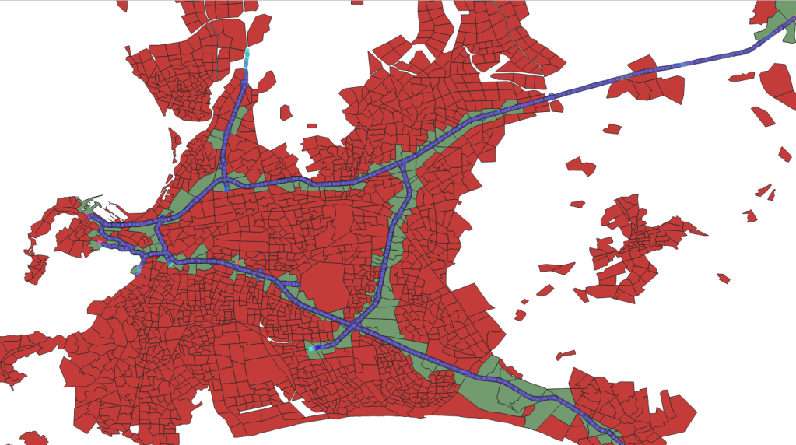
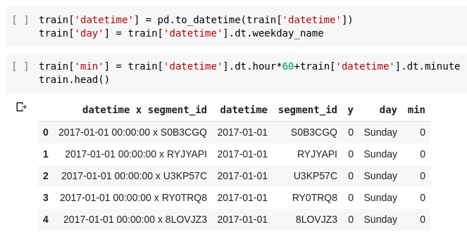

Welcome to the first in a three-part series on Zindi's Uber Movement SANRAL Cape Town Challenge. This tutorial will take a look at the challenge, start exploring the data and show how to fit a quick model and get a score on the leaderboard. Part two will add in some extra features and a more complex model, and part 3 will run through some GIS tricks to further augment the data and improve our accuracy.

Follow along with this post using [this notebook](https://colab.research.google.com/drive/1HjJhghj2b5JJnOFNTcojLfAicDf5QWWK).

## The Challenge

This aim of this competition is to predict where road incidents in Cape Town are likely to happen next. It's interesting for a few different reasons:  
1) Traffic incidents are rare - so rare the odds of one happening on a 500m stretch of road in a given hour (which is how Zindi has framed the problem) are always going to be low enough that 'no incident' is the most likely outcome. If the metric was accuracy, predicting all 0s would probably be your best bet. However, incidents do occur! And the chosen metric (F1 score) means that you'd better predict some incidents or you'll score 0. More on this later.  
2) It's spatial. We can treat this like any other supervised learning problem (with some data shaping) but these events are all located on a road grid that exists in the real world. Segments have positions, and lead into other segments. There are intersections, corners, different lanes.... Some GIS knowledge could give you an edge here (or you could wait for part 3!)

So, we need to create a model that can predict how likely it is that there will be an incident on a given stretch of road at a given time. Then we need to use that likelihood to choose some segments where we thing the chances of an incident are highest. And then we make submissions and hope we get a good score :) Where do we start? Let's take a look at the data.

## The data

The different road segments

The roads along which events have been recorded have been divined into segments, each roughly 500m long (lengths vary). The events themselves each have a latitude and longitude associated with them, and have been tagged with the segment id of the nearest road segment. Due to map inaccuracies, the events don't always line up exactly with the road network.

Events (blue) not quite aligned with road segments.

The main input file is 'train.csv', which contains the individual events. The submission requires grouping these into segments and making hourly predictions, so some re-shaping is required (see [the notebook](https://colab.research.google.com/drive/1HjJhghj2b5JJnOFNTcojLfAicDf5QWWK)).

train.csv - the base on which we'll build

Extra data includes a shapefile of the road segments themselves. This shows the segments but also includes extra info like the umber of lanes, road name etc. There is also Uber Movenet data with travel times between different zones withing the city. In part 3 we'll look more at this.

Uber movement zones (red) with those along the road segments selected (green).

Finally, there is the data from SANRAL and the option to add weather data. Initially, the SANRAL data was only provided for the training period (since the worry was that it would give too much away). It has since been updated to include all dates covered - making it much more useful.

## Adding some features

We're looking at each segment, for each hour. What kinds of features can we add that could help us create a model? The other data sources contain some useful info (as we'll see in the following posts) but even with just train.csv we can start building up some info to work with. For example, we can derive day of the week, time, month etc from the datetime - all of which likely influence the incident rate.

Adding some date-related variables

We can also get the rough locations of the segments by looking at the locations of the incidents within them:

Adding location columns

There's plenty more, but for now let's fit a model and make some predictions.

## Modelling

I went with CatBoost as a starting model. Good performance, reasonable handling of imbalanced data and it saves us having to fiddle with categorical columns. We specify the input and output columns, create a CatBoostClassifier and throw our data at it:

First model

In the notebook, you'll see me scoring the model with log-loss to see if it's better than random predictions or predicting the mean. Even though it isn't the metric Zindi is using, it'll help us pick the best out of several models. Then I try F1 score, and we see our first little hitch: the model scores 0 (bad) on the test set. What's up? It's predicting all 0s, as any good model would.

## F1 scores, thresholds and classification vs prediction

Looking at the model's predicted probabilities, we see the issue - values range from ~0 to ~0.2. If we were gunning for classification accuracy, we'd go with 0 if the probability is this low. BUT, here we're not going for absolute classifications, we're aiming for predictions of which segments are most likely. A good article on the difference [here](https://www.fharrell.com/post/classification/). So how do we fix this?

One approach is by picking a threshold and predicting 1s where it is exceeded. In the notebook, I show that predicting 1s if the probability is >0.05 gets a better f1 score. Of course, there are experimental or theoretical ways to get this threshold correct (see [this paper](https://arxiv.org/abs/1402.1892) for eg) but trying a few different values and guessing was my lazy approach :)

Another option is to mess about with the class\_weights parameter. I followed the advice in the docs, and got roughly the same score as I had with the threshold method.

Tip from the CatBoost documentation

## Making a submission

So, we have a model that predicts probabilities, and a threshold above which we'll predict a one. All that's left is to transform our sample submission dataframe the same way we did with train - adding time and location columns. Then we feed it through our model, save and submit!

Making predictions

This model scores around 0.036 on the leader-board (10'th place since the contest is still new). At this stage, you could go into Zindi competition mode and start tweaking every possible model parameter to up your score slightly, but the real value will be in getting more than just some date-related columns to work with. We''l get to that - for now, take a look [my starting notebook](https://colab.research.google.com/drive/1HjJhghj2b5JJnOFNTcojLfAicDf5QWWK), play around, get on that leaderboard and stay tuned!
