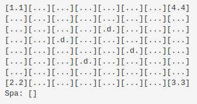

I'm going to be exploring the world of Reinforcement Learning. But there will be no actual RL in this post - that's for part two. This post will do two things: describe the game we'll be training our AI on, and show how I developed it using a tool called NBDev which is making me so happy at the moment. Let's start with NBDev.

## What is NBDev?

Like many, I started my programming journey editing scripts in Notepad. Then I discovered the joy of IDEs with syntax highlighting, and life got better. I tried many editors over the years, benefiting from better debugging, code completion, stylish themes... But essentially, they all offer the same workflow: write code in an editor, run it and see what happens, make some changes, repeat. Then came Jupyter notebooks. Inline figures and explanations. Interactivity! Suddenly you don't need to re-run everything just to try something new. You can work in stages, seeing the output of each stage before coding the next step. For some tasks, this is a major improvement. I found myself using them more and more, especially as I drifted into Data Science.

But what about when you want to deploy code? Until recently, my approach was to experiment in Jupyter, and then copy and paste code into a separate file or files which would become my library or application. This caused some friction - which is where [NBDev](http://nbdev.fast.ai/) comes in.

\~~~~~ **"Create delightful python projects using Jupyter Notebooks**" - _NBDev website_ ~~~~~

With NBDev, everything happens in your notebooks. By adding special comments like `#export` to the start of a cell, you tell NBDev how to treat the code. This means you can write a function that will be exported, write some examples to illustrate how it works, plot the results and surround it with nice explanations in markdown. The exported code gets paces in a neat, well-ordered .py file that becomes your final product. The Notebook(s) becomes documentation, and the extra examples you added to show functionality work as tests (although you can also add more formal unit testing). An extra line of code uploads your library for others to install with pip. And if you're following their guide, you get a documentation site and continuous integration that updates whenever you push your changes to GitHub.

The upshot of all this is that you can effortlessly create good, clean code and documentation without having to switch between notebooks, editors and separate documentation. And the process you followed, the journey that lead to the final design choices, is no longer hidden. You can show how things developed, and include experiments that justify a particular choice. This is 'literate programming', and it feels like a major shift in the way I think about software development. I could wax lyrical about this for ages, but you should just go and read about it in [the launch post here](https://www.fast.ai/2019/12/02/nbdev/).

## What on Earth is Swoggle?

Christmas, 2019. Our wedding has brought a higher-than-normal influx of relatives to Cape Town, and when this extended family gets together, there are some things that are inevitable. One of these, it turns out, is the invention of new games to keep the cousins entertained. And thus, Swoggle was born :)

A Swoggle game in progress - 2 players are left.

The game is played on an 8x8 board. There are usually 4 players, each with a base in one of the corners. Players can move (a dice determines how far), "spoggle" other players (capturing them and placing them in "swoggle spa" - none of this violent termnology) or 'swoggle' a base (gently retiring the bases owner from the game - no killing here). To make things interesting, there are four 'drones' that can be used as shields or to take an occupied base. Moving with a drone halves the distance you can travel, to make up for the advantages. A player with a drone can't be spoggled by another player unless they too have a drone, or they 'powerjump' from their base (a half-distance move) onto the droned player. Maybe I'll make a video one day and explain the rules properly :)

So, that's the game. Each round is fairly quick, so we usually play multiple rounds, awarding points for different achievements. Spoggling (capturing) a player: 1 point. Swoggling (taking out a base): 3 points. Last one standing: 5 points. The dice rolls add lots of randomness, but there is still plenty of room for tactics, sibling rivalry and comedic mistakes.

## Game Representation

If we're going to teach a computer to play this, we need a way to represent the game state, check if moves are valid, keep track of who's in the swoggle spa and which bases are still standing, etc. I settled on something like this:

Game state representation

There is a `Cell` in each x, y location, with attributes for player, drone and base. These cells are grouped in a `Board`, which represents the game grid and tracks the spa. The `Board` class also contains some useful methods like `is_valid_move()` and ways to move a particular player around. At the highest level, I have a `Swoggle` class that wraps a board, handles setting up the initial layout, provides a few extra convenience functions and can be used to run a game manually or with some combination of agents (which we'll cover in the next section). Since I'm working in NBDev, I have some docs with almost no effort, so check out [https://johnowhitaker.github.io/swoggle/](https://johnowhitaker.github.io/swoggle/) for details on this implementation. Here's what the documentation system turned my notebooks into:

Part of the generated documentation

The ability to write code and comments in a notebook, and have that turn into a swanky docs page, is borderline magical. Mine is a little messy since this is a quick hobby project. To see what this looks like in a real project, check out the [docs for NBDev itself](https://dev.fast.ai/) or [Fastai v2](https://dev.fast.ai/).

## Creating Agents

Since the end goal is to use this for reinforcement learning, it would be nice to have an easy way to add 'Agents' - code that defines how a player in the game will make a move in a given situation. It would also be useful to have a few non-RL agents to test things out and, later, to act as opponents for my fancier bots. I implemented two types of agent:

- `RandomAgent` Simply picks a random but valid move by trial and error, and makes that move.
- `BasicAgent` Adds a few simple heuristics. If it can take a base, it does so. If it can spoggle a player, it does so. If neither of these options are possible, it moves randomly.

You can see the agent code [here](https://github.com/johnowhitaker/swoggle/blob/master/01_ai.ipynb). The notebook also defines a few other useful functions, such as `win_rates()` to pit different agents against each-other and see how they do. This is fun to play with - after a few experiments it's obvious that the board layout and order of players matters a lot. A `BasicAgent` going last will win ~62% of games against three `RandomAgents` - not unexpected. But of the three `RandomAgents`, the one opposite the `BasicAgent` (and thus furthest from it) will win the majority of the remaining games.

## Next Step: Reinforcement Learning!

This was a fun little holiday coding exercise. I'm definitely an NBDev convert - I feel so much more productive using this compared to any other development approach I've tried. Thank you Jeremy, Sylvain and co for this excellent tool!

Now, the main point of this wasn't just to get the game working - it was to use it for something interesting. And that, I hope, is coming soon in Part 2. As I type this, a neural network is slowly but surely learning to follow the rules and figuring out how to beat those sneaky `RandomAgents`. Wish it luck, stay tuned, and, if you're \*really\* bored, `pip install swoggle` and watch some `BasicAgents` battle it out :)
