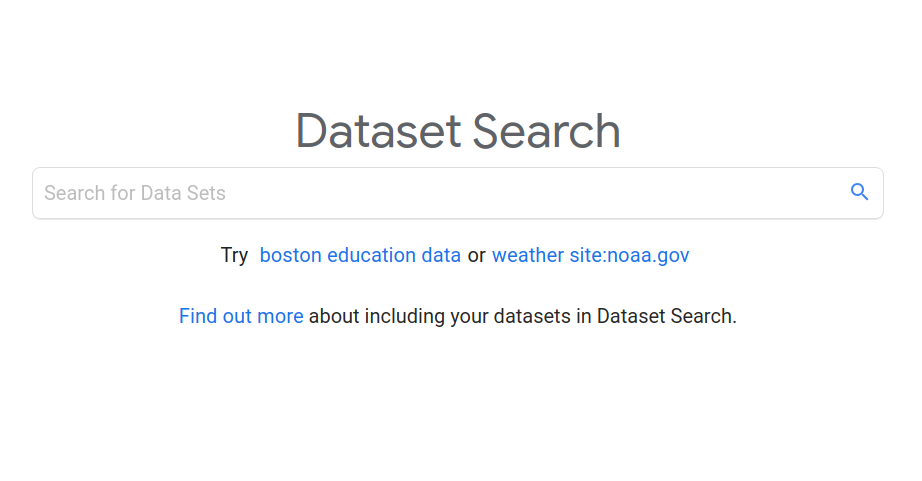
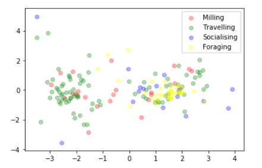

Christmas came in January this year, with Google's release of '[Dataset Search](https://datasetsearch.research.google.com/)'. They've indexed millions of cool datasets and made it easy to search through them. This post isn't about any specific dataset, but rather I just wanted to share this epic new resource with you.

Google's [Dataset Search](https://datasetsearch.research.google.com/)

I saw the news as it came out, which meant I had the pleasure of sharing it with my colleagues - all of whom got [nerd sniped](https://xkcd.com/356/) to some degree, likely resulting a much loss of revenue and a ton of fun had by all :) A few minutes after clicking the link I was clustering dolphin vocalizations and smiling to myself. If you're ever looking for an experiment to write up, have a trawl through the datasets on there and pick one that hasn't got much ML baggage attached - you'll have a nice novel project to brag about.

Clustering Dolphin noises

Say what you like about Google, there are people there doing so much to push research forward. Tools like Colab, Google Scholar, and now Dataset Search make it easy to do some pretty amazing research from anywhere. So go on - dive in :)
