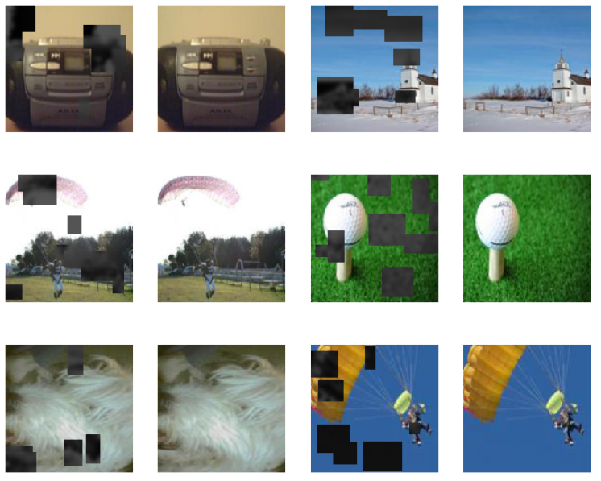
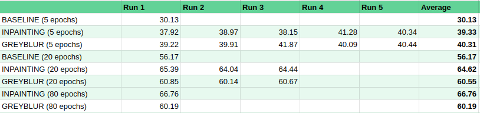

## Intro

Until fairly recently, deep learning models needed a LOT of data to get decent performance. Then came an innovation called transfer learning, which we've covered in some previous posts. We train a network once on a huge dataset (such as ImageNet, or the entire text of Wikipedia), and it learns all kinds of useful features. We can then retrain or 'fine-tune' this pretrained model on a new task (say, elephant vs zebra), and get incredible accuracy with fairly small training sets. But what do we do when there isn't a pretrained model available?

Pretext tasks (left) vs downstream task (right). I think I need to develop this style of illustration - how else will readers know that this blog is just a random dude writing on weekends? :)

Enter Self-Supervised Learning (SSL). The idea here is that in some domains, there may not be vast amounts of labeled data, but there may be an abundance of unlabeled data. Can we take advantage of this by using it somehow to train a model that, as with transfer learning, can then be re-trained for a new task on a small dataset? It turns out the answer is yes - and it's shaking things up in a big way. [This fastai blog post](https://www.fast.ai/2020/01/13/self_supervised/) gives a nice breakdown of SSL, and shows some examples of 'pretext tasks' - tasks we can use to train a network on unlabeled data. In this post, we'll try it for ourselves!

Follow along in [the companion notebook](https://colab.research.google.com/drive/1nyFixKKTC5LOAyFWm-RgpVdIMkY9f1Dc).

## Image网

Read the literature on computer vision, and you'll see that ImageNet has become THE way to show off your new algorithm. Which is great, but coming in at 1.3 million images, it's a little tricky for the average person to play with. To get around this, some folks are turning to smaller subsets of ImageNet for early experimentation - if something works well in small scale tests, \*then\* we can try it in the big leagues. Leading this trend have been Jeremy Howard and the fastai team, who often use [ImageNette](https://github.com/fastai/imagenette) (10 easy classes from ImageNet), [ImageWoof](https://github.com/fastai/imagenette#imagewoof) (Some dog breeds from ImageNet) and most recently [Image网](https://github.com/fastai/imagenette#image%E7%BD%91) ('ImageWang', 网 being 'net' in Chinese).

Image网 contains some images from both ImageNette and ImageWoof, but with a twist: only 10% of the images are labeled to use for training. The remainder are in a folder, `unsup`, specifically for use in unsupervised learning. We'll be using this dataset to try our hand at self-supervised learning, using the unlabeled images to train our network on a pretext task before trying classification.

## Defining Our Pretext Task

A pretext task should be one that forces the network to learn underlying patterns in the data. This is a new enough field that new ideas are being tried all the time, and I believe that a key skill in the future will be coming up with pretext tasks in different domains. For images, there are some options explained well in [this fastai blog](https://www.fast.ai/2020/01/13/self_supervised/). Options include:

- Colorization of greyscale images
- Classifying corrupted images
- Image In-painting (filling in 'cutouts' in the image)
- Solving jigsaws

For fun, I came up with a variant of the image in-painting task that combines it with colorization. Several sections of the input image are blurred and turned greyscale. The network tries to replace these regions with sensible values, with the goal being to have the output match the original image as closely as possible. One reason I like the idea of this as a pretext task is that we humans get something similar. Each time we move our eyes, things that were in our blurry, greyscale peripheral vision are brought into sharp focus in our central vision - another input for the part of our brain that's been pretending they were full HD color the whole time :)  
  
Here are some examples of the grey-blurred images and the desired outputs:

Input/Output pairs for our pretext task, using the RandomGreyBlur transform

We train our network on this task for 15 epochs, and then save its parameters for later use in the downstream task. See the notebook for implementation details.

## Downstream Task: Image Classification

Now comes the fun part: seeing if our pretext task is of any use! We'll follow the structure of the [Image网 leaderboard here](https://github.com/fastai/imagenette#image%E7%BD%91), looking at models for different image sizes trained with 5, 20, 80 or 200 epochs. The theory here is that we'd hope that out pretext task has given us a decent network, so we should get some results after 5 epochs, and keep getting better and better results with more training.

Results from early testing

The notebook goes through the process, training models on the labeled data provided with Image网 and scoring them on the validation set. This step can be quite tedious, but the 5-epoch models are enough to show that we've made an improvement on the baseline, which is pretty exciting. For training runs 20 epochs and greater, we still beat a baseline with no pre-training, but fall behind the current leaderboard entry based on simple inpainting. There is much tweaking to be done, and the runs take ~1 minute per epoch, so I'll update this when I have more results.

## Where Next?

Image网 is fairly new, and the leaderboard still needs filling in. Now is your chance for fame! Play with different pretext tasks (for eg, try just greyscale instead of blurred greyscale - it's a single line of code to change), or tweak some of the parameters in the notebook and see if you can get a better score. And someone please do 256px?  
  
Beyond this toy example, remember that unlabeled data can be a useful asset, especially if labeled data is sparse. If you're ever facing a domain where a pretrained model is unavailable, self-supervised learning might come to your rescue.
