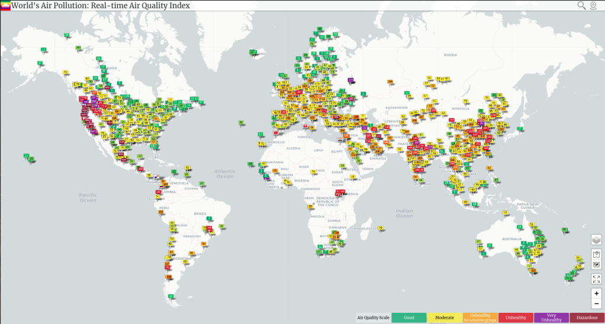

Air quality has been in the news a lot recently. Smoke from fires has had thousands of Californians searching for info around the health hazards of particulate matter pollution. Lockdown-induced changes have shown how a reduction in transport use can bring a breath of fresh air to cities. And a respiratory virus sweeping the globe has brought forward discussions around lung health and pollution, and the health burden associated with exposure to unhealthy levels of pollutants. There are thousands of air quality sensors around the world, but if you view a map of these sensors, it's painfully obvious that some areas are underserved, with a marked lack of data:

Air Quality from sensors around the world. Source: https://waqi.info/

The 'gap in the map' was the motivation for a weekend hackathon hosted through Zindi, which challenged participants to build a model capable of predicting air quality (specifically PM25 concentration) based on available satellite and weather data.

The hackathon was a success, and was enough of a proof-of-concept that we decided to put a little more work into taking the results and turning them into something useful. Myself and Yasin Ayami spent a bit of time re-creating the initial data preparation phase (pulling the data from the Sentinel 5P satellite data collections in Google Earth Engine, creating a larger training set of known air quality readings etc) and then we trained a model inspired by the winning solutions that is able to predict historical air quality with a mean absolute error of less than 20.

Dashboard for exploring air quality across Africa ([http://www.datasciencecastnet.com/airq/](http://www.datasciencecastnet.com/airq/))

A full report along with notebooks and explanation can be found in [this GitHub repository](https://github.com/johnowhitaker/air_quality_prediction). But the good news is that you don't need to re-create the whole process if you'd just like a look at the model outputs - those predictions are available in the repository as well. For example, to get the predictions for major cities across Africa you can download and explore [this CSV file](https://github.com/johnowhitaker/air_quality_prediction/blob/master/Data/results/af_cities_predictions.csv). And if you don't want to download anything, I've also made [a quick dashboard](http://www.datasciencecastnet.com/airq/) to show the data, both as a time-series for whatever city you want to view and as a map showing the average for all the locations.

I've tagged this post as a 'Data Glimpse' since the details are already written up elsewhere :) I hope it's of interest, and as always let me know if you have any questions around this. J.
