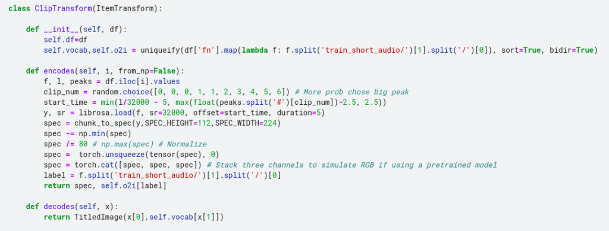
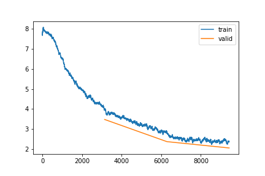

The Cornell Lab of Ornithology run an annual competition to identify bird calls in soundscapes. I decided to have a go at [this year's competition](https://www.kaggle.com/c/birdclef-2021#) to get back into audio classification and try out some new approaches. For this first post I will examine the data, choose methods for picking the right clips within larger recordings and for generating a spectrogram from said clip, and train a simple model to use as a baseline for future experiments.

## Finding the Calls

In many recordings, the bird in question is not calling continuously. The final task involves predicting which birds are calling at 5-second intervals, so that is my chosen input length. If we just sample a random 5-second clip from a full recording, we might end up with a clip in which the bird is not calling - not ideal! To get around this, we compute a sort of signal-to-noise measure (in this case, [PCEN-based SNR as used by the BirdVox project](https://github.com/BirdVox/PCEN-SNR)). With this, we can choose 'peaks' where the calls are most prominent.

Identifying 'peaks' with a high PCEN-based SNR

The code for this is in [my first notebook](https://www.kaggle.com/johnowhitaker/peak-identification). For each train file, we store the location of 20 peaks in a csv file which we will than use during training to select the appropriate clips.

## Preparing the data for modelling

We could try feeding the raw audio data into a model, but 5 seconds of audio represents quite a lot of data. Some models can handle this, but in most cases a better approach is to find a more compressed representation of the sound. In this case I chose a fairly standard approach: the mel spectrogram. A spectrogram looks like a 2D image, with time on the X axis, frequency on the y axis and intensity represented by colour.

An example spectrogram

The model training notebook shows how we set up the dataloaders to read in a specified clip and turn it into a spectrogram that can be fed to the model. This is quite CPU-heavy, which does slow the training down. But I still chose this approach over pre-computing the spectrograms once at the start because it allows for data augmentation such as shifting the window, adding noise etc on the raw audio before it gets converted to a spectrogram.

You can see all the code in the [baseline model notebook](https://www.kaggle.com/johnowhitaker/baseline-model). Taking inspiration from the [pets tutorial](https://docs.fast.ai/tutorial.pets.html), we create our own custom Transform that handles 'encoding' a given clip/label pair, which in turn is used to create our DataLoaders. By adding a 'decodes' method we also enable functionality such as 'show\_batch()'.

## Training

Loss plot over 3 epochs of training

I'm not doing anything fancy for training - our goal here is a simple model to use as a baseline for future tests. A few things I did learn however:

- To be able to access the output of a Kaggle notebook, you have to re-run it by clicking 'save'. This can eat up GPU time, so I have started running my interactive tests with small subsets of the data and then relying on the run triggered by a save to actually do the full training.
- Because this is then running 'in the background', saving any info you need is a must. I use the CSVLogger callback to save the stats after each epoch, and do other things like saving loss plots as pngs. Finally, we save the model itself for future use.
- With this small model and CPU heavy dataloader, running on CPU was only a couple of times slower than on GPU. Wih a bit of patience, one could simply run this overnight rather than using up your weekly GPU quota, saving the GPU goodness for fast iteration when experimenting. In fact after the save failed a few times I ended up switching off the GPU and letting it train on the CPU over 7 or 8 hours.

Again, full code is in [the notebook](https://www.kaggle.com/johnowhitaker/baseline-model). After 3 epochs (the number of epochs and the learning rate chosen somewhat arbitrarily) we get to an accuracy of ~53% - impressive given the large number of classes. I'm sure a better model and more training would boost this, but that is something we can play with later...

## Evaluation

During training we calculate an 'accuracy' score based on some clips withheld from the training data. These all have a single label (even though there may well be other calls mixed in) and they are taken from a different source to the actual test data that we will be scored on in the competition. We would assume a better accuracy in our simplified case will mean a better model, but ideally we want a way to evaluate our model in a setting that is as close as possible to the final task.

Fortunately, the competition hosts have provided some labelled audio recordings that match the format of the test set. We can use this in our evaluation notebook to simulate a submission. Our model needs to provide a list of all bird species calling in a given 5-second clip. The way we will approach this for now is to take the model's output probabilities and pick some threshold above which we will include a given species.

In the future, we will want to take geographic location into account, as well as ideally training a model directly on this kind of multi-label task. Even without this, our very simple model gets and F1-score of about 0.64 on the provided evaluation set and a leaderboard score of 0.55. The notebook is very rough, but for completeness [here is a link](https://www.kaggle.com/johnowhitaker/evaluation-try-1).

## Conclusions and Next Steps

Our submission scores 0.55, placing 167th on the leaderboard. Not terrible, but there is a ways to go before we are up there near the top. If I manage to spend some time on this, there will hopefully be a part 2 in which I explore ways in which we can get the score boost... Stay tuned for that :)
