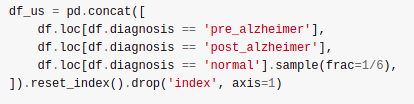

We often encounter imbalanced data in the world of machine learning, and have to decide how best to handle this. In 'real life' it is up to us to decide how to evaluate performance, which types of errors we care the most about and so on. But in the example we'll look at today, the situation is slightly different: we have an imbalanced training set, and the test set (we're working with [this competition](https://www.aicrowd.com/challenges/addi-alzheimers-detection-challenge)) has had the class distribution modified to make it more balanced. So, we need to find a way to take this into account when submitting predictions. The following plot shows the difference in distributions:

Class distribution of the training set compared to the validation set

It's worth pointing out that this is showing the results for the validation set - there is an unseen test set that could very well have it's own slightly different class distribution. There isn't much to say that wasn't covered in [the notebook](https://www.aicrowd.com/showcase/dealing-with-class-imbalance), so check that out for implementation details. That said, let's go over the main strategies we could use:

1. Do nothing and hope for the best... Not great, but when the imbalance is small then some models are pretty decent at making sensible predictions. This isn't going to win any competitions though!
2. Drop some fraction of the majority class. This turned out to work surprisingly well - I suspect this mimics the steps the organizers took when preparing the data.
3. Generate some extra 'synthetic' samples for the under-represented class using **Synthetic Minority Oversampling Technique** (SMOTE)
4. Combine the steps 2 and 3, to avoid relying on too much synthetic data. In this case I chose to use the imblearn library's RandomunderSampler to discard some of the majority class.
5. Take advantage of the sample\_weights parameter available in some models. For example, with Catboost we can explicitly tell the model to assign less weight to samples from the majority class. This lets us use the whole dataset (no need to throw out perfectly good data) and it performed the best in some experiments, loosing only to the basic under-sampling technique in the final assessment.

Dropping 5/6 of the rows from the majority class - a frustratingly successful approach!

Again, check out [the notebook](https://www.aicrowd.com/showcase/dealing-with-class-imbalance) for details and code. Here are the results:

<table><tbody><tr><td>Strategy</td><td>Log Loss (local)</td></tr><tr><td>Under-sampling the majority class</td><td>0.556998</td></tr><tr><td>CatBoost with altered sample weights</td><td>0.559395</td></tr><tr><td>SMOTE + RandomUnderSampler</td><td>0.579939</td></tr><tr><td>No modifications</td><td>0.674555</td></tr></tbody></table>

Results

The big takeaway here for me was that getting this right makes a huge difference in these types of competition. Without a good strategy even the fanciest model has no hope of matching the top submissions. Fortunately, even basic under-sampling can get great results, and I hope that between my notebook and discussions from others sharing their tips we have an even playing field on this front, allowing competitors to work on the more interesting aspects like feature engineering.
