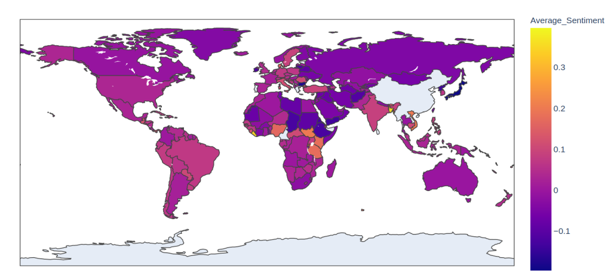

The average sentiment of the most recent 200 tweets from each country's capital city.

A mentee of mine has been working on web scraping for NLP projects and her most recent target was Twitter. She's working on something cool ([stay tuned](https://twitter.com/johnowhitaker)) but in the meantime, I thought I'd share a few of my own experiments. You can follow along and see full code examples in [this colab notebook](https://colab.research.google.com/drive/14yUDV7vYFNe3pINAFL-Y_rjfJvXxZH3_?usp=sharing).

## Scraping Tweets with Twint

Scraping tweets from a specific user

I used [twint](https://github.com/twintproject/twint) - a scraper written in Python which gives a lot of functionality while avoiding the need for API keys, authentication etc. You can target specific users, locations, topics and dates (see [their wiki](https://github.com/twintproject/twint/wiki/) for details) which makes this a powerful tool for finding and downloading tweets. For my tests today, I chose a few well-known Twitter personalities from my feed. I also scraped tweets from capital cities around the world, using the 'Lang' configuration option to focus on English tweets to make comparison easier (yes, I know, this is not ideal).

## Sentiment Score with roBERTa

NLTK's SIA can give a quick and easy sentiment score for a piece of text, but many tweets use more obscure language and styles that aren't well-captured by the default lexicon or the approach as a whole. Luckily, tweet sentiment analysis is a popular task and there are pre-trained deep learning models available that do a pretty good job out-of-the-box. I used a roBERTa model fine-tuned on the [TweetEval task](https://arxiv.org/pdf/2010.12421.pdf). The [model card on huggingface](https://huggingface.co/cardiffnlp/twitter-roberta-base-sentiment) had all the code needed to classify a piece of text, making it very simple to get started. I'm so glad this trend of making models accessible with key info is catching on!

- 
    
- 
    
- 
    
- 
    

The model outputs three scores corresponding to the labels 'negative', 'neutral' and 'positive'. We can combine the positive and negative scores to get a combined sentiment score running from -1 (very negative) to +1 (very positive). From this, we can get stats like 'average sentiment', but I wanted a better way to see at a glance what a user's tweets look like. Hexbin plots to the rescue :) These show the distribution of tweets in both sentiment and tweet length. You can see that Musk tends to tweet shorter, more neutral tweets while Gates favours mid-length positive ones and Lomborg tends heavily towards grumpy full-length rants 😂

## Scoring Countries

I was curious: what would we see if we grabbed some tweets from the capital city of each country and found the average sentiment score? Where do the positive tweeters live? Ideally, we'd account for different languages, grab a wide selection of tweets covering a longer timeline and do all sorts of other careful analyses. But since this entire project is the result of one night's insomnia I just grabbed the latest 200 English tweets from each country's capital (using the countryinfo library to get the coordinates) and went with those. Plotting the average sentiment as a choropleth map using Plotly gives us the title image of this post. Don't read too much into this - it's just a demo to show what might be possible with a bit more work.

## Conclusions

Data Science gives us the tools to ask questions about the world around us. And thanks to the kind folks who put so much effort into the libraries and tools we can access for free, it doesn't have to be hard! I hope this post inspires you to ask your own questions. Feel free to modify and share [the code](https://colab.research.google.com/drive/14yUDV7vYFNe3pINAFL-Y_rjfJvXxZH3_?usp=sharing), and PLEASE tag me on Twitter @johnowhitaker with your own visualizations and extensions. Happy scraping :)

EDIT: I made a Huggingface space where you can try this for yourself: https://huggingface.co/spaces/johnowhitaker/twitter\_viz
