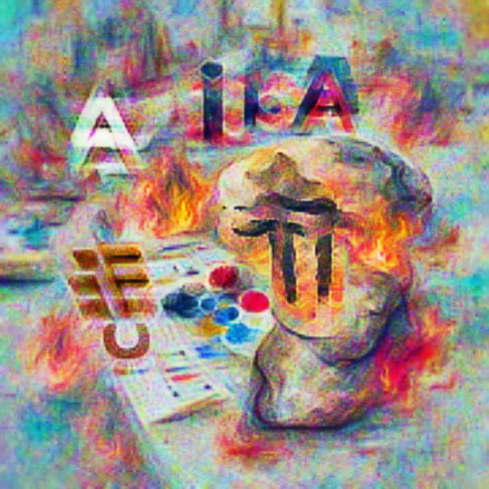

A small selection of images generated during the course

A few weeks ago we wrapped up the first run of 'AIAIART', a short course on creating art with deep learning. The course was originally delivered over Discord, but you can access recordings of the lessons on [YouTube](https://youtube.com/playlist?list=PL23FjyM69j910zCdDFVWcjSIKHbSB7NE8) alongside Colab Notebooks containing the code and examples.

https://youtube.com/playlist?list=PL23FjyM69j910zCdDFVWcjSIKHbSB7NE8

The experience of putting this together and sharing it was highly enjoyable. I always get a kick out of seeing my code or teaching being used by other people to make cool stuff, and [our Discord server](https://discord.gg/vDwGFQTKrW) is a steady stream of fun projects and experiments that make me so happy.

If I had to distil a few key takeaways I've gained from this endeavour, they would be

- **Optimization is magic**. Set things up so that <some function> uses <some parameters> to produce <some output> which can be evaluated against <some goal> in a differentiable way, and suddenly you can iteratively update those parameters bit by bit until (if all goes well) you achieve said goal. The secret here is that code for updating an image to look more like a description is practically identical to the code for updating the parameters of a neural network to solve some complicated task. And so while we were busy making art, everyone was secretly learning the much broader skill of solving problems with optimization :)
- **You don't need a PhD to dabble with deep learning**. Quite a few students had been playing with various AI art models but hadn't been able to dig in and understand the code or inner workings. But once we started building up from simple examples, it suddenly 'clicked' and what was previously intimidating walls of code became fancier versions of the patterns we'd already seen again and again.
- **I really like teaching**. Seeing that 'aha' moment makes me so happy - I'm going to have to find ways to do more of this :)
- **People are SO COOL!** I love seeing how different people can see the same material and get inspired to create wildly different things.
- **AI art is SO COOL!** We're still at the beginning of this movement, but already there are such powerful and amazing models and techniques available to us. With a little bit of tinkering you cna learn how to make them sing, and the results can be simply stunning. I look forward to seeing where the next few generations of tech take us.

Anyway, that's about all I have for this post. Check out the videos or come and hang out in the [discord](https://discord.gg/vDwGFQTKrW) to see what we're playing with next, and stay tuned since I might turn this V1 course into something a little more polished over the Christmas holidays. Happy arting - J
