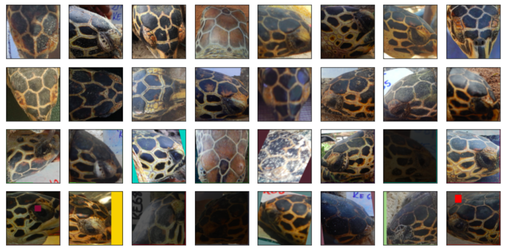
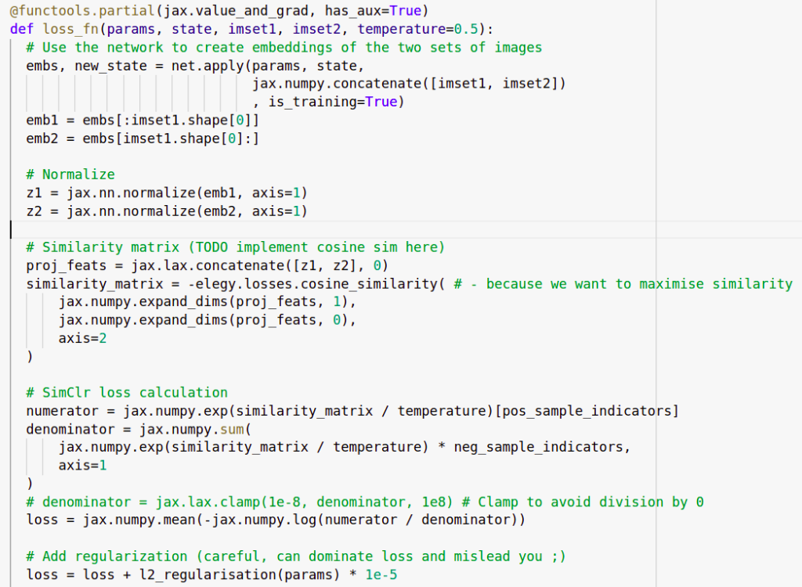
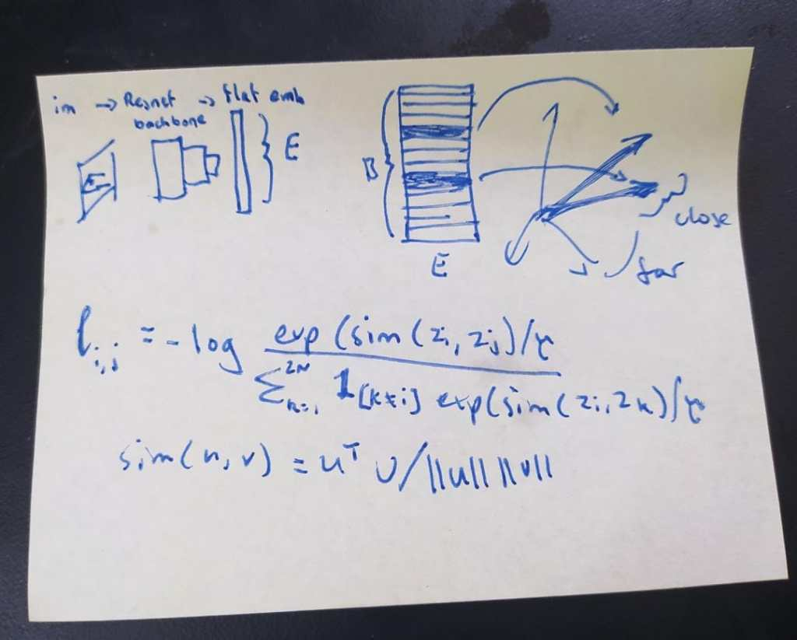
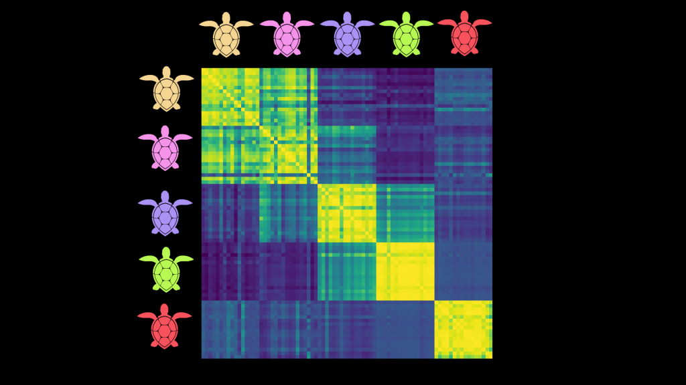

NB: A scoring glitch caused this approach to look very good on the leaderboard, but local validation and a fix from Zindi later confirmed that it isn't as magical as it first seemed. Still interesting from an educational point of view but if you're looking to compete I'd suggest investigating alternate strategies.  

## Introduction

Zindi has a [competition](https://zindi.africa/competitions/turtle-recall-conservation-challenge) running to identify individual turtles based on images from different views. This presents an interesting challenge for a few reasons:  
1) There are relatively few images per turtle (10-50 each) and these have been taken from multiple angles. Given how similar they are, simply treating this as a normal multi-class classification challenge is hard.  
2) There is an emphasis on generalization - it would be great if the organizations involved could add additional turtles without expensive re-training of models.

One potential approach that should help address these problems is to learn **useful representations** - some way to encode an image in a meaningful way such that the representations of images of one individual are all 'similar' by some measure while at the same time being dissimilar to the representations of images from other individuals. If we can pull this off, then given a new image we can encode it and compare the resulting representation with those of all known turtle images. This gives a ranked list of the most likely matches as well as a similarity score that could tell us if we're looking at a completely new turtle.

To keep this post light on code, I have more info and a working example in [this colab notebook](https://colab.research.google.com/drive/1AZkjlJ3oPUL-nZ03PU4d_jQL2yiKNHJp?usp=sharing). I'm also working on a video and will update this post once that's done. And a modified version of this might be posted on Zindi learn, which again will be linked here once it's up.

## Contrastive Learning

The goal of contrastive learning is to learn these useful representations in an unsupervised or loosely-supervised fashion (aka self-supervised learning). A typical approach is to take some images, create augmented versions of those images and then embed both the originals and the augmented versions with some encoder network. The objective is to maximise the similarity between an image and its augmented version while minimising the similarity between that image and all the rest of the images in the batch. The trick here is that augmentation is used to create two 'versions' of an image. In our turtle case, we also have pictures of the same individual from different angles which can be used in place of (or in addition to) image augmentations to get multiple versions depicting one individual.

Top two rows: 16 turtles. Bottom 2 rows: augmented versions of different views of those same 16 turtles.

In my implementation, we generate a batch by picking batch\_size turtles and then creating two sets of images with different pictures of those turtles. A resnet50 backbone acts like the encoder and is used to create embeddings of all of these images. We use a contrastive loss function to calculate a loss and update the network weights.

This is my first time using jax so there are probably more elegant ways to do this!

My post-it note with the formula

My attempt at a contrastive loss function

You can check the notebook or the video for more details on the implementation here. Once all the bugs were ironed out, the training loop runs and the loss shrinks nicely over time. But the question arises: how do we tell if the representations being learnt are actually useful?

Key reference for going deeper: [SimCLR - A Simple Framework for Contrastive Learning of Visual Representations](https://arxiv.org/abs/2002.05709)

## Representational Similarity Matrices

Remember, our end goal is to be able to tell which individual turtle is in a new image. If things are working well, we'll feed the new image through our encoder model to get a representation and then compare that to the encoded representations of the known turtles. All pictures of a given individual should be 'similar' in this space, but should not be similar to images of other individuals. A neat way to visualize this is through something called a Representational Similarity matrix. We take, say, 16 images of 5 different turtles. We embed them all and compute all possible pair-wise similarities and then plot them as a heatmap:

A Representation Similarity Matrix (RSM) comparing embeddings of 16 images from each of 5 turtles.

The images are obviously identical to themselves - hence the thin bright diagonal. But here you can also see that images of a given turtle seem to be similar to others of that same turtle - for instance, the bottom right 16x16 square shows that all images of the red turtle are quite similar to each other. This also shows us which turtles might be regularly confused (pink and yellow for eg) and which are relatively easy to disambiguate (pink and green).

RSMs are a useful tool for quickly getting a feel for the kind of representations being learnt, and I think more people should use them to add visual feedback when working on this kind of model. Looking at RSMs for images in the training set vs a validation set, or for different views, can shed more light on how everything is working. Of course, they don't tell the whole story and we should still do some other evaluations on a validation set.

## So does it work?

I trained a model on a few hundred batches with an embedding size of 100. For the test set, I took the turtle\_ids of the most similar images in the training set to each test image and used those as the submission. If there were no images with a similarity above 0.8 I added 'new\_turtle' as the first guess. This scores ~0.4 in local testing and ~0.36 on the public leaderboard. This is pretty good considering we ignored the image\_position label, the label balance and various flaws in the data! However, a classification-based baseline with FastAI scores ~0.6 and the top entries are shockingly close to perfect with mapk scores >0.98 so we have a way to go before this is competitive.

One benefit of our approach: adding a new turtle to the database doesn't require re-training. Instead, we simply encode any images of that individual we have and add the embeddings to the list of possible matches we'll use when trying to ID new images.

## Where Next?

There are many ways to improve on this:

- Experiment with parameters such as embedding size, batch size, augmentation types, training approach, regularization etc.
- Incorporate the image\_position labels, either doing separate models for different angles, filtering potential matches based on the test labels or finding some way to feed the label into the model as an extra type of conditioning.
- Experiment with fine-tuning the model on the classification task. Since it has now (theoretically) learnt good representations, we could likely fine-tune it with a classification loss and get even better competition performance (at the cost of lower genaralizability)
- Explore automated data cleaning. Some images are out-of-domain, showing random background as opposed to turtle faces . Some images are just bad quality, or just don't work with center-cropping.
- Try different models as the backbone
- Investigate label balance

...And many more. I hope this post gets you excited about the competition! Feel free to copy and adapt the notebook (with attribution please) and let me know if you manage to make any improvements. See you on the leaderboard :)
