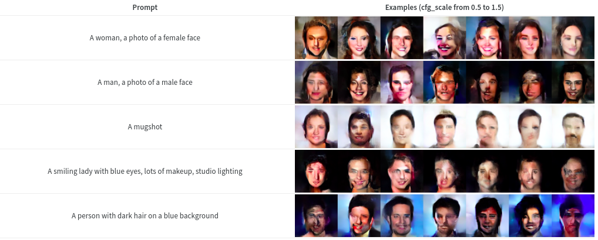

A few recent projects I've worked on have been documented elsewhere but haven't made it to this blog. The point of this post is to summarize these so that they aren't lost in the internet void.

## AI Art Course

https://www.youtube.com/watch?v=XGq6eWW-72E&list=PL23FjyM69j910zCdDFVWcjSIKHbSB7NE8&index=5

The playlist (you can also start from [lesson 1](https://www.youtube.com/watch?v=p814BapRq2U&list=PL23FjyM69j910zCdDFVWcjSIKHbSB7NE8))

Part 2 of AIAIART launched last month. You can see all lessons and a link to the YouTube playlist here: [https://github.com/johnowhitaker/aiaiart](https://github.com/johnowhitaker/aiaiart)

- Lesson 5 - Recap of key ideas and start of part 2: [https://colab.research.google.com/drive/1cFqAHB\_EQqDh0OHCIpikpQ04yzsjITXt?usp=sharing](https://colab.research.google.com/drive/1cFqAHB_EQqDh0OHCIpikpQ04yzsjITXt?usp=sharing)
- Lesson 6 - Transformers for image synthesis and VQ-GAN revisited: [https://colab.research.google.com/drive/1VhiIxMw9YClzmwamu9oiBewhZPnhmSV-?usp=sharing](https://colab.research.google.com/drive/1VhiIxMw9YClzmwamu9oiBewhZPnhmSV-?usp=sharing)
- Lesson 7 - Diffusion Models: [https://colab.research.google.com/drive/1NFxjNI-UIR7Ku0KERmv7Yb\_586vHQW43?usp=sharing](https://colab.research.google.com/drive/1NFxjNI-UIR7Ku0KERmv7Yb_586vHQW43?usp=sharing)
- Lesson 8 - Neural Cellular Automata: [https://colab.research.google.com/drive/1Qpx\_4wWXoiwTRTCAP1ohpoPGwDIrp9z-?usp=sharing](https://colab.research.google.com/drive/1Qpx_4wWXoiwTRTCAP1ohpoPGwDIrp9z-?usp=sharing)

## Image Generation with CLOOB Conditioned Latent Denoising Diffusion GANs

I had fun trying out a new(ish) approach for text-to-image tasks. The neat thing with conditioning on CLOOB embeddings is that you can train without text captions and still get some text guidance ability at inference time (see image above). This got written up as [a nice report on Weights and Biases](https://wandb.ai/johnowhitaker/cclddg_report/reports/New-Techniques-for-Generating-Images-with-Text--VmlldzoxOTc1NDU3).

## Getting Started with the Microsoft Rice Disease Classification Challenge

Images from the training data

An intro to the latest Zindi challenge with starter code and some thoughts on experiment tracking. You may see more of this at some point - for now, you can [read the report here](https://wandb.ai/johnowhitaker/rice_challenge/reports/Getting-Started-with-the-Microsoft-Rice-Disease-Classification-Challenge--VmlldzoyMDIyMzE0).

## Fun with Neural Cellular Automata

https://twitter.com/johnowhitaker/status/1528710004441751553?s=20&t=GifiFRsva0l4Ef\_MTFMjBA

Building on lesson 8 of the course, this project involved training various neural cellular automata and figuring out how to make them do tricks like taking a video as a driving signal. I'm particularly pleased with [the W&B report for this](https://wandb.ai/johnowhitaker/nca/reports/Fun-with-Neural-Cellular-Automata--VmlldzoyMDQ5Mjg0) - I logged interactive HTML previews of the NCAs as shaders as they train, and tracked just about everything during the experiments. I also made a Gradio demo that you can [try out right now](https://huggingface.co/spaces/Gradio-Blocks/video_nca).

## Huggan Projects

So many butterflies

We trained some GANs on butterflies! Have fun with [the demo space](https://huggingface.co/spaces/huggan/butterfly-gan). I also did [a similar version with AI-generated orbs as the training data](https://huggingface.co/spaces/johnowhitaker/orbgan_demo). I love how easy it is to get a demo running with HF spaces + gradio. Feels like cheating!
