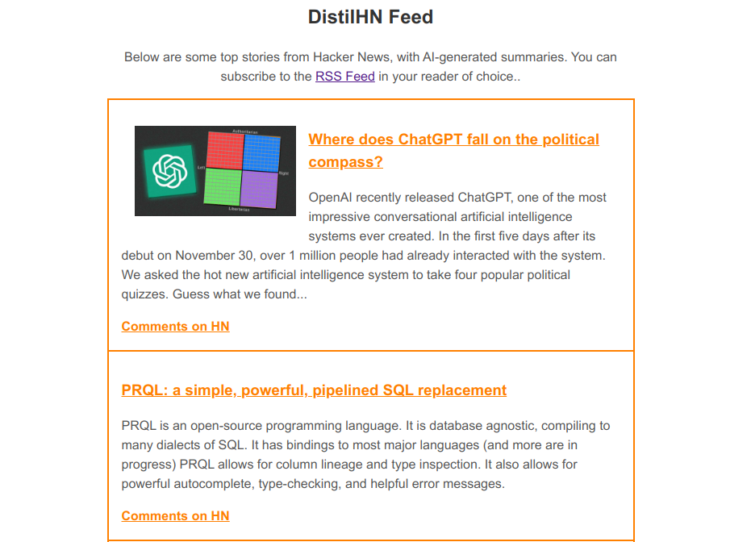
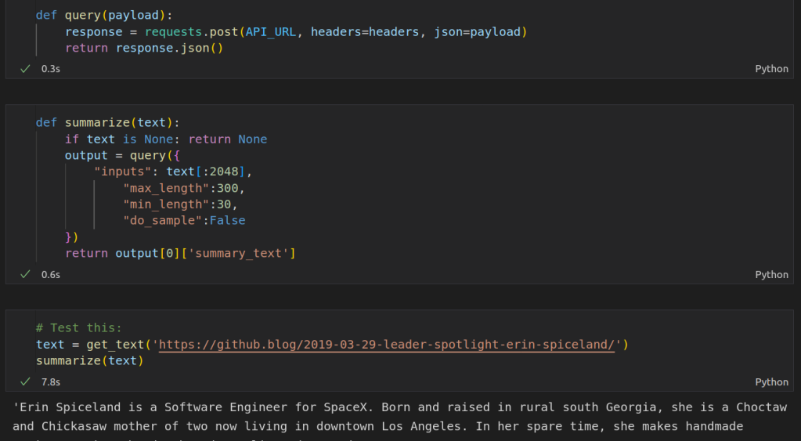
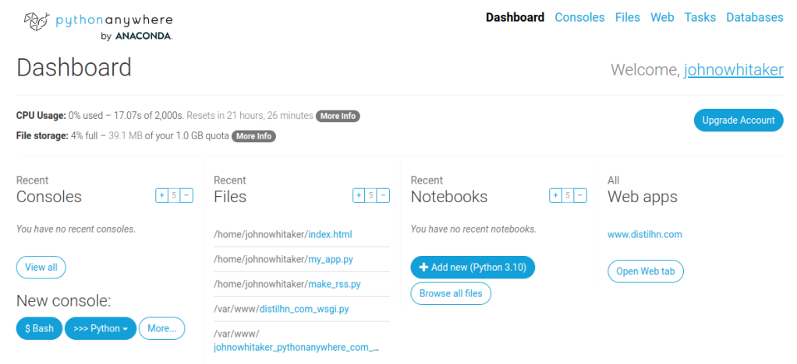

https://youtu.be/TBqzMfWpQrs

In this series, I'd like to explore how to take an idea within machine learning from proof of concept to production. This first post is going to get things going with a little mini-project that I did in the downtime between Christmas activities, creating a website called [DistilHN.com](https://www.distilhn.com/) using a bit of machine learning magic and some basic web scraping. Let's get started.

The DistilHN page

## The Idea

I've been thinking about how to make a better news feed. When confronted with a clickbait headline, I often want a little more info, but don't feel like clicking through to the article (and dismissing the cookie popup, and scrolling past the ads, and declining their invite to sign up for the newsletter, and ...) just to see what it's about. So, this is the idea: use AI to generate a short summary that you can read before deciding whether you're going to commit to the full article or just skip straight to the comments section on Hacker News.

## Scraping Text

I started working on a way to get the main text from an arbitrary website using Beautiful Soup, writing heuristics for which elements were worth including or ignoring. It turns out this is a very hard problem! After a while I had something that sort of worked for some sites, but in desperation I decided to take another look around online to see if someone else had already done the hard work.

Extracting text from a website using Trafiltura

Enter the [Trafilatura](https://trafilatura.readthedocs.io/en/latest/index.html) library, purpose-built for this exact task! It makes it super easy to grab the text from any website, as shown in the screenshot above. Aside: all the code shown in this post is also available as a notebook on Google Colab [here](https://colab.research.google.com/drive/1WiCszznFmwdlrsozagT6IJSnuOLQUFqK?usp=sharing).

## Summarization

For the actual summarization step, I choose to use [this model from Facebook](https://huggingface.co/facebook/bart-large-cnn) which was fine-tuned for news article summarization. You can run it locally with a huggingface pipeline, but I chose to use the free inference API since we're not going to need to run this thousands of times an hour and we may as well do as little work as possible ourselves! We set up a query, specify the text we want to summarize and the min and max length for the summary, post the request and wait for the summary back.

Summarizing the text with the HuggingFace Inference API

This was a bit of a revelation for me. In the past I'd be downloading and training models as soon as I started a project like this, but here is an existing solution that does the job perfectly. If we want to scale up, Huggingface has paid inference options or we can switch to running the model ourselves. But for this proof-of-concept, the inference API makes our lives easy :)

## Sharing

It's one thing to run something like this once in a notebook. To make this a permanent solution, we need a few things:

- Some server to run a script every hour or so to fetch and summarize the latest articles.

- A website or something so that we can share our project with others, including a place to host it

- Ideally, an RSS feed that users can read from their RSS app of choice.

I decided to start by wrapping up the scraping and summarization code into a script and having it write the results to an RSS feed (using the [feedgenerator](https://pypi.org/project/feedgenerator/) Python library). This way I'd have the content in a known format and a useable output before I start hacking on the front end.

My PythonAnywhere Dashboard - the script has only used ~20 seconds of CPU time so far today!

While you could host something like this yourself on a small VPS, I chose to go the easy route and use a website called PythonAnywhere which handles some of the admin for you. They have a [tutorial for hosting a static site](https://help.pythonanywhere.com/pages/hosting-a-static-site) and make it easy to upload files like the aforementioned script and set them to run on a schedule. I did end up making a minimal flask app too in case I want to develop this further, but for the initial demo, I just exposed the index.html and feed.xml files to the web via the PythonAnywhere web UI. This is great for getting demos up quickly, and since this is just serving a static site it should scale extremely well.

Speaking of index.html, I made a simple HTML page and modified a Javascript snippet from [this](https://dev.to/geekgalgroks/building-an-rss-reader-in-javascript-1ep0) tutorial to load in the items from the RSS feed and add them to the page. I'm not particularly comfortable with HTML/CSS so styling this took ages, and it still looks a little clunky. ChatGPT and GitHub CoPilot turned out SUPER useful for this step - I find myself relying on CoPilot's suggestions much more when working with languages that I am less familiar with, and being able to just type **`/* Make the image appear at the top, centered */`** and then hit tab to get the CSS I needed for something is delightful compared to my usual fiddle->test->google->repeat cycle.

## Taking This Further

You can see the final website at https://www.distilhn.com/. I'm quite pleased with how it turned out, even if there are still a few things to iron out. I'm already working on a more ambitious follow-on project, pulling news from across the globe and filtering it using more ML magic... but that will have to wait for a future post :) Until then, have fun with the website, and let me know if you have ideas for improvements! Happy hacking.
