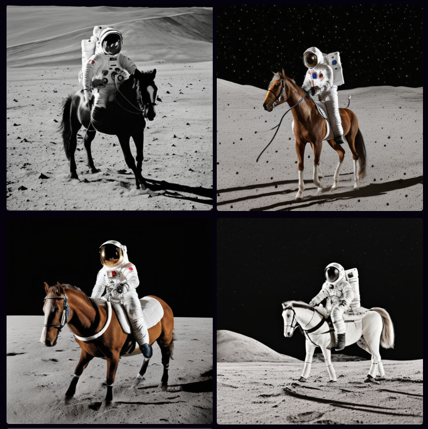
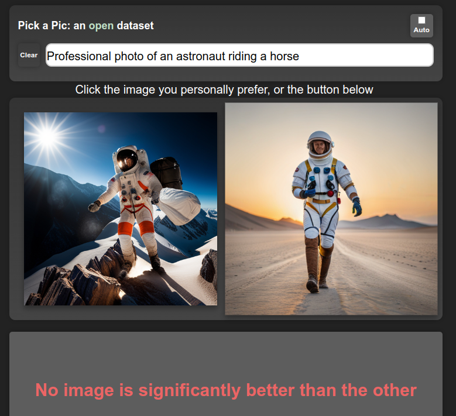
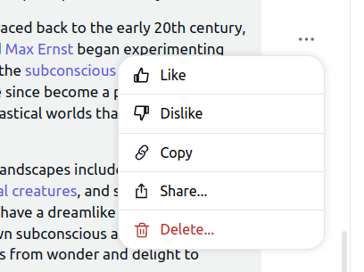

Generative models are all the rage at the moment, and quality seems to be skyrocketing across the board. In this post, I share what I'm realizing is \*the\* key recipe that is powering the best models at the moment.

## 1) Pre-train on LOTS of data

A robot working hard to read every book possible

This makes sense - more data = better, right? And so we see language models training on every scrap of text they can find - books, video transcripts, the entire internet. In the text-to-image domain, datasets like LAION contain **billions** of images, scraped from the web. This stage is necessary if you want your model to have an 'understanding' of as many topics as possible.

## 2) Fine-Tune with HIGH-QUALITY data

After (1), your model can hopefully produce anything. The downside is that it can produce, well, anything! Including badly spelled Reddit rants (for text models), or low-quality PowerPoint screenshots (for image models). For text-to-image models, another aspect of 'high-quality' data is image-caption alignment. If captions don't match images very well, the model will learn to rely less on the prompt when generating. The fix is to continue training on 'better' data, to bias the model toward generating the good stuff. You're not necessarily teaching it much new in this stage - just pushing it towards a subset of the possibilities it could already generate.

SD 1.5 trained on ~1B samples - "A professional photo of an astronaut riding a horse on the moon"

SD1.5 fine-tuned on ~1M 'good' samples

For a model like ChatGPT, this step involves manually finding or creating high-quality examples of chat dialogs. For something like Midjourney, it presumably involves collecting a dataset of stunning-looking images and making sure they have good captions (either by filtering out existing captions or by using auto-generated captions). Next time you read about a cool new generative model, keep an eye out for mention of this 'high-quality fine tune' step. For example, in [this post on the new Kandinsky 2.1 text-to-image model](https://habr.com/ru/companies/sberbank/articles/725282/), they note that after training on a large dataset "_Further, at the stage of fine-tuning, a dataset of 2M very high-quality high-resolution images with descriptions ... was used separately collected from open sources."_

## 3) Incorporate HUMAN FEEDBACK

Most apps have a way for users to provide feedback on generations or to explicitly rank images/texts

(1), or maybe (1) + (2), will get you great results on automatic evaluations and benchmarks, and may be enough for getting a publication with a SOTA result. However, successful products require pleasing users, so making sure the model creates things that users like is a big deal. Midjourney is a great example - they've been collecting user feedback since day 1, and presumably using said feedback to improve their models. Apart from explicit ratings, there are also other ways to get user feedback - for example, when a user selects one of four possible images to download or upscale they provide a signal that can be used to estimate their preference:

https://twitter.com/johnowhitaker/status/1640608207730081792?s=20

The exact method for incorporating this feedback varies. For text, the standard approach is to do something called "Reinforcement Learning from Human Feedback" (RLHF) where a large number of human-labeled outputs are used to train a 'reward model' that scores a given generation. This model is then used to train the generative model, evaluating its outputs and providing a signal which is then used to update the model such that it produces **better** ones according to the reward model. You could also use this kind of preference model to filter out low-quality data (feeding back into (2)) or to condition your model on quality, such that at inference time you can simply ask for 10/10 generations! Whatever the method used, this final stage is once again not teaching the model anything new but is instead 'aligning' the model such that its outputs more often look like something humans will like.

## 'Cheating'

OpenAI spent tons of money and compute doing their supervised fine-tuning and RLHF magic to create ChatGPT and friends. Facebook released a research preview of LLaMa, a family of models trained on more than a billion tokens. The LlaMa models have only had step (1) applied, and aren't great out-of-the-box for chat applications. Then along come various groups with access to OpenAI's models via API, who created a training dataset based on ChatGPT outputs. It turns out that fine-tuning LlaMa on this data is a quick way to get a high-quality chatbot! A similar dynamic is playing out with various open-source models being trained on Midjourney outputs. By copy-catting powerful models, it is possible to skip (2) and (3) to a large extent, leaving the companies investing so much in their models in an interesting position. It will be interesting to see how this plays out going forward...

## Conclusions

This recipe isn't necessarily new. The [ULMFiT paper](https://arxiv.org/abs/1801.06146) from Jeremy Howard and Sebastian Ruder in 2018 did something similar, where they pre-train a language model on a large dataset (1), fine-tune it on industry-specific data (2), and then re-train for a specific task such as classification. That said, I feel like this year we're seeing it really pay dividends as apps like ChatGPT reach hundreds of millions of people and companies scramble to offer free access to powerful models in exchange for that all-important user preference data. Excitingly, there are open-source efforts to collect the necessary data too - see the PickAPic effort (for images) or the Open Assistant project (for chat data) among many others. And open source models such as stable diffusion let others skip the expensive pre-training phase and move straight to fine-tuning, lowering the barrier to entry substantially.

## PS: Who's Feedback?

Images generated with the generic prompt "lol" in Midjourney

Something worth mentioning (thanks @LuciaCKun for highlighting this) is that using human feedback has some ethical considerations. It could be that a small set of people (employees of a company, or early testers) get to spend time telling a model "This is good, that is bad", and their biases end up defining the behavior of the model for everyone. You see this with images - anything trained on early user preferences for text-to-image models is likely to skew toward fantasy women and art-station aesthetics. Finding ways to align with different people's values rather than locking in a specific behavior is an active area of research, in which there is plenty of work left to do.
