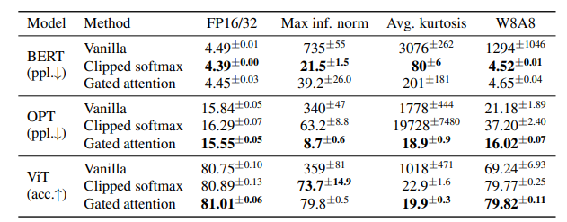

Last week a guy called Evan Miller tweeted out a blog post claiming to have discovered a flaw in the attention mechanism used by transformers today:

https://twitter.com/EvMill/status/1683508861762695168?s=20

The phrasing was sensationalist, and many people were dismissive of the idea. Evan hadn't run any experiments, and it turned out that his proposed fix was already implemented in PyTorch as a (typically unused) option in the standard Multi-Headed Attention implementation. Surely this was something that would already be in use if it was actually useful? But, since the suggested change was pretty simple, I figured I'd try it out for myself. And that in turn led to a fun little research adventure, in which some internet randos may just have found something impactful :) Let me explain...

## The Problem

Neural Networks like transformers are stored as big piles of numbers (parameters) that are applied in different mathematical calculations to process some input. Each parameter is represented inside the computer by some number of 1s and 0s. If you use more of these bits per parameter (say, 32) you can represent the numbers with a lot of precision. But if you use fewer (say, 8) the model takes up less storage space, more parameters can be kept in RAM, and the calculations could potentially be faster. So, using fewer bits per number - quantization - is a hot topic at the moment for anyone concerned with running big models as cheaply as possible.

The problem arises when you try to go from a high-precision 32-bit neural network to an 8-bit one. With 8 bits you can only represent 2^8 (256) different numbers. If most of your numbers are small, then you can use those 256 numbers to represent, say, a range of values from -1 to 1 and map your 32-bit floating point numbers to the nearest 8-bit approximation without too much loss in accuracy. However, if there is an occasional \*outlier\* in your set of numbers then you may need to represent a much larger range (say, -100 to 100) which in turn leaves far fewer options for all those small values close to 0, and results in much lower accuracy.

Figure from Time Dettmer's blog [post](https://timdettmers.com/2022/08/17/llm-int8-and-emergent-features/) showing the drop in performance with quantization after outliers emerge

[Tim's blog post](https://timdettmers.com/2022/08/17/llm-int8-and-emergent-features/) explains this extremely well. And in bad news for quantization fans, it turns out that outliers do indeed occur in these models especially as you scale up, leading to major drops in performance after quantization unless you do lots of extra work to address the issue. For example, you can identify groups of parameters that contain most of the outliers and keep these in higher precision (say, 16-bit) while still quantizing the other 99.9% of the network parameters down to 8 bit or less. Still, this is extra work and imposes a performance penalty. If only there were ways to avoid these outliers from occurring...

## Existing Fixes

Some researchers at Qualcom (who have a keen interest in making LLMs runnable at the edge) explored this problem in depth and proposed two clever solutions. It was their paper that sparked this whole thing. To summarize their findings:

- Many outliers occur as attention heads try to learn a 'no-op' where they don't modify the residual. They do this by creating a larger and larger input to the softmax, pushing the rest of the values closer to 0 (but thanks to the softmax formulation they never get all the way to 0).

- One fix is to scale and clip the softmax output such that it can saturate and go completely to 0, blocking gradients and preventing the values from growing further. This is the method they call _clipped softmax_.

- Another option is to add some additional parameters for a learnable gating function, which can control whether the attention output is added in or not. This lets the network learn another way to achieve the so-called 'no-op'. They call this _gated attention_.

- Both of their approaches do dramatically reduce the presence of outliers (which they show by measuring the max magnitude of the activations as well as the 'kurtosis') and the resulting transformers perform almost as well quantized as they do in full precision, unlike the baseline without their proposed fixes.

Table 2 from the paper showing results. The max activation size (inf. norm) and kurtosis are much lower with their fixes, and the performance after quantization (W8A8 column, i.e. weights and activations are both 8-bit) is close to that of the model before quantization, unlike the baseline (vanilla) case.

This paper is nice in that it gives a very concrete way to think about the problem and to measure how well a particular solution solves it. If your model has less outliers (measured via inf norm and kurtosis) and still performs well after quantization, you're on the right track!

## Evan's suggestion

Both of the methods above have potential downsides. Clipping can mess with gradients, and gating requires additional parameters. Evan, with his Physics and Economics background, believes there is a simpler fix: modify the softmax operation itself. Softmax is often used in a 'choose between options' scenario, and gets thrown in a lot whenever ML people want a convenient function whose outputs sum to 1 (great when you want probabilities). In the case of attention, this is not necessarily a desirable property!

Evan's proposed 'Softmax1' formula

Evan's suggestion is to effectively add an extra logit that is always set to 0, which means that if the rest go negative the final outputs can all approach zero without the sum needing to be 1. In most cases this function will behave very close to vanilla softmax, but it gives the network an out for when it doesn't want to have any high outputs. In practice this is implemented by adding 1 to the denominator in the softmax formula. See [his post](https://www.evanmiller.org/attention-is-off-by-one.html) for more details.

## Testing it out

Since the change is so small, I cast about for a transformer implementation I could quickly adapt to try this. Karpathy's [nanoGPT](https://github.com/karpathy/nanoGPT) is perfect for this kind of thing. Written to facilitate easy learning, a single model.py file to mess with, it was the perfect starting point for experimentation. It turns out I was not the only one to think this, and soon I was in touch with Thomas Capelle (who was using the llama2.c repository that tweaks the nanoGPT code to implement the more recent LlaMa architecture) and with 'HypnoPump17' on Discord who trained two gpt2-small sized models using nanoGPT which were larger than the mini ones I'd been messing with and formed a good starting point for trying to measure the effects of interest.

Visualizing the activations from an attention layer ([notebook](https://colab.research.google.com/drive/1DExSfbVVxP34RfSlSiNt25eexpmq4Vrc?usp=sharing)). You can see that some dimensions (the 768 dims are spread along the x axis) have outliers present.

My first experiments were on very small models (15M parameters). It's usually good to start small so you can iterate quickly, but in this case this backfired and my results were inconclusive. As noted in Tim's blog and subsequent work, outliers only start to emerge above 100M parameters and reach some sort of critical threshold only in even larger models (5b+). Luckily, swapping in the 125M parameter models from HypnoPump was and easy change and my quick exploratory [notebook](https://colab.research.google.com/drive/1DExSfbVVxP34RfSlSiNt25eexpmq4Vrc?usp=sharing) showed a marked improvement in inf. norm and kurtosis for the modified softmax, in line with what the Qualcomm authors had observed with their fixes.

## The magic of enthusiastic collaborators and outsider insight

While it remains to be seen how impactful this is (see next section), the thing that has really stood out to me so far in this little experiment is how great community research can be. One person with a unique educational background spots a potential new idea, another implements it, a third runs some training runs, a forth analyses the weights, a fifth sets up instrumentation with W&B to track stats during training, someone else starts organising time on a cluster to run some bigger experiments... the productivity of a Discord channel full of enthusiastic hackers is quite something to behold!

## Where we are and what comes next?

Amid all this fun the paper authors have been in touch, and have run their own tests of the softmax1 approach, finding that it seems to work about as well as their other proposed fixes. Of course, there's a lot of work to be done between 'this maybe works in a quick test' and something being accepted by the larger community as a technique worth adopting. I expect the next stage involves some larger training runs and more thorough evaluation, hopefully resulting in a paper that presents enough evidence to show the teams currently working on the next generation of LLMs that this is worth paying **attention** to ;)

## Conclusions

This blog post isn't about the results - we'll have reports and papers and all that from other people soon enough. At the moment this still has a good chance of ending up in the large and ever-growing bucket of "proposed changes to transformers that never ended up going anywhere". The reason I've written this is instead to share and praise the process, in which open science (teams sharing research on Arxiv), diverse perspectives (Evan writing his post, misc twitter experts chiming in), great tools (Karpathy's amazing didactic repos, easy experiment tracking and weight sharing) and an active community of hobby researchers all come together to deepen our collective understanding of this magical technology.
