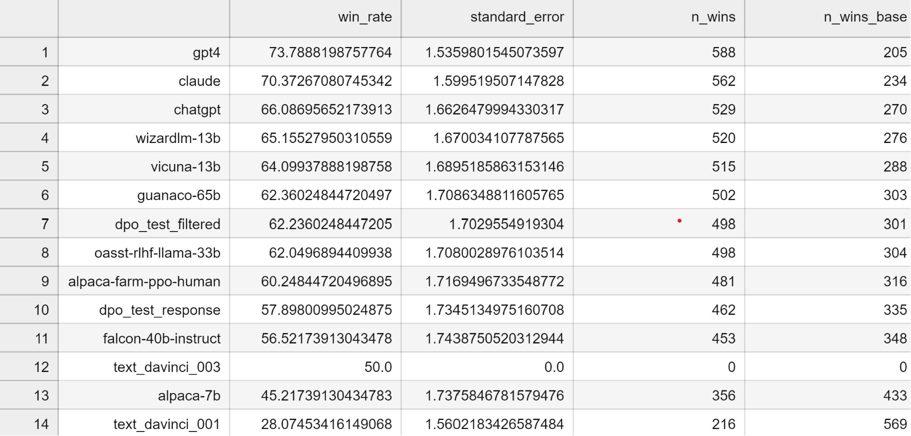

# Filtering Preference Data for Better DPO

With recent discussion around DPO (and proposed alternatives cDPO and IPO) I figured it was time we ran some experiments to see what works and what doesn't. As a good warmup, I thought I'd test the effect of data quality by doing two runs, identical except that one would use a popular preference dataset, and the other would use a filtered version of the same dataset.

I started with [this example code](https://colab.research.google.com/drive/15iFBr1xWgztXvhrj5I9fBv20c7CFOPBE?usp=sharing) by [Maxime Labonne](https://twitter.com/maximelabonne/status/1729936838318543243) which uses a dataset from Intel ("Intel/orca_dpo_pairs"). 

My 'filtering' was comically simple: using a model I had handy, I used the following prompt and then looked at the logits for 'Yes' and 'No' to decide whether to keep the example or not:

```python
def item_to_prompt(item):
    prompt = "<|im_start|>system\nYou are a helpful assistant who evaluates chat responses.\n<|im_end|>\n"
    prompt += "<|im_start|>user\nConsider the following hypothetical chat and evaluate whether the first response (Option 1) is better than the second."
    prompt += "A good answer follows the system prompt and question/instruction well. Answer 'Yes' or 'No' only.\n"
    prompt += f"Hypothetical system prompt:\n {item['system']}\n\n"
    prompt += f"Hypothetical question:\n {item['question']}\n\n"
    prompt += f"Hypothetical option 1:\n {item['chosen'][:1600]}\n\n" # << NB setting a max length
    prompt += f"Hypothetical option 2:\n {item['rejected'][:1600]}\n\n"
    prompt += "Is Option 1 better than Option 2? Yes or No."
    prompt += "<|im_end|>\n" + "<|im_start|>assistant\n"
    return prompt
```

Side note: `tokenizer.encode("Yes")` won't give you the right token in this case, since "Yes" at the start of text or with a preceeding space != "Yes" following another character like the newline. Always check the topk probabilities from the model or decode some tokens to make sure you use the right one!

Anyway, keeping those examples where the model agreed with the original label, I ended up with a smaller dataset I could use for the 'filtered' version. Training for the same number of steps on each, we see the score boost from 57.9 to 62.2 thanks to the filtering:



Scoring was done with alpaca_eval, using the 'chatgpt_fn' evaluator to save costs.This is just a quick initial test, but it aligns with my feeling that data quality is pretty important and that the existing datasets for fine-tuning and preference stuff might need a bit of cleanup!

Related Tweet: https://x.com/johnowhitaker/status/1732489803340673053?s=20