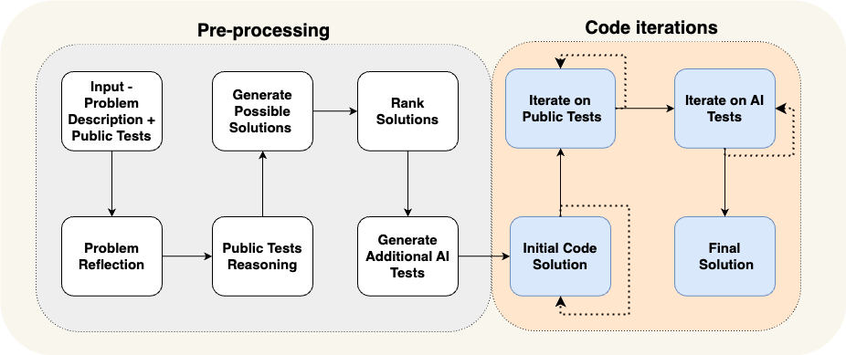

In this post I want to share a few quick experiments to show something that is both obvious and also perhaps underappreciated: you can get a sizeable quality boost from a generative model by generating MORE. For example, generating more samples and picking the best ones (with a few caveats). In this post I'll show this in action and talk about some of the implications.

## Pic The Best

Let's start on images. Imagine you have two competing text-to-image systems. Both use an identical model, but when A generates an image it only shows you one sample, while B generates 4 and picks the best one. What percentage of the time will you prefer the image from B? 80% of the time! Newer models are lucky if they can brag about a 5% improvement in win-rate over the competition (see below) so an 80% win rate is huge. Now do the maths for a case where we generate 100 images and pick the best...


Of course, there's a catch. "The best one" in the previous paragraph assumed we have a way of picking in advance which of the four you'll prefer. Imagine instead that B generates 4 images and returns one of the four at random. Now the win-rate is back to 50%. And worse, it takes 4x as long! So the only way our scheme has any legs is if we can somehow pick images in a way that at least roughly aligns with what humans (you're a human right?) will prefer.

One useful measure is the CLIP similarity score between the image and the prompt, which tends to track well with how accurately the image represents the prompt. Another option is to use a model trained to predict human ratings or preferences - I'm a fan of [PickScore](https://github.com/yuvalkirstain/PickScore) which correlates well with aesthetics in my experience.

To play with these ideas, I wrote some code that ships off a prompt to ~5 different image generation APIs and generates a bunch of candidate images which are then scored with CLIP and PickScore to rank them. Here's the best and worst image from my first test, for the prompt "An astronaut riding a horse on mars:

::: {layout-ncol=2}


:::

Now, how can we spend even more inference time compute to get this system to deliver even better results? We have big LLMs now that can do things like re-write the prompt, and since some are 'multimodal' we can also show them the results and use that to modify the prompt to fix any potential flaws. With this we're moving from 'generate N pick one' to something more like the 'flow engineering' the cool kids like to talk about, creating multi-step processes that refine the result. Think about something like this:

```
Your task is to evaluate whether the following image accurately follows the prompt.
Prompt: {image_prompt}
If the image follows the prompt well, respond with 'yes'. 
If not, suggest a better prompt...
```

I added this to my pipeline, along with a pre-processing step that re-writes the prompt to get more variations and a final ranking step using model X to pick the final one. The results take a while but are pretty darn good! I ran it on 50 prompts from my 'that should be a band-name' list, you can see the results here TODO link. TODO random boting to get a win rate?

## Text

How can we map similar ideas to text? As a first test I was curious how well best-of-N would work for text generation. With AlpacaEval-2 as the metric, let's see how much we can boost Llama 3 8B. I used [this](https://huggingface.co/sfairXC/FsfairX-LLaMA3-RM-v0.1) reward model (which itself is also a fine-tune of Llama 3 8B, making this something we could reasonably imigine being a lightweigt adapter) to score the candidate completions. Best-of-10 vs the baseline boost the win rate from 20.5% to 29.0%. Not bad!

| Model                         | win_rate | avg_length |
|-------------------------------|----------|------------|
| gpt4_turbo                    | 50.0     | 2049       |
| Yi-34B-Chat                   | 29.7     | 2123       |
| **Llama 3 8B (Best of 10)**   | 29.0     | 1895       |
| gpt4                          | 23.6     | 1365       |
| mistral-medium                | 21.9     | 1500       |
| **Llama 3 8B (Default)**      | 20.5     | 1795       |
| Mixtral-8x7B-Instruct-v0.1    | 18.3     | 1465       |
| claude-2                      | 17.2     | 1069       |
| gemini-pro                    | 16.8     | 1315       |
| tulu-2-dpo-70b                | 16.0     | 1418       |
| claude-2.1                    | 15.7     | 1096       |
| Mistral-7B-Instruct-v0.2      | 14.7     | 1676       |
| llama-2-70b-chat-hf           | 13.9     | 1790       |
| llama-2-13b-chat-hf           | 7.7      | 1513       |
| llama-2-7b-chat-hf            | 5.0      | 1479       |
| text_davinci_001              | 2.8      | 296        |

I'm not the first to think of this approach - looking at the full [leaderboard](https://tatsu-lab.github.io/alpaca_eval/) reveals a number of entries with names like `Snorkel (Mistral-PairRM-DPO+best-of-16)` which have obviously taken a similar approach. With LLM-judged leaderboards like this we must always be cautions translating scores to true performance... Which brings up a good, more general question: how should we rank/score outputs if we want to bring this same approach to bear on other text generation tasks? And how can we improve on the simple 'best of N' approach?


The literature around this topic is filling up with approaches, some of which are illustrated in the figure above. There's 'Chain of Thought' where we ask the model to produce some intermediate reasoning steps before its final answer, 'Tree of Thought' which constructs a tree of possible completions, along with tons of variations that cajole different models into debates with eachother, introduce 'backtracking' to try and correct mistakes partway through, and so on. A good example of a complex flow tuned to a specific system was this one I found recently looking at ways to boost performance on coding tasks:



These flow-based approaches might not make sense just yet, when it feels like a bigger model might come along and do the tasks better without any tricks or that latency matters... But anyone who has tried the 800 tokens/second Grok demos or the real-time image generation demos kows, we're getting better at making things go fast! And as anyone who's spent time with even the best models knows, there is still a lot that these things can't reliably do. So I suspect we will see more and more cases where it makes sense to spend a bit more inference compute to get a better result. I hope this blog post has you thinking of some ways you might be able to do that :)