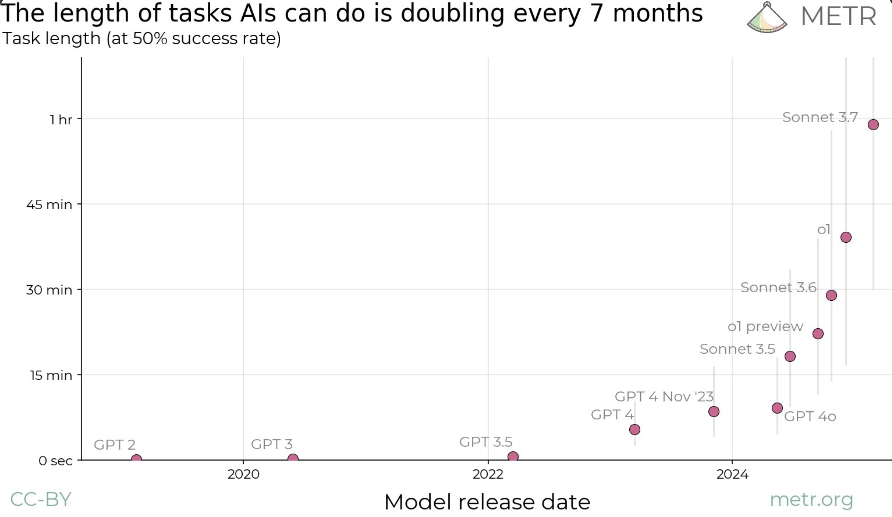

You should definitely read this piece by Nicholas Carlini: [https://nicholas.carlini.com/writing/2025/thoughts-on-future-ai.html](https://nicholas.carlini.com/writing/2025/thoughts-on-future-ai.html).
Many people have very confident beliefs - from '100% AGI in 3 years' to 'AI is just hype'. I think a spectrum of outcomes are possible and worth considering. Motivated by Carlini's post, I'm going to attempt to document my own (similar) views in this post plus additional thoughts.

## My (Evolving, Uncertain) Views

I'd historically been in the camp of 'LLMs are fuzzy pattern matchers, impressive but bounded in what they can do'. Very powerful, but e.g. I didn't expect even much larger LLMs to be able to play connections well 0-shot - a game that for humans requires back-tracking and mentally 'trying out' different combinations.
The initial o1 announcement was the final nail in the coffin for that theory for me - 'thinking' tokens expand the  space of 'programs' LLMs can run - 'reasoning' not just 'intuition'. And RL means they can potentially discover new useful patterns that work for them, rather than relying on human demonstration (i.e. pretraining or SFT).

I still think there's a small chance the recent wave of RL/post-training stuff is mostly bringing out more from the powerful-fuzzy-pattern-matching pretraining stage - the so-called '[elicitation hypothesis](https://www.interconnects.ai/p/elicitation-theory-of-post-training)', which would possibly mean that we're still plateauing once the immediate gains run out, with much larger training runs (e.g. 4.5) yielding only modest improvements, and 'needs to have had *some* demonstration on the internet' still being a requirement. This would still means incredibly powerful models! Lots of things are well-covered in pre-training space, e.g. frontend dev which current models are incredible at. But you'd still want a human steering when doing any novel research, you'd still expect ~poor performance on truly novel tasks. IF it isn't just that, then it looks like this approach could take us **very far**. Lots of things you can make verifiable tasks for will get 'solved' quite fast - and a big open question is how well gains on a bunch of different tasks like this transfer to stuff that's harder to score.

OK so so far I'm saying I think could slow down, could go 'very far'. Hedging your bets Johno! Yeah, I'm conflicted. I have very wide error bars on my future predictions! I must confess recently my 'feeling the AGI'-meter has been wavering upwards.

More reasons for the slow case:

- People I respect (e.g. Jeremy Howard) have seen past hype cycles and suggest this could be more of the same
- A lot of AGI believers seem to hold almost religious convictions. Reminds me of my religious past - which makes me skeptical that the arguments presented are the true reasons for belief. Sometimes looks more like a desperate hope for the coming super-being.
- While current models are 'wow' when vibe-coding simple applications, they still break when you do more complex things or work a different way (but less over time, so not a strong case).
- So much hype and nonsense in the AI space, which I fear is distorting my perceptions. So. Many. Grifters. most of whom have little clue what they're talking about.
- Lots of people selling the dream work at companies who stand to gain, with lots of funding on the line and the potential for regulatory capture or other power grabs.

More reasons for the AGI soon case:

- Lots of researchers I respect hold this idea
- Huge investment and influx of smart people (many manhattan-project-equivalents)
- I'm very incentivized to think I'm special for being a very smart human, and resistant to the idea that 'being smart' might not be so valuable going forward, which might make for some motivated reasoning against AI progress (a.k.a. cope)
- Existing progress is, when you step back a bit, truly remarkable

One recent [paper](https://arxiv.org/abs/2503.14499) ([blog post](https://metr.org/blog/2025-03-19-measuring-ai-ability-to-complete-long-tasks/)) that did a great job highlighting current progress looked at the *length of time* tasks take humans as a measure of difficulty, and how models do at these tasks. Notably, and matching my experience with coding agents like claude-code, recent models do well at tasks that could take 15 minutes and only drop below ~50% success rate at around the hour mark. Importantly, they estimate the doubling rate for the lenght of tasks AI can do at 7 months and possibly dropping. The paper is new and focused on code but I think captures the larger trend well.

At the very least then, I think we should take the possibility seriously that folks like Dario might be right - even if the timelines are a little longer than claimed. Because if they are right, then we're in for some big shifts!

## So What?

AGI or not, AI is powerful and improving, which leads to a few worries:

- Misuse: I'm worried people will do some bad things with this technology - no malign super-intelligence required. It's tricky to prevent this when working on such a general, 'dual-use' technology but if you're in this space have a good think about what your specific contributions can/will be used for please
- Concentration of power: a very valuable + powerful technology in the hands of a few could mean concentrations of power and wealth that are Probably Not Good(TM) - see [AI Safety and the Age of Dislightenment](https://www.fast.ai/posts/2023-11-07-dislightenment.html) for an interesting essay on this
- Gradual Disempowerment: if people rely on AI more and more to do coding and other cognitive tasks, they might lose their skills and/or sense of purpose. Which I think would be sad! Especially since co-creating with AI could be so positive.
- Junk Food: relatedly, reward-tuned feeds optimised for engagement, AI answers optimized for us to like them, AI relationships optimized for profit... might not constitute a healthy diet for our poor primate brains.

](anthropic_views.png)

If you believe, as many do, that we're just a few years away from "Intellectual capabilities matching or exceeding that of Nobel Prize winners across most disciplines" (which [Anthropic claims will be hear by late 2026/2027](https://www.anthropic.com/news/anthropic-s-recommendations-ostp-u-s-ai-action-plan)) then there are additional worries - how should we re-structure society? Will there be new jobs for people? Will this be like that Rick and Morty episode where the dinosaurs return and humanity basically retires? Will the 'country of geniuses in a datacenter' have rights, or decide they don't want to make me another HTML snake game? While I'm not sold on the superintelligence front just yet I think governments etc should be thinking very seriously about what to do under different rates of AI advancement.

I am currently working at a company that is (effectively) betting **against** the 'country of geniuses by 2026' thesis. We're teaching people to code, carefully and mostly by hand, with AI assistance. We're building our own tooling and experimentation muscles to develop hundreds or thousands of clever, specific AI applications. We're thinking hard about the (current) limitations of LLMs, and how to use them to augment human creation rather than trying to replace people entirely. And we're planning to work on this for many years. If AI can build better than us by next year, well, we lost the bet! Still - I can't think of a better way to spend my time regardless of outcome, and I think we and many others can play a small part in finding ways to spread the benefits of AI far and wide (especially with a focus on efficiency and learning).

## You Tell Me

Anyway, this is a long rambly post. What are your thoughts dear hypothetical reader? Do you lean more strongly one way or another? Do you have smaller error bars with justifications you can share? Have you got sufficient hobbies to keep you busy in humanities retirement? Are you stockpiling problem descritions from your backlog to feed to 2026's top AI? Do you have suggestions for things people should work on *now*? Please let me know :)

PS: As recommended by Nicholas Carlini, I encourage you to think of concrete demos that would sway you on capabilities/timelines. Lots of my past ones have fallen! A current one I use would be: come up with an efficient (possibly GPU-accelerated) way to solve the map folding problem and get an answer for the 8x8 case without years of CPU time. I don't know if this is possible (!) but I do know there aren't existing solutions, and solving it would require some clever thinking about a problem that is quite 'spatial' and geometric (something current models struggle with). Another might be playing SMESS (an old obscure chess derivative) given the rules - I'd be impressed to see a model learning to do this via self-play, and even more to see one able to play at my level (i.e. smart human with ~2 games of experience so far) without any training at all. We'll see how long these last :)

PPS: 'AGI' is a tricky term - I've claimed since GPT-4 that we already have something that is undeniably artificial, somewhat general, and definitely intellight! But I use it in this post as shorthand for 'powerful, transformative AI that is >= human level at lots of things'.