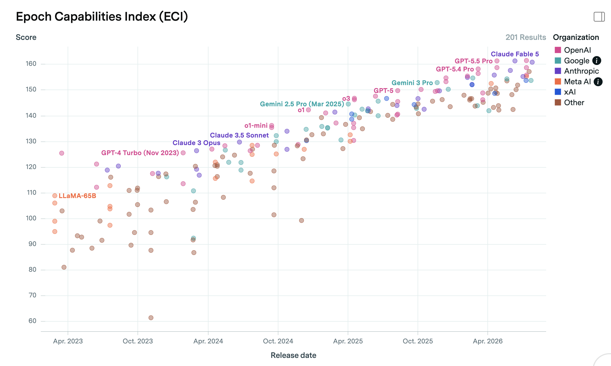
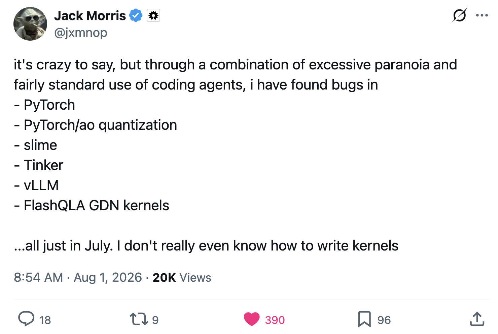

I took the summer off as a sabbatical from answer.ai, to travel with my wife, tinker with some side-projects, and spend some thinking through what I want to do in what feels like a particularly pivotal time. I've decided not to return to answer, but am still unsure about how to choose between my remaining options. This essay is for me, to consider them all in one place, and for everyone else who has been asking me what I'm going to do now :)

I drafted this with a bunch of bullets, and may leave them rather than expanding. You can ask your AI to complete it if you prefer fancy writing.

## Why Now?

- AI is getting v. good
- Software skills may have a limited remaining shelf life
- I want to step back and see if I'm in the best spot to contribute vs doing work that will happen anyway
- It was good for me to have a break from 'participation', to sit back and relax and spectate rather than being plugged-in to each model release and AI news story. I think I was pretty burnt out, as [many in the space are](https://www.interconnects.ai/p/burning-out)

## Factors To Consider

- Do I enjoy it (e.g. I like teaching)
- Does it have lasting value (e.g. teaching some specific tech << teaching some general principle)
- Does it have +ve impact (I want to do good)
- Are other people doing it? (I prefer less populous areas of the map)
- Does it pay? (I've historically skewed unprofitable-but-fun, now worry about financial footing given how many of the skills I have might tank in value as they get automated)

With that, let's look at a few options.

## 1) Back To The Mines (AI Research)

Lots of effort and capital is flowing into AI research right now. Many things feel 'overdetermined' - that is, they're going to happen pretty much regardless of what I or any other individual chooses to work on. That said, even if you think AI research is on track to be fully automated in the next few years, you can't look at the **current** state of things and not see that there is still LOTS of work to do:

I'm a little rusty on model training, but I have > a decade of experience at this point, and am sure I could find ways to contribute. There are organizations working to build AI that benefits people, doing hard + interesting technical work, that pay decently. I'm not sure the day-to-day of begging codex to fix distributed training code would be my *favourite* thing to do, especially if I don't have a compelling reason to want the result NOW (vs a little later, without me having to lift a finger). Still, I'm chatting to a few people who may convince me that their org is doing cool enough stuff that I'm compelled to chip in and help it along :)

## 2) Frontier?

- Probably not, unless alignment or application like bio.

## 3) Bio?

- Slow and expensive
- Possibility (e.g. ML 2014) to bring it to many more people
- ...and build on models getting better, cheaper synthesis etc in the future
- got some ideas...
- but not quite yet. Can't afford to pursue myself, but can keep on side (or beg for funding as a startup)

## 4) 'Poke The World With Science' course

- Didn't want to do a course
- But came up with an idea I would be OK charging for, that I love
- Participants get a kit of science stuff each [time period] and some lessons on a few things, then self-directed exploration using those principles to take stuff further and build up a tech tree for themselves over time
- more on this soon possibly

## Shorter-Term Projects

- Hardware Hacking Evals (time sensitive, impactful, I can't afford to try it on my own dime)
- Portland DIYBio scene (exciting, I think we could build a commuinity here in time)
- Electronics Kickstarter (might test the waters as a way back to EE)

## Why Not Answer.AI

I had a great time at Answer, they're good people! Solveit was fun, although (personal opinion only) it feels like we made a fantastic tool for coding with AI in 2024, or learning to code with AI in 2025... As AI progress relentlessly continues, I feel the need to make some different bets. I'm sure they'll continue to have fun teaching AI to code like Jeremy! And it's good that there are people trying different things as we all explore what the heck programming looks like now and in the future :)

## You Tell Me!

There are lots of areas I'm probably unaware of or underestimating! I'd love to hear from you if you have ideas for what I should work on! Even just my announcement on X that I'm formally unemployed has led to lots of lovely chats from people wanting to share the cool things they're working on, which I am loving. I really appreciate everyoine who has taken time to talk to me and answer my unusual questions as I've been setting out to figure this stuff out.

Also, more directly than ideas, you (dear hypothetical reader) can steer what I do with the application of money. If there's a direction you think I should go, a project you think I should do, and 

## Final Musings & FAQ

One of the biggest sticking points when I talk through my decision space with people is my lack of motivation to work on things I think are going to get done. Someone is going to build it, why shouldn't it be me? There are two main pieces where I think I am unusual as regards motivation:
- The puzzle is important: the fun part for me is figuring out if something can be done, and how. Once I can see that I lose a lot of drive - and for many software problems now the 'how' is some variant of "wait for the AI to get good enough then ask nicely". This takes a lot of the wind out of my sails. Obviously it is still worth doing the things, when you care about the outcome or will get paid to do it or whatever... but I care above average about having to figure out new stuff.
- I am anti-trend. I really dislike working on things that lots of other people are working on for some reason. (This is a bad preference for career earnings!). I am so much happier if I can find something that wouldn't otherwise happen, open up some new area of the map and then make it easier for others to come check it out and explore with me. This is why I loved AI art in 2020 and lost interest as it took off, why I'm drawn to niche things like neural cellular automata or DIY biology... IOW my explore vs exploit dial is set way over on 'explore'.

Another frequent question is, given my penchant for teaching, why not teach courses? Once I find something cool worth teaching, I am allergic to monetizing it. I can't stand charging for content - possibly because I grew up in a poor country where a price tag meant no access? I've also been very resistant to monetizing my YouTube/teaching content for fear of losing control over what I cover. If I have a paycheck attached to what I produce, that will heavily incentivize pushing towards the content in demand, chasing the hype. I might set up a Patreon this week and try to overcome these instincts to some extent, but this is why the list abive doesn't feature things like running courses on agentmaxxing or whatever the current thing is. 

## Money Talk

People don't like discussion salaries for some reason. Here are some figures to help you understand how I think about money:

- I grew up in Zimbabwe where many people live on less than $1 a day, so everything in tech sounds insane.
- My first work was stats+ML+coding for low hundreds of dollars a month (for a good cause)
- Out of college I was doing data science for low hundreds of dollars a day (for a good cause)
- My salary at Answer.AI doing AI R&D was something like $150,000 a year. 
- (This split e.g. last year to living: ~$50k, tax: ~40k giving: ~25k, IVF & savings the rest - very approximate)
- I'd consider short consulting for $500/hr if it's a few hours, possibly less if it's a longer time. Also, people who know me know that I can be expoited to work for free if you can nerd snipe me, feel free to exploit this information.
- I'd been giving myself $500/month as a lab budget upper bound, that might have to drop while we're drawing down savings. SO, if you want to contribute to me doing science stuff specifically, donating for lab spending specifically would make a huge difference to what I can do - this is also one reason I am thinking of starting a patreon even though it would be unlikely to move the needle much re: more general living expenses. Guilt-free budget for science is the dream :)

Given the pace of improvement in AI coding, I am more inclined now than ever before to let money become a factor in what I do with my time. Right now, I am valuable for getting things to happen with computers, likely to be accelerated further as tools improve. But within a few years AI may well make my involvement less necessary - so those skills at least (i.e. software engineering specifically) feel like they have a couple of years left for me to capitalize on them. 