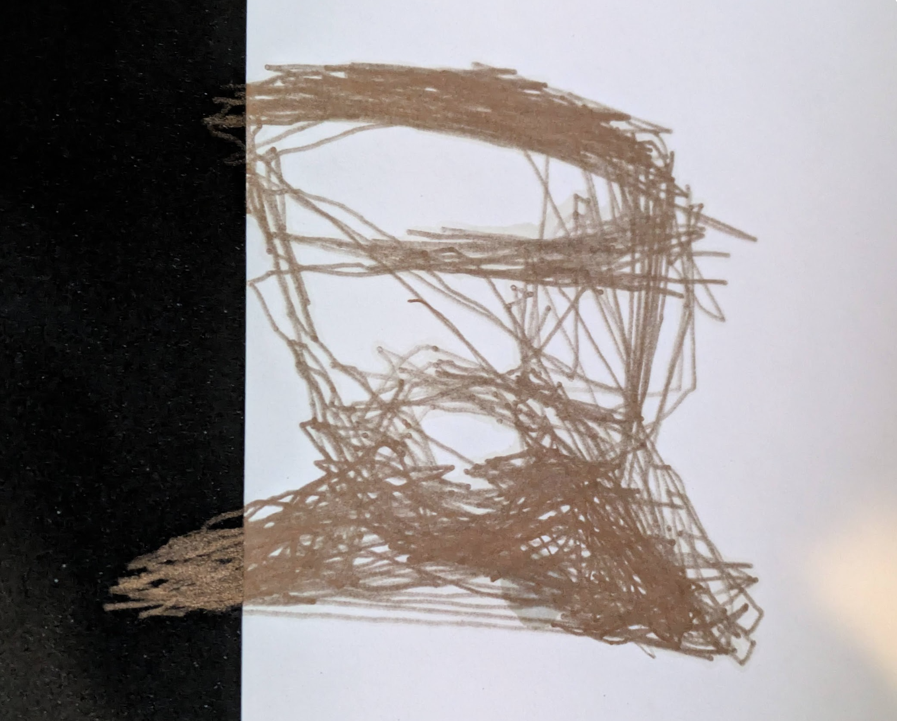

A [Karpathy tweet](https://x.com/karpathy/status/1886192184808149383) sparked a bunch of discussion about 'vibe coding' - his term for completely embracing AI coding assistance where "it's not really coding - I just see stuff, say stuff, run stuff, and copy paste stuff, and it mostly works.". He clarifies that this is still only good enough for "throwaway weekend projects" but it’s clear that many think of this as the obvious future of coding. So - is it? And if so, is that a good thing? I think my weekend hobby coding helps illustrate why I hope that the old fashioned way sticks around.

## What-plotters?

The project in question was a 'V-Plotter' - a device that draws by moving a pen/sharpie around at the end of two strings or chains, wound in and out by a pair of motors under computer control. Building one was on my project list, but I’d been putting off writing the necessary software. So, when o3-mini was released and its coding capabilities lauded, I threw it a challenge: write a web app that would take in an SVG and spit out the G-CODE that would control my motors correctly to draw the image in question.

It spat out a [functional-seeming site](https://tools.johnowhitaker.com/svg2g), and so I cobbled together the necessary hardware and attempted a plot. Apart from being rotated 90 degrees, the results seemed to indicate that it was working as hoped! A project that I’d been idly thinking about for years had materialized before breakfast on a Saturday - vibe coding for the win!

## A Question Begets a Question

I shared the first test in a group with some folks from my local hackerspace, and a fellow member responded asking if we could chat further - turns out the too had long wanted to build such a device. I agreed to meet, but felt an instant pang of *something* - what would I tell this guy? "Oh yeah I kinda know how it works but actually I just had AI write all the code?" Bah! Haven’t I spent the last few months teaching a course on doing things carefully, iteratively, in small pieces, with AI supporting but a human in charge? There was only one thing to do.

## Another Way

I started from a clean slate - a Jupyter notebook and a plan. With AI assistance, I started building up pieces bit by bit, sprinkling in some explanation. Can I load an SVG? What do lines and polylines look like? Can I turn those into sequences of moves? Can I shift and scale these move sequences? And then, once I was ready, the crux: how do you turn a set of X,Y positions into string length commands that would make sense for the plotter? What scary maths would one need to know? 

Prompt: Please write function c_t_v that takes the plotter params and a set of moves defined in cartesian space, and converts them such that they'll work on the plotter. Test it with the square from before.

With all the other scaffolding in place, the new function was only a few lines of code. And looking at it, with plots and examples in my own ‘context window’, it was immediately obvious how that code works. It’s just two triangles! 

This was code I could share with and explain to my soon-to-be-new-friend. This was something I could write a tutorial on. This was something I could code again in 2 years time when I decide I need to build a better plotter. In other words, 'inverse kinematics for hanging plotters' is now something I **understand**. 

## The Moral Of The Story

There are so many use-cases for instant, throwaway software. So many things now in reach for people who are new to coding or time constrained. Vibe coding is amazing, and powerful, and I enjoy it a lot! But there’s something delightful about figuring out something for yourself that I’m worried people might miss out on. Because behind the intimidating syntax and the boilerplate there’s often something extremely elegant and satisfying, which our puny human minds are more than capable of understanding. I hope that as we develop these tools even further, we keep in mind the value of wasting an hour or two trying to do things the human way. 

Yours, humanly, Johno
