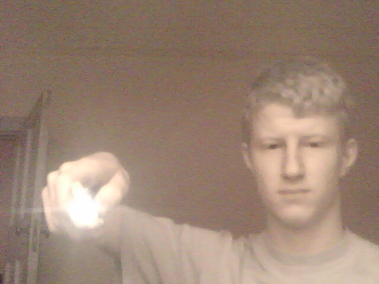

---
title: "IR Webcam"
date: 2013-07-04
categories: 
  - "mini-projects"
image: "images/ir_remote.jpg"
description: "When I found out this was possible I couldn't resist having a go. Sadly, I didn't document the build process but there are many tutorials out there 
		already explaining all the details. A short explanation and some more pics in 'more details'."
---

# IR Webcam

I modified my brother's webcam to see in near infra-red (NIR) rather than the visible spectrum, giving an interesting insight into the world of 
colours that we simply can't see. Coke looks like water, bills reveal secret patterns and your TV remote becomes a torch!

 The method really depends on your camera, but basically what you are doing is locating the CCD chip (which records 
the images) and removing the tiny, fragile piece of IR-blocking glass, then replacing it with a piece of something that blocks visible light
but lets through infra-red. This works because most CCD chips can pick up NIR - they usually just block it before it reaches the chip. I experimented
with a couple of different filters - both old floppy disk and overexposed camera film work well. They have to be cut to squares about 5mm a side, and getting these
to fit over the chip was the hardest part of this project. I recently set this up as a security camera using my raspberry pi to detect motion and stream the video over the network, but I will write that up in another post.
Here is a gallery of some pictures taken with the webcam.
My common room at school (the couch is black to our eyes):

A match:

An LED torch (very bright, but almost no IR):

A remote:

Some of my parents new $100 notes :) :

