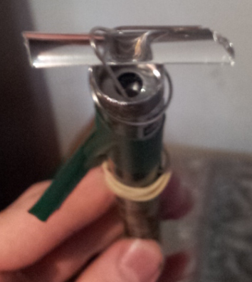
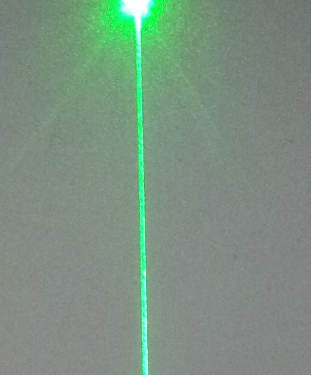
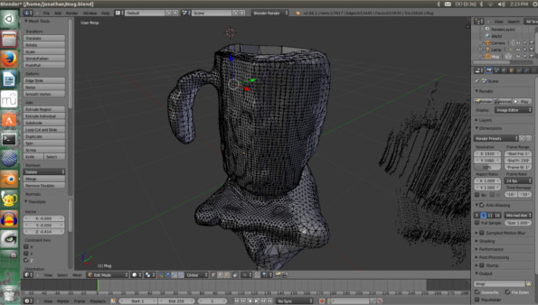

---
title: "Easy 3D Scanner"
date: 2013-08-03
categories: 
  - "mini-hw-projects"
image: "images/3dscan_1.jpg"
description: "How cool would it be to be able to scan objects in 3D? Turns out its not hard, and can be done with stuff you probably have lying around the house.
		I made mine using a cheap laser pointer, a broken wine glass stem (sorry mum :) and some cool software -makerscanner. This is
		a piece of software designed specifically for their design, but I will explain how to adapt it if you don't have a 3D printer. I also usedMeshlabandBlenderto clean up the results."
---

# Easy 3D Scanner

3D printers are pretty cool things, and with more and more people getting access to these lovely little machines, [Makerbot](http://www.makerbot.org) decided that people needed an easier way to make 3d models without having to learn a bunch of new software. So they came up with a piece of software called makerscanner and released designs for a 3d scanner. However, their designs required 3D printed parts, a PS2 camera and a specific model of line laser. I didn't have any of these things, but giving up is for quitters so I set out to see what I could do.

The first thing to do was to figure out the distance between the laser and the camera. I found it on a forum somewhere - 19.8cm. Fortunately, this was almost exactly the distance from my laptop's webcam to the edge of the laptop, but if you want to change it you can edit ScanThread.cpp and adjust the line `#define DISPARITY_DISTANCE 19.8` before re-compiling.

Now I needed a line laser. This can probably be ordered online, but I am broke and impatient so instead I made my own lense to make a line laser with a nice strong laser pointer:

Considering that this was done with a paperclip and a bit of broken wine glass, it actually works suprisingly well!

The procedure is simple - fire up makerscanner, input the distance to your backdrop and then sweep your laser back and fourth over the object to be scanned.
	It needs to be in some sort of pivot. For the top image I used a retort stand in our school lab to scan a teachers cup, but I have also taped the laser to an arrow,
	basically whatever is on hand should work fine. The resulting point cloud can be viewed in meshlab immediately, but will need some adjustment to get a 3D
	model. If you (like me) live in a country whose locale specifies the comma as a decimal point, the point cloud will not open in anything, but don't despair! 
	I managed to fix the problem by opening makerscanner with the following command (this will probably be different if you are not on linux): 'LC_ALL=C makerscanner'.

Post-processing is relatively painless, but there is a tutorial on the makerscanner site so I won't go into detail.
	 The idea is to take several scans and then combine them into one model, but depending on what you are scanning you can get a very rough model from just one scan:

So there you go, a 3D scanner that I built in half an hour - a simple but really cool project to try next time you're bored.

	 

