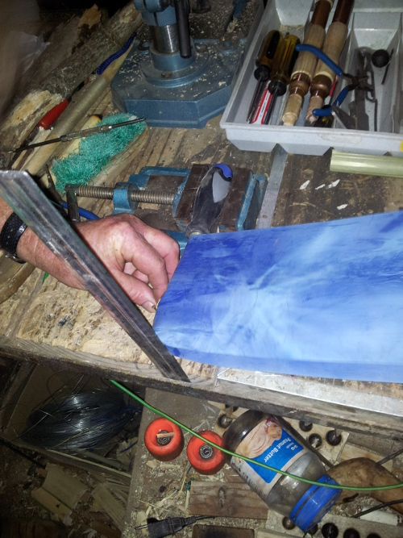
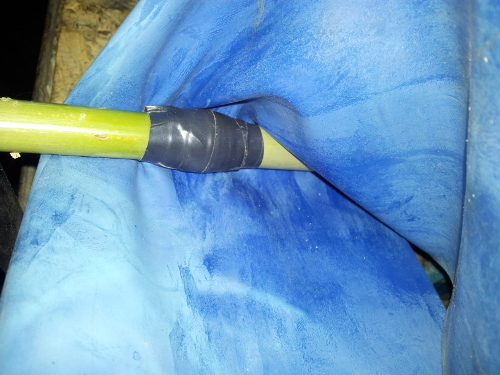
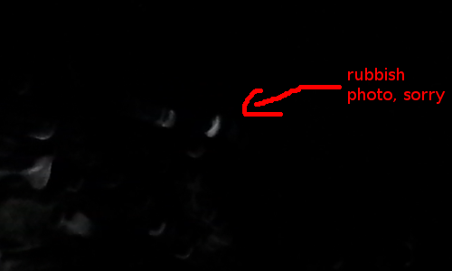

---
title: "Junk VDG"
date: 2013-09-02
categories: 
  - "mini-hw-projects"
image: "images/vdg_top.jpg"
description: "I threw together a Van de Graaff generator out of stuff lying around. It worked, but the whole point was that by doing everything wrong I can now explain
		how it should have been done. Check out the full article for the details."
---

# VDG in an hour (from junk)

Our school has a Van de Graaff generator - it is pretty much a must-have for a physics lab. We used to have a teacher who used it often,
 zapping us with a lyden jar whenever some of the class were missing and we needed a more low-key lesson (this is great fun!!).
 However, he left and now it gets pulled out at open days and used for one lesson on static electricity per year. For such low usage it is 
 a pretty expensive piece of equipment - I don't know how much ours cost but even very low-end ones on amazon are upwards of $200. Surely 
 there must be a cheaper option! The following monstrosity is not fit to replace our lab one, in fact I purposefully did lots of stuff wrong 
 so that I can then explain how one would go about building a cheap Van de Graaff generator out of whatever you have lying around, and I 
 hope that by doing it this way I can say what NOT to do but also show how easy it is to get sparks.

First up, you need a way to move the belt. This can be whatever you have handy - a washing machine motor, one from an RC car or even just a hand crank. 
All that is required is that it generate enough torque (spinning power) to spin your belt at a decent speed. Old fans are great for this purpose, and they even 
have adjustable speed. I had one lying around with a PVC pipe already glued on in place of the blades, a relic of a past VDG project (that was never finished...) 
. I pulled this out, blew the sawdust off and added a bulge of insulation tape in the middle of the PVC to hold the belt in place (more on this later).
 Drive motor - check.
Now for the belt. This is going to ferry charge to the dome, and is one of the most important bits. I remembered that my mom had a nice piece of stretchy 
 rubber for exersise. Belt - check!
Now for your dome. This is where the charge is stored. I have been looking hopefully around shops for a nice domed metal bowl, but
 no luck. Instead, I settled for a plastic bowl wrapped in aluminium foil. Dome - check.
Here is what it looked like at this point:

Now for the other roller. I used a piece of bamboo that was lying on the ground. In the middle is another bulge of tape (this magically keeps the belt central)
and a screwdriver is threaded through the middle. A ruled keeps it from slipping off. This is what it looks like:

And under the belt:

As you can see from the first picture, the top brush was just mangled foil. For the bottom a ran a cable from the 
ground of a plug to just below the roller and splayed out the end. After that I turned it on and presto - it worked!
Because of the rubbish dome it only produced 1cm sparks but it was enough to give a decent shock. When my little brother 
stood on a "rubber mat" (actually cricket pads) I could shock him by flicking my finger near his ear, and he gave my dad 
a fright with a shocking handshake.

To get a bit more juice, I built a leyden jar - in this case just a cup half full with salty water, a teaspoon and some aluminium foil. 
This works as a capacitor to store charge and make a better spark:

This gave a brighter spark, and a much bigger jolt. To charge it, I just held the cup so that the spoon was by the dome.
Check out the comparison of the spark from the dome and the spark when I moved the spoon close to the foil.
First the normal, tiny spark (it produced way longer ones but they didn't show in the photos)

Now the spark from the jar - much brighter:

How it SHOULD be done
This worked surprisingly well, but it could be vastly better. Here is how each part should have been made:
The Dome
This is the worst part of my whole build. The size of the dome determines the length of spark you are going to achieve. Ideally it should 
be a smooth sphere (or as close as you can get to that) with as few pointy bits as possible as these cause corona discharge and
 you loose voltage. The bigger the radius, the better. It should also be isolated as completely as possible. My foil-covered bowl 
 was as far from this as you can get, hence the puny 1000V sparks.
The Rollers
In this build I just used whatever was close to hand for rollers, but ideally a lot more thought should go into them.
 Obviously, they should spin easily with little wobble (unlike mine). Use masking tape to create a bulge in the middle before covering them in
 your chosen material. Choosing the materials affects the rate of charging of the dome, and may seem complicated. It is actually pretty easy.
It all comes down to something called the triboelectric series. Simply coat one roller
  in a material from high up in the series (nylon for example) and one from the bottom (teflon is easy - plumbers tape). Swapping the two rollers will 
  cause the dome to become positively charged or negatively charged. Experiment to find out which works better for you.
The Brushes
These should have many points close to, but not touching, the belt. A trimmed piece of gauze works well, but steel wool or just stripped 
 multi-core wire will work fine. It is possible to work out whether they should be placed just before the roller or just after, but this is hard to 
 explain and easy to work out by experimentation. If you are not sure, sticking them directly above or below the roller should work fine :).
The Belt
For the belt, try to choose a material somewhere between your two rollers in the series. Do NOT use rubber from an inner tube, as it does not work at all.
 It turns out that my mom's exersize belt was actually perfect for the job and the favourite of hobby VDG builders. Obviously a smoother join would be 
 better, and the broader the belt the faster your VDG will charge. Keep the belt dry and free from oil as much as possible, as this will affect performance.
General tips
 - The internet is full of tutorials for building VGDs. It help if you read a few of these before starting on your own.
 - Any moisture or humidity vastly reduces performance, so ttry to keep everything as dry as possible and don't complain
if it stops working on rainy days.
 - There are not really any specialised parts needed, and you should have almost everything needed to complete this project around your house. 
Don't be discouraged if you cannot find something mentioned in a tutorial - just find a substitute!
 - Finally, don't be afraid to experiment and fail. If it doesn't work, ask yourself why and then fix the problem. This is a really fun machine to 
build and play with. If you are completely stuck, e-mail me at johnowhitaker@yahoo.com and I will try to help you out. Good luck!