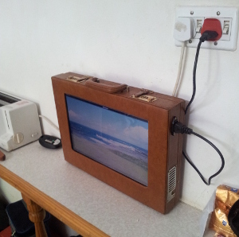

---
title: "Laptop in a briefcase"
date: 2013-10-02
categories: 
  - "mini-hw-projects"
image: "images/lb_finished_laptop_small.jpg"
description: "After I managed to get my hands on an old laptop, I wanted to try my hand at making it into a “picture-frame” display, as seen all over the web.
		 However, with the power of a (n admittadly derelict) laptop at your disposal it seems a bit of a waste if all you want is a slide-show. 
		 In addition, my mother didn't look too happy with the idea of me liberating a frame from one of her pictures."
---

# Laptop in a briefcase

I wiped the flash stick containing the live boot enviroment I had set up, and I don't
feel like going through the whole process just yet, so I am postponing the finishing off of this project
untill I have more free time. Here are some pics that outline the build process. I am using polystyrene
blocks as spacers to ensure a snug fit and a "universal laptop charger" that I bought in a flea market 
as the power supply. 

Dad inspecting my handiwork...

A snug fit

Early testing (notice the external laptop charger and the wires...)

This has the potential to become a nice feature in our kitchen, possibly controlled using an old IR 
remote and an ATTiny85 with a reciever inside the box, but for now I must let it lie.
