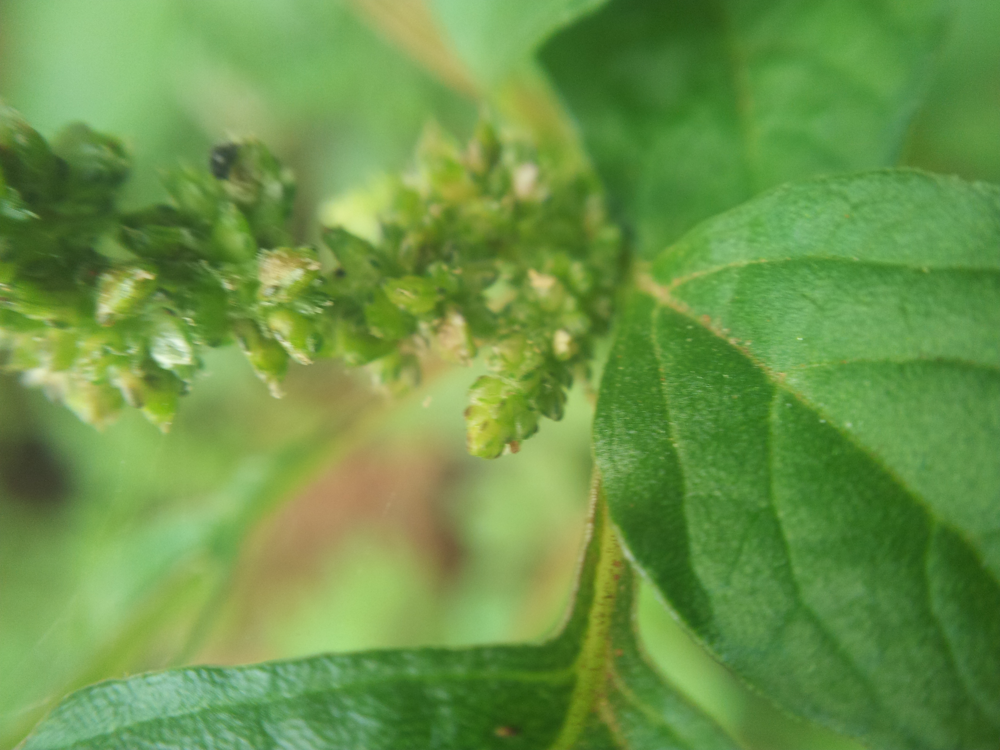
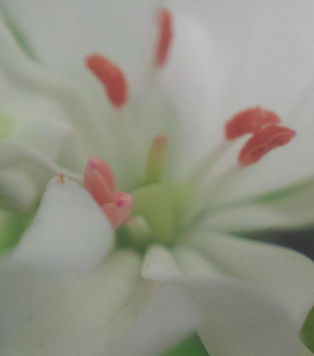
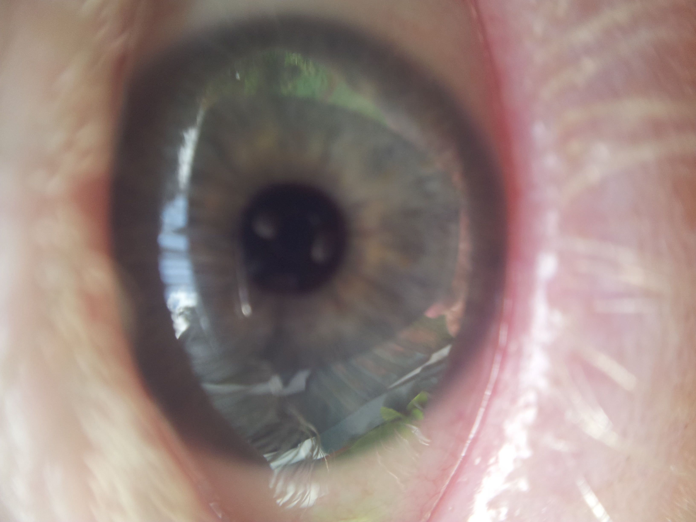

---
title: "DIY Cellphone Macro Lens"
date: 2013-12-01
categories: 
  - "mini-hw-projects"
image: "images/macro_lens_flower.png"
description: "Found an easy and free way to take amazing macro shots with your cellphone using the lense from inside a DVD player. 
		Pics and long explanation in 'more details' (warning, large ~2MB images)"
---

# DIY Cellphone Macro Lens

I am doing some research work, and we needed a way to differentiate between two species of baobab (Adansonia Digitata and A. Kalima). Seeing as the only
difference visible at this time is a the stomatal apature size, we needed magnification, and fast. Rather than carry a microscope into the field, an idea
solution would be something that could be clipped to a cellphone. My brother mentioned seeing a lense from a cheap laser used as a macro lens. Ten minutes later,
I had a lovely lense from a DVDs laser array balancing on my phone. It worked!

The lense stuck (temporarily) to my samsung galaxy S2:

Leaf bottom lifted with clear nail polish - you can see a stoma!

 ^^ A macro selfie ^^
