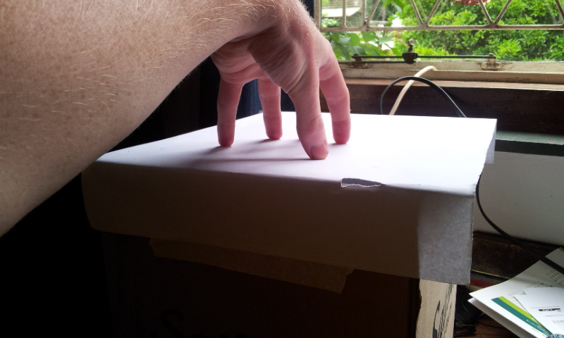

---
title: "Multitouch Surface"
date: 2014-01-01
categories: 
  - "mini-projects"
image: "images/multitouch7.png"
description: "Whipped up a quick DIY multitouch thingee - really cool to play with and cost $0 (not bad considering Microsofts commercial alternative costs $12000!).
		 Uses an open source program called CCV to process the video feed 
		from my IR camera in the bottom of a box. The box is covered by a piece of perspex and a sheet of paper. 
		By analysing the shadows on the paper the fingers can be detected. I also set a projector in the box so that you see the screen react as you touch it."
---

# Multitouch Surface

First project of 2014! I had a bit of free time and found this awesome tutorial explaining how to make a multitouch surface.
Another great use for my IR webcam. It only took an hour or so to throw it together, and while I had issues getting the software working properly on linux (
all the demos were flash programs, but pyMT came with some great examples) it was still a remarkably easy and quick project. Sadly, I didn't bother to take a photo of 
it working with our pico projector (so that it behaves like a touch screen rather than a track-pad) and only took photos of it in use as a multi-touch input device.
I can't wait to start coding my own custom apps and games for this! Here are some pics:

Obviously this is going to be improved, and is still basically a prototype. Once I get some more time, I will be building this into a table with a projector as the 
screen and my Raspberry Pi doing the processing. I also intend to write some apps of my own for it, and possibly use it as an interactive educational piece somewhere. For now, however,
 it will remain as an ugly box on top of my cupboard as I focus on more important things...