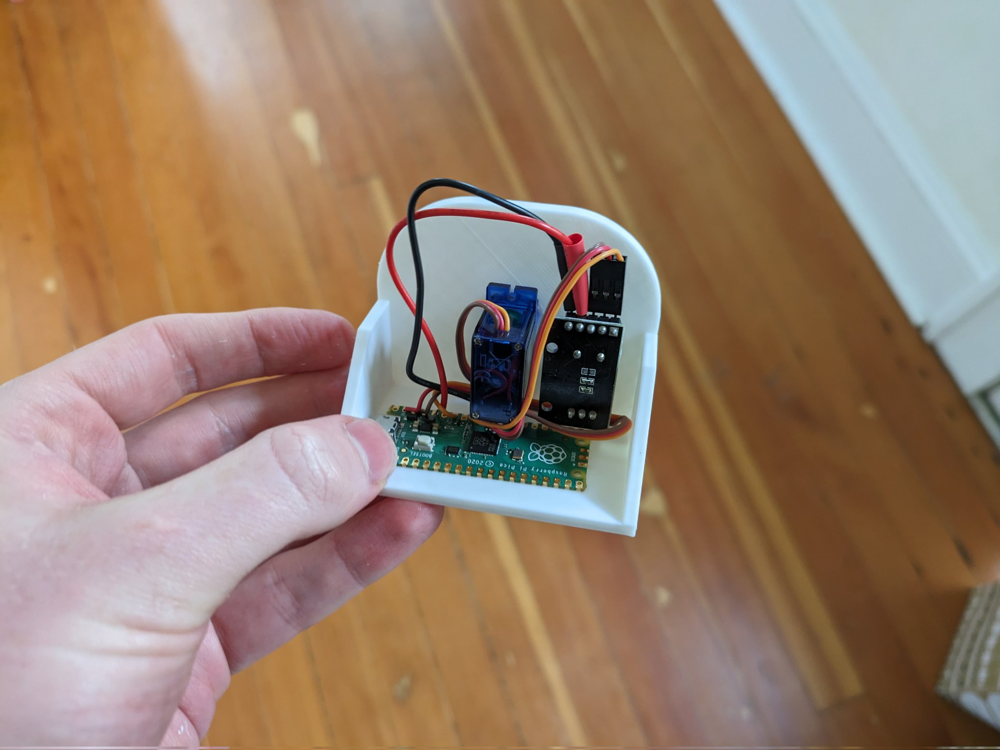

# Mini Work Timer

I lose track of time easily, so I'm trialling a little timer widget on my desk. Good for regulating Twitter breaks.

The electronics are fairly simple: a Raspeberry Pi microcontroller reads a rotary encoder and servo that acts like a clock hand. A button (integrated into the quadrature encoder) switches from seconds to minutes mode, since I expect this to come in handy for board games too. I printed an enclosure, which is waiting for a paint job :)

The code is written in Micropython, and the development experience was a pleasant suprise - just edit a .py file and drag onto the storage device that shows up. My previous embedded development experiences usually involved proprietary debuggers, arcane toolchains and pain... 