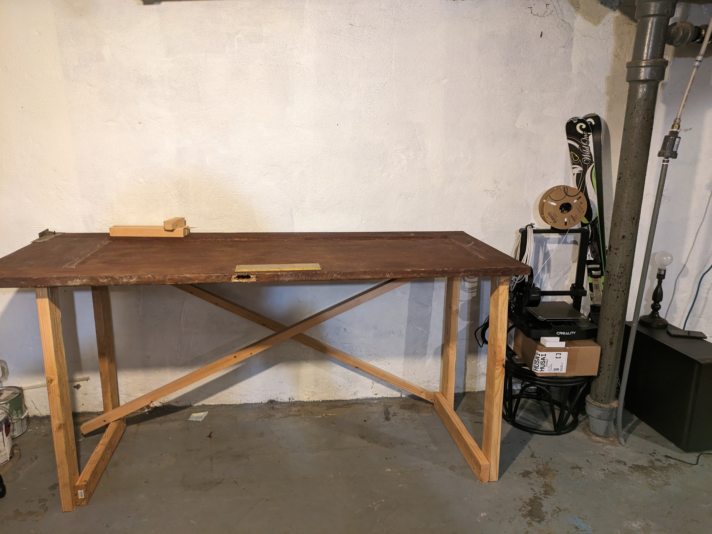

# Quick and Dirty Workbench

I'm slowly getting the basement organised into a nice workspace. In addition to my primary desk I wanted a standing workbench for soldering and other messy work. A scrap door and some lumber that was lying around made for a quick and easy solution:

I love how a bit of cross-bracing turns a rickety structure into something solid. This still needs a bit of finishing, but it's already sturdy enough to work on which makes me think any further work will may procrastinated indefinitely :)

A curious side-note: I keep an air quality monitor down here, and the CO2 levels usually stay <600ppm even after a few hours of work. But today, between moving things around and assembling the desk with my wife's help, the CO2 levels shot up to 1200ppm. I would have expected a small bump, but not that much - which makes me wonder if there wasn't something else (ozone from brushed motors in the drill and vacuum?) that was causing the spike. I'll keep an eye on it next time I do a longer workout down here and see if I cause a similar spike.

PS: main desk setup:

Slowly but surely this is turning into a great space to work!