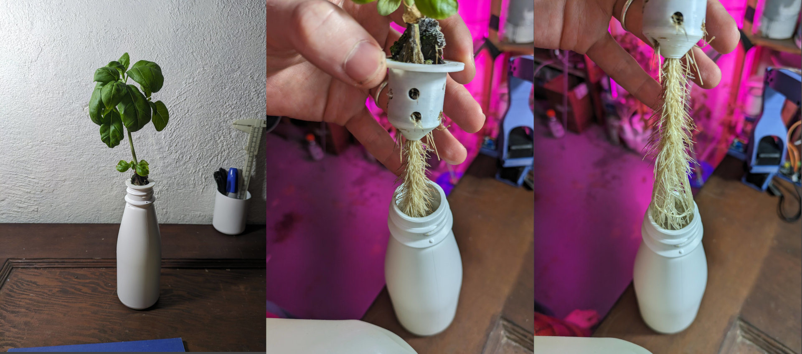

# Basement Hydroponics: Part 1

I've been dabbling with hydroponics in my basement since discovering some unused grow lights from someone else's abandoned attempt. It's fun to see things grow! The system has also doubled as a way to start seeds indoors before transplanting them outside, and gave various flowers and herbs a head start. Now that all the seedlings are planted out, this is what the system looks like in its current state:

There's a gazillion youtube videos and desicated kits for hydroponics, but the simple fact is that plants do OK if you dunk them in water filled with nutrients and the rest is mostly fluff to get you to buy someone's over-priced pump or whatever. I'm using some nurtrients from the same abandoned project that left me the lights, and the rest is just stuff I had lying around. I opted for a Kratky-style system, which is a set-and-forget style of hydroponics where the plants wick up nutrient from a tank that starts mostly full and slowly empties as the plants grow. I started seeds in 'Jiffy Peat Pellets' which can be suspended in holes in the containers by shoving some screws or skewers through them. For some smaller experiments I've had success using smaller bottles with a cap I 3d-printed:

This is inspired by the excellent Falcoponics system invented by Sebastian S. Cocioba (@ATinyGreenCell) for small-scale hydroponics. With these smaller containers you need to top up the water more often, but it's a fantastic approach for testing out ideas without needing to wrangle hoses or worrying about contaminating some big central reservoir.

We've been consistently harvesting basil and chard, and there are flowers on the engineered purple tomato plant so stay tuned for a part 2 if that works out :) The only downside to this nice efficient system that I've set up is that it actually doesn't require any input from me, which makes it not much of a hobby! I may have to start experimenting with some fast-growing plants and try to do more experiments in the small bottle system I've developed, just for an excuse to go smell the good green smells and tinker more frequently...