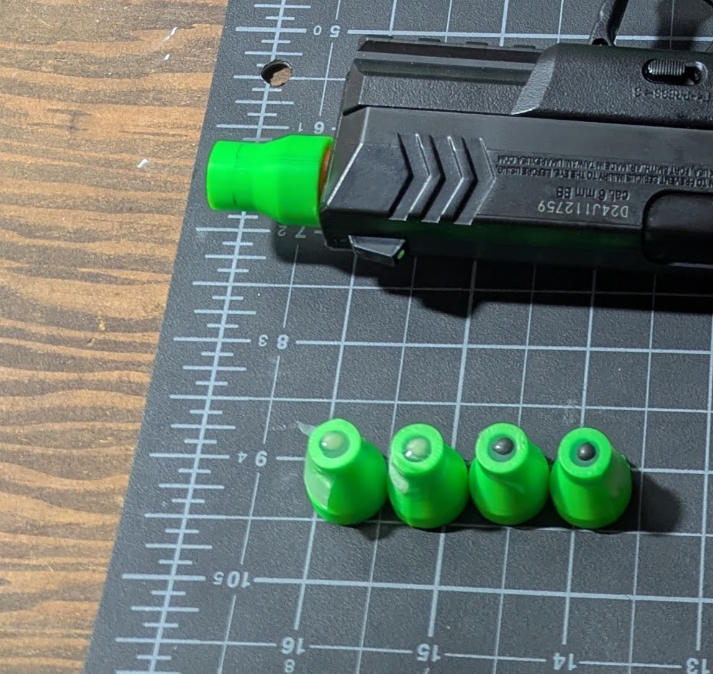
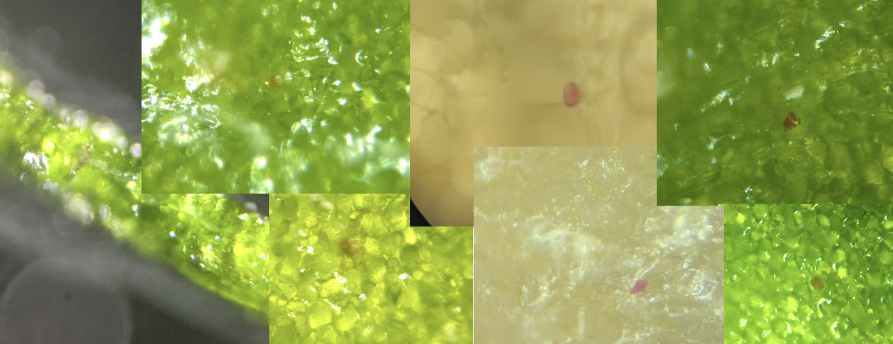
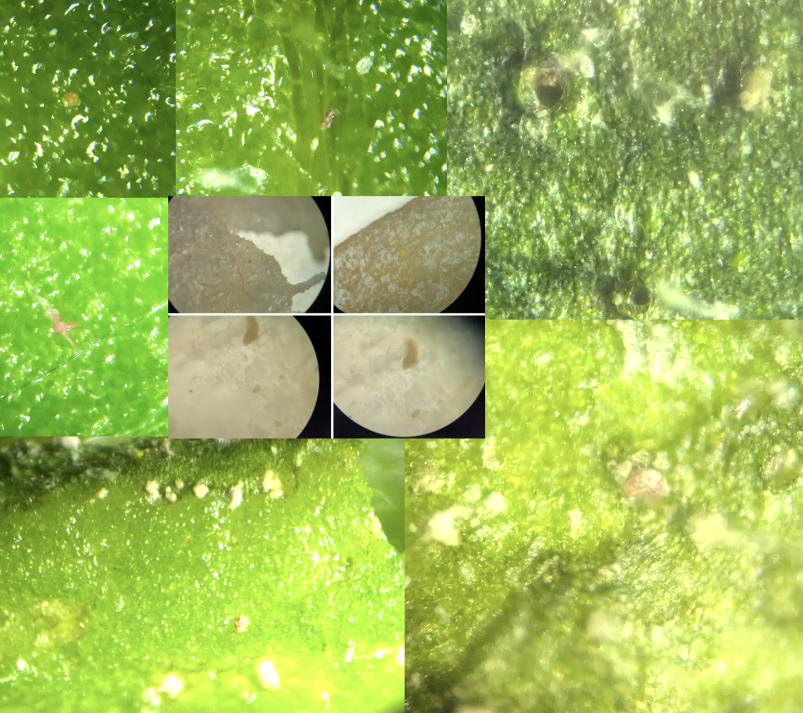
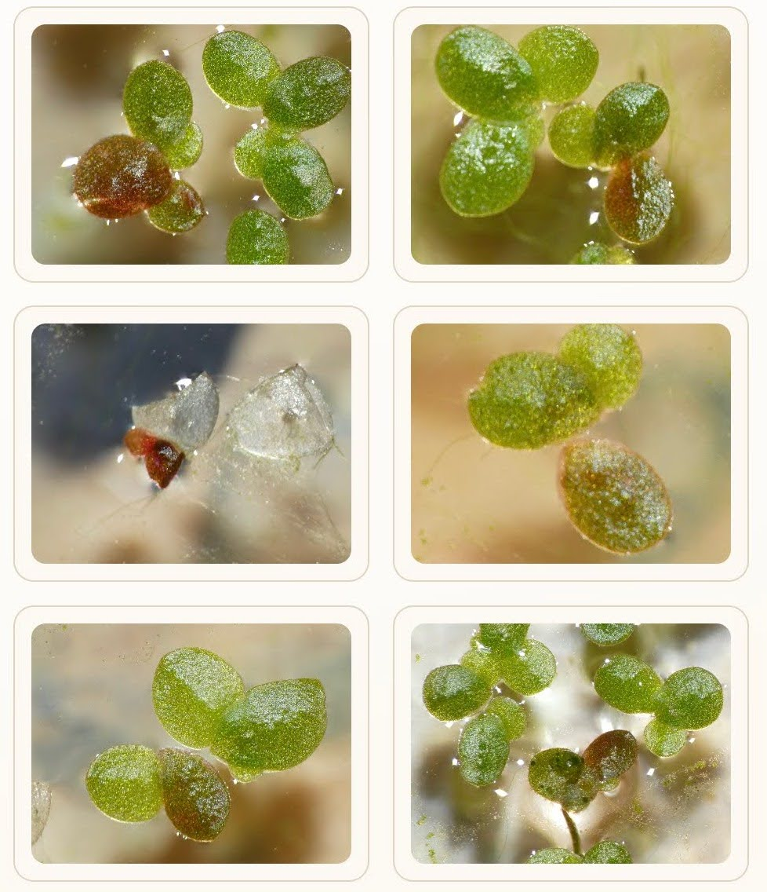

In a [previous post](https://johnowhitaker.dev/mini-hw-projects/airsoft-gene-gun.html), I pointed out that a gene gun (fancy, $XXXXX) and a cheap airsoft gun share a lot in common. Now that I [have DNA](https://johnowhitaker.dev/posts/dnaq.html), it was time to pew pew - and it looks like maybe we got some transformations! I'll explain what I've tried, what I found, what I'm thinking, and what I hope to try next.

## The Method

I take a small amount (10uL) of a slurry of diatomaceous earth (DE), add some (10uL, 50mM) calcium chloride and some (~1ug, in ~2uL) plasmid DNA and place it on a piece of parafilm stretched over a 3D-printed tube. I dry it in a filtered stream of air, then the tube adapts to the end of my cheap airsoft pistol, and I fire it at a leaf from a few cm distance.

The DNA I have codes for the 'RUBY' reporter, which expresses a red pigment. I extracted the DNA from bacteria carrying this plasmid which I got from [Sebastian's Biotech Bazaar](https://atinygreencell.com/products/pcambia2300-rubygreen). I used [this miniprep kit](https://bioland-sci.com/products/plasmid-miniprep-ii-kit-50-preps?pr_prod_strat=e5_desc&pr_rec_id=821821b3f&pr_rec_pid=8042713055421&pr_ref_pid=8042712826045&pr_seq=uniform) to purify out the plasmid DNA.

## Findings

I shot some tobacco leaves, some duckweed, a slice of carrot and some onion... In the leaves, around the spots shot with DNA (but not the controls) there are some, well, reddish bits that show up after a few days! And after lots of squinting at them I've convinced myself that at least some of these are cells expressing RUBY :)

My gallery is filled with blurry attempts to capture this, and none make it as obvious as I'd like. For example, there are also plenty of cases where, around an impact point where a clump of DE has hit, there'll be some orange-ish crud welling up. Around most impacts (and all that I saw in the no-DNA controls) this stuff is pale white. Could this be RUBY too, expressed in some damaged cell(s) and being included in whatever is happening around the hole? Plus there are random red things just around the place - bits of fiber, random flakes - here's a gallery of things I was more sceptical of:

The almost magenta dots in the carrot are apparently pretty much what [RUBY looks like in carrot]((https://academic.oup.com/hr/article/10/4/uhad024/7036638)), that was a YOLO shot with some leftover stuff, I'll do some follow-on ones with carrot callus that I have growing and hopefully get a clearer signal. But in general it was much harder looking for red/orange reporter in orange carrot tissue!

I didn't see anything in the onion I shot. Nor did I see anything in onion that I tried my micro-needle idea on. But then, RUBY doesn't work everywhere - for example [this paper documents it being a poor marker in coconut](https://pmc.ncbi.nlm.nih.gov/articles/PMC12787607/) (also a good ref for optimization strat once I can easily bombard and measure.)

For comparison: I've also been trying transformation with agrobacterium, which gives a much more macro result - here are some duckweed fronds expressing RUBY to various degrees:

## Thoughts, What didn't work, What Next

What didn't work:

- Using graphite as the carrier (I wanted something more visible than the DE, so I sanded some graphite rod to get powder, but I didn't ever see transformation using it)
- Using my tungsten micro-needles seemed to kill leaf cells, and when I tried them more gently on onion I didn't see any transformation
- Bombarding duckweed was tricky (it tended to fly away in the blast) and I didn't see any transformation of its tiny cells.

I *think* the red spots are enough to indicate that we've gone from 0 to 1. From here, we can optimise - playing with

- DNA, carrier and buffer amounts
- Nozzle diameter and geometry (I already switched to a converging-diverging nozzle which seems to give a much nicer shot). [Ref for flow guiding barrel design (just found)](https://www.nature.com/articles/s41467-025-60761-x)
- Shot distance
- etc.

But I'm not happy with RUBY as a readout - too hard to see and measure. I'd love to use a flourescent reporter, but after months of trying I wasn't able to get my hands on some. I have a construct with a fluorescent reporter ready to go for another project, which I'll be ordering soon, for about $500... Once I get that I'm hoping we'll be able to easily quantify how well a given shot does, and start optimizing everything. I wish individuals could order plasmids from addgene! Anyway.

Once you have some transformed cells, you can try to grow them out in tissue culture, optionally with something like herbicide resistance to select for the trasnformed ones. I'm hoping we can find a visual-selection-only flow since I don't want to me making herbicide resistant plants or having other people work with them.

My dream is to work out a path for people who haven't done this before, and don't have the tools to do assembly and cloning, to still order a construct with their own protein/design, and get it into a plant, all as easily as possible. Wish me luck :)

