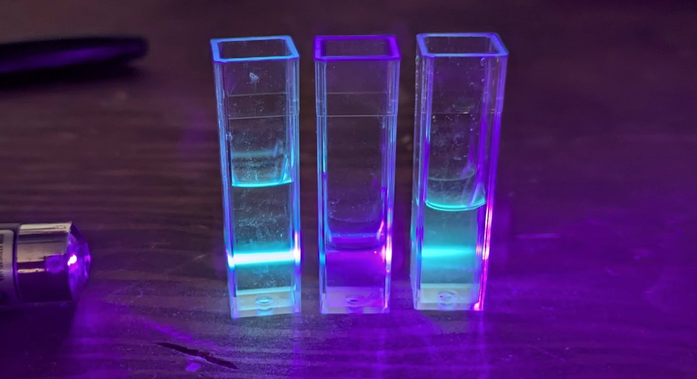
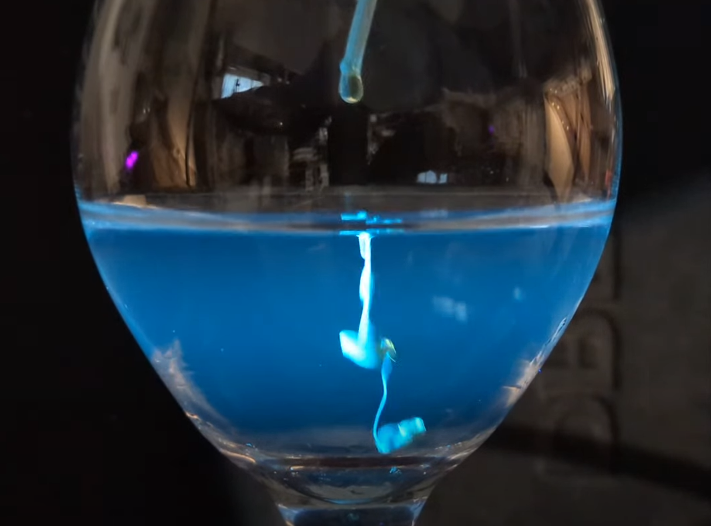
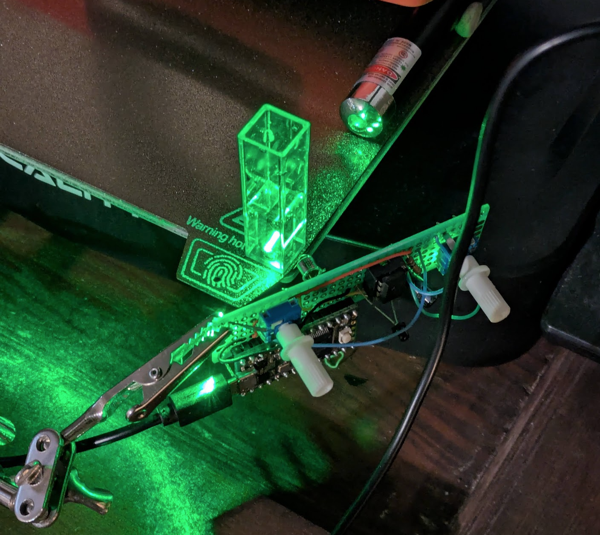

intro para

Initial inspo: [this Instructables post](https://www.instructables.com/DIY-Quantum-DotsNanotech-in-Your-Kitchen/) and various replications from hobby scientists on the net. Using a microwave cut the time taken down from 4-8 hours (the 'hydrithermal method' in the formal literature) to <10 minutes. In my attempt I used much smaller quantities that the Instructables post, so two ~2-minute microwave sessions were sufficient. Still - I'm an impatient chap!

TODO link video

So, here's my new, minimal, quick-and-dirty method for making carbon quantum dots:
- In a spoon, put a pinch of ascorbic acid (vitamin C) powder* and a pinch of sucrose (table sugar).
- Add a few drops of water (~1/4 to ~1/2 tsp)
- Heat over a flame (I used a mini blowtorch) until the most of the liquid is gone and the color starts turning golden brown (like caramel).
- Add some water back, yiending a brownish-yellow syrup.

*: Use vinegar instead of water for a more acidic solution if you don't have ascorbic acid on hand - bubbles more furiously but works just as well.

Drip some of this into water while shining a UV light or blue laser through it. If all goes well you'll see some beautiful blue-green flourescence!

I've been trying to use a technique called 'Direct Light Scattering' to estimate the particle size. From the literature, it seems the CQDs are ~2-4nm. But unlike other QDs, the color isn't tied to size as much - so who knows. I was skeptical these are even true quantum dots - maybe caremalized sugar just fluoresces under UV light? But nope, seems like this is matching what the science nerds do and these are indeed QDs. My DLS setup needs some tweaking before I'm ready to report any results with certainty though :)

PS: other things I tried
- Just sugar (no acid) - no flourescence
- A basic version with sodium bicarbonate (baking soda) in place of ascorbic acid - no flourescence
- Using vinegar instead of water, with just sugar added - WORKS
- Trying other solvents (careful if you're heating IPA for e.g. - it's flammable!) or adding things later to try and change the color - no luck
- Eating it ("Johno don't eat the quantum!") - no superpowers yet. Probably don't do this :)

I really want to make different colors, so next I'll look around for other carbon precursors and try different heating methods. For now, I have an easy way to make pretty glowy water, which is at least a start!