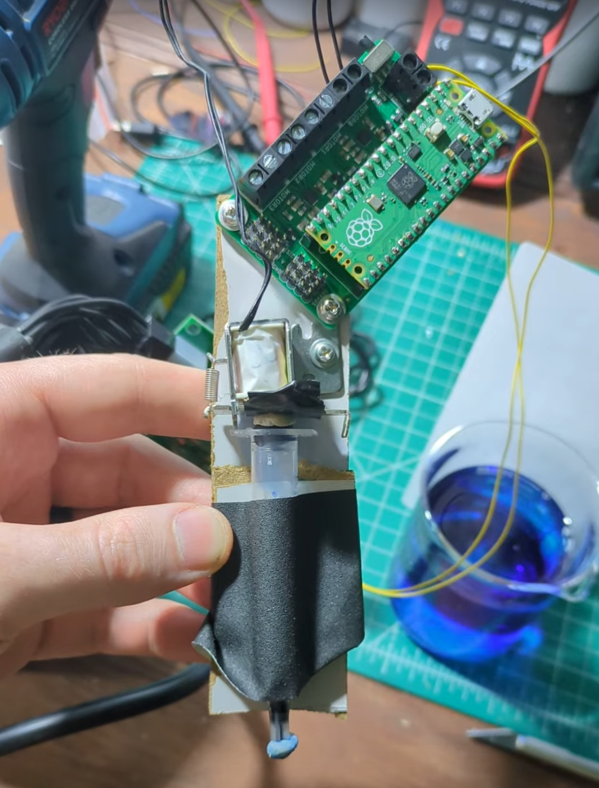
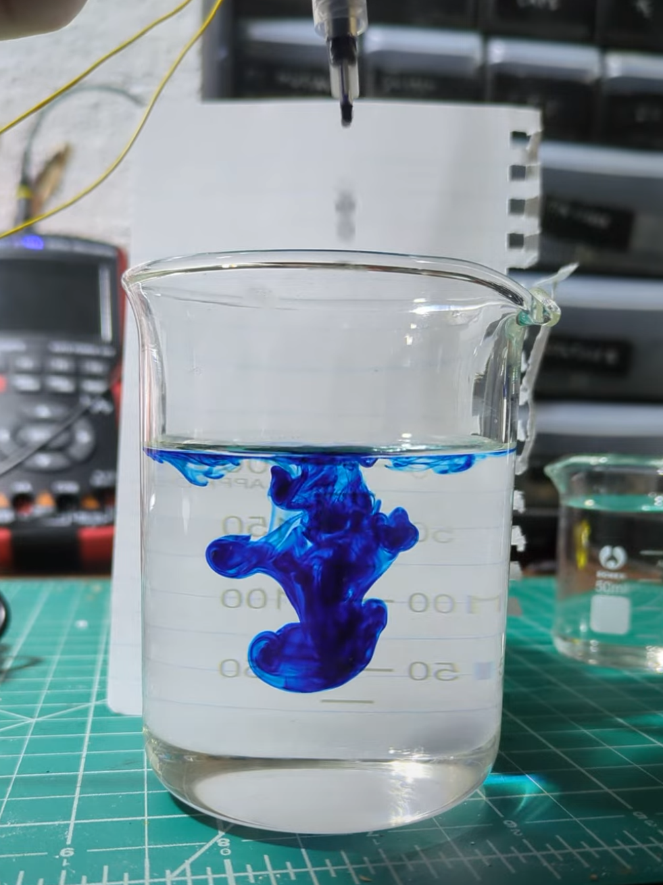

Inspired by the [Hackaday One Hertz challenge](https://hackaday.io/contest/203248-one-hertz-challenge), I used a solenoid scavenged from an old printer to drop dye into water once a second, making for a pretty (if short-lived) time-keeping device. Video of it in action [here](https://x.com/johnowhitaker/status/1947072110817644573).

The top of the syringe plunger makes a loose seal, and is popped out briefly by a pulse of the solenoid. This let's a bit of air in, which allows a small drop to form at the bottom of the syringe (with needle removed the hole is perfectly sized for this). The tap and small pressure bump as the plunger top returns to it's resting position knocks the drop off, giving a perfect* 1Hz drip.

I 'filmed' a full syringe worth of beautiful footage - about a minute of fresh ink dropping into clear water, with it all set up in a stand. The alignment was perfect, single drops each time. I went to 'stop' the recording and, womp womp, it hadn't started. I promptly spilled some dye, knocked things over and messed it all up attempting several re-takes before deciding I'm content with the current shorter clip. Each failing tick spewing mess on my bench felt like a metaphor for time passing that I did not enjoy :D

Parts used are a Raspberry Pi Pico RP2040 microcontroller in the "Kitronik Simply Robotics Motor Driver Board for Raspberry Pi Pico" board. The code is attached, pulsing the solenoid (connected to the MOTOR_0 output of the board) for a set time each second. Code dumped on the [hackaday io project](https://hackaday.io/project/203568-1hz-dropper) (but it's basically just blinky, one-shotted by o3, plus stolen library code).

Not my finest work in any respect but it was a fun diversion from Sunday tidying.