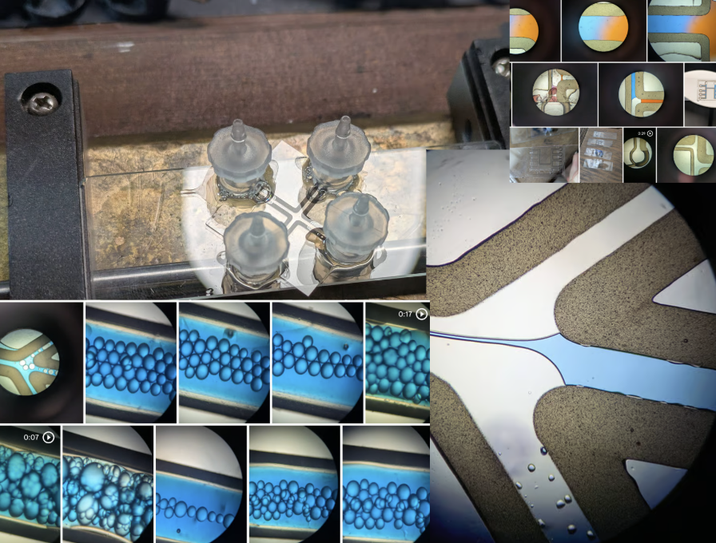
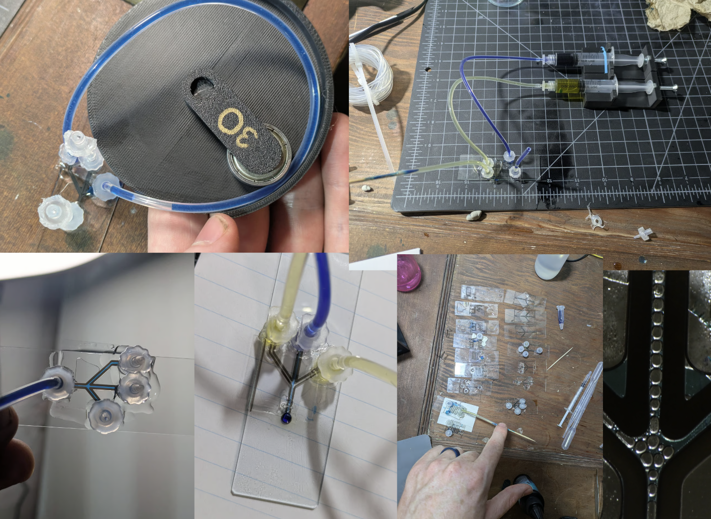

I've been messing with making microfluidics (or maybe just fluidics, since the smallest features are still hundreds of micrometers at present). I think I've got quite a neat technique that I haven't seen elsewhere. I made a video a couple of days ago with my first few tests:



Since then, I've managed to get rough proof-of-concept bits working for droplet generation and sorting, my two main goals. But I've also spilled a lot of mineral oil and dye, and keep breaking things just as I get them working :) Still, I want to write down some rudimentary notes on my process since I'm leaving for an off-grid trip then going camping so it'll be a few weeks before I can resume work on this. 

To make something useful with microfluidics, you need 1) a way to lay out precice channels and geometry for liquids to flow in and 2) ways to control the flow of liquid through those channels. Existing techniques include micro-machining tracks in polycarbonate, resin printing molds then casting them with silicon and adhering that to plasma-cleaned glass, etc. A few people have had the idea to print onto glass with an FDM printer but find that plastic often doesn't stick very well.

My main trick is to print the outlines I want (using a custom script [1] rather than relying on an existing slicer to get full control of flow etc) and then to place a coverslip over the top and set the whole thing on a hotplate at 180C until the plastic softens, melts to the glass and makes a good seal. You can see this happen over the course of a few seconds - leave it too long and the channels get thinner and eventually close. Too short and you won't get a perfect seal. But just right, and you end up with a much stronger bond and precise, watertight channels a few hundred um wide.

I then glue on ports (luer to 1/16" barb fittings for now) using UV curing resin glue, attach 1/16" tubing, and push fluid through. I printed syring holders, and push the syringes either manually (not very precise) or with stepper motors. With the latter, driving a threaded bolt that pushes the syringe, each microstep of the stepper results in a small movement of the fluid in the channels. Another avenue I explored for possible sorting was using a peristaltic puml-like arrangement, with a bearing pressing in the tube. Placing a finger on this while watching through the microscope is fun - pushing one direction with barely any motion scoots the internal fluids around pretty precisely, I could quite easily shift the droplets (which are about 10 nanoliters, so TINY) around one at a time into different channels with a little practice. 

The trick of course will be doing this under computer control and at high speed, or at least doing it with high reliability.

Notes:

- I used olive oil for the original tests but have since moved to light mineral oil with Tween 80 (polysorbate 80) as a surfactant for the oil phase. I think dialing in the surfactant concentration is going to help with making good stable droplets.
- The water phase likes to stick to the glass by default, one of the reasons I was getting co-flow rather than droplets in some early tests. I ran rainX through and let it sit for a while - this is a hydrophobic glass-coating product sold for car windshields. This seemed to help a lot, I'll try to get some better before+after to show in a future video on this topic
- Any air bubbles/pockets act like 'capacitors', which can be good to avoid too much pressure but bad if you're trying to do something sudden, since they can absorb a pressure spike and release it (relatively) slowly.
- Fluid motion at these scales can be a little unintuitive! But fun to play with
- UV resin and superglue don't stick very strongly to PP fittings, especially with mineral oil getting everywhere too. This is nice for undoing mistakes and re-using bits, bad for fragility. I want to try other, better approaches.
- I've been thinking of using a custom PCB in place of the bottom glass slide - this would let me place inlets wherever I like via holes in the PCB, and let me try using electrodes to do droplet sorting.
- I should try shrinky-dink microfluidics inspired by [the Thought Emporium's old video](https://www.youtube.com/watch?v=eNBg_1GPuH0) on that subject.
- Hunching over a bench working on these fiddly, tiny things was bad for my back haha

Anyway, this post is marked as WIP since I want to come back and tidy up + document all this a lot better, but hopefully between the initial quick video and this post the core idea is findable and out there. LMK if you have ideas to try or questions about how I do this.

[1] For now, the code is dumped in [this gist](https://gist.github.com/johnowhitaker/b0bc4bd3a51d6d047851c5db4c4525b1) with an example command - I'll tidy up and share once I get this reliably doing something useful.