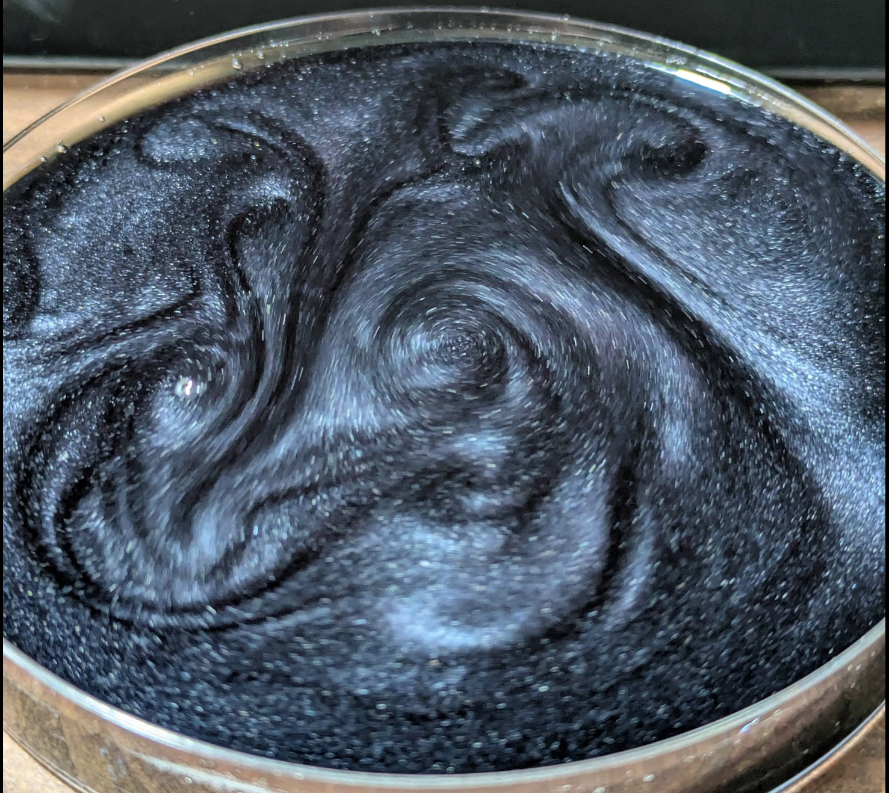
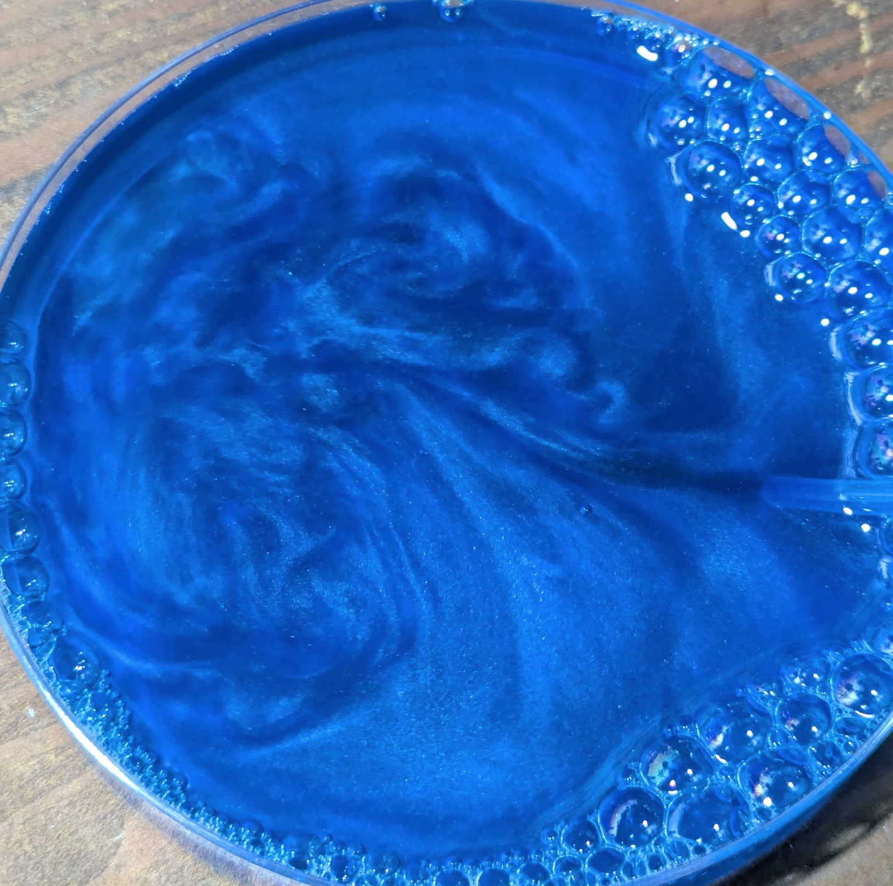

As I grabbed the waste tub from my lab bench to deal with it, I noticed the liquid in the bottom swished around in a shiny and interesting way. I pipetted some out and took a closer look. Any movement resulted in irridescent swirls - I'd accidentally made a rheoscopic fluid! This isn't exactly rare - people make it by adding mica powder to water, for example. But I couldn't figure out what was causing the effect in my case at first - no mica here, just the remains of a couple of experiments related to cyanotype and the paper towels I'd used to clean up. Intrigued, I set about trying to figure out the minimal recipe needed to re-create the effect. Before we get to the recipe though, take a look at it in motion:

Lovely, isn't it! More videos in [this twitter thread.](https://x.com/johnowhitaker/status/1906154484826595722)

Turns out you can make this as follows:
- Add a strip of paper towel to a container of 2% hydrogen peroxide and a few drops of dish soap.
- Leave it for several days (the longer the better)
- Add color to taste :)

I think what is happening is the H2O2 is breaking down parts of the paper towel, leaving little bits of cellulose and other stuff suspended in the water which catch the light at the right angle, aligning based on the flow, giving the irridescent effect. The soap helps to stabilize the suspension. I used food coloring to boost the contrast. In the initial version the yellow (from potassium ferricyanide) was the initial color, then it later turned blue (from the cyanotype reaction) - which is how I got the idea. The white version was cool too in some lights but didn't photograph nearly as well. 

Under a microscope it looks like this:

Anyway, it was a fun 'science at home' moment to spot this, chat about it with an AI, come up with some theories, try out varous mixtures (with and without the various chemicals I thought might be in the original batch) and then double check the recipe again. I bet stronger H2O2 would work better - LMK if you do an independent replication!

